```{r include = FALSE}
# Define the web addresses for the course
# run as needed, not included automatically because of stuff (aka git complains)
serverurl <- "https://daur.rstudio.hu.nl/"
githuburl <- "https://github.com/ontox-hu/course_R_AI"
readerurl <- "..."
ev1vurl <- "https://lesmaterialen.rstudio.hu.nl/statistiek-en-excel-reader/"
email <- "marc.teunis@hu.nl"
deadline1 <- "vrijdag 11 maart 22.00 uur"
deadline2 <- "vrijdag 18 maart 22.00 uur"
deadline3 <- "vrijdag 25 maart 22.00 uur"

save(
    list = c("serverurl", "githuburl", "readerurl"), 
    file = "course_urls.RData")
```


```{r include = FALSE, eval = TRUE}
# set CSS for objects
knitr::opts_chunk$set(class.source="Rchunk", class.output="Rout")
```

# Introduction {-}

Welcome to the course on the basics of data analysis in R and an intro in Machine learning. This course consists of 5 lessons. You can find these lessons in the menu on the left. Each lesson starts with a short introduction by the teachers. After that, you are supposed to study the lessons yourself and make the exercises. During the lessons, you can ask questions to the teachers and the teachers will provide feedback. It is very important that you make all exercises. You will not learn using R by reading about it. 

Please note: this is a crash course. We scheduled this course to allow you to throw yourself into R and be able to see yourself making progress very quickly. 

We wish you good luck and we hope you will have a lot of fun with R!

## Course outline

This page explains how the course is constructed and what will be expected from you.

**Schedule 2022:**

Day 1:

 - Intro to R and RStudio
 - Getting the materials from Github
 - R-syntax, objects, data types and classes
 - RMarkdown
 

Day 2:

 - Reading and cleaning data
 - Visualizations
 

Day 3:

 - Data wrangling
 

Day 4:

 - Functional programming
 - Writing functions
 

Day 5:

 - Machine Learning with {tidymodels}
 - Deep Learning with tensorflow for R


### Course material

The course material consists of the following:

- Instruction pages (menu to the left). 
- Exercises.

To navigate through the different materials, you can use the menu on the left. The course is based on the online book [R for Data Science](https://r4ds.had.co.nz/index.html).

### Lessons

Each lesson will consist of:

- a short introduction to the subject by the instructor;
- selfstudy of the instruction pages; 
- and making the exercises.

Each lesson, one or two instructors will be present to assist with the exercises and provide feedback. 

### Exercises

The exercises consist of writing R code to solve data analysis problems. Answers are available for each exercise. Most likely you will not finish all exercises during the lesson, which means that you will have to finish them in your own time. It is important to make all exercises: the only way to learn R is to practice, practice and practice by making the exercises. Some R functions and principles are only explained via the exercises.


### Rstudio server

During the course, we will use an **RStudio server**, which you can reach via [this link](`r serverurl`) using a browser. You can log in to this RStudio server with your HU email address and with your HU password. Within the Rstudio environment you'll have to make an R Project (see instructions in lesson 1). Data files will be provided by the instructors and are present in the Rstudio server folder mabdaur/data. 

In case of any problems with the RStudio server, please contact `r email`.


## Learning objectives

After this course, you will be able to 

- use R to perform your analyses repoducible
- backup your work using version control in github
- implement literate programming in data analysis and visualization.
- communicate the results of data analysis and how you reached them using Rmarkdown
- explain the basics of machine learning in toxicology.

<!--chapter:end:index.Rmd-->

# Preparation before the course

```{r include=FALSE}
load("course_urls.RData")

```


## Let's get started! 

**Note: if you already have R and RStudio installed (and recently updated) on your computer, skip to the next page**

RStudio is a nice [IDE](https://en.wikipedia.org/wiki/Integrated_development_environment) for using R, with a user-friendly interface and lots of options.


In preparation of DAUR2, we are going to install RStudio (and first R itself!) on your own computer, so it is readily available to you at any time within and after this course. R and RStudio are both free and [open source](https://en.wikipedia.org/wiki/Open_source). We encourage you to keep using R for future projects, internships and your everyday data issues. It is currently an important tool in data science and bioinformatics (and looks rather nice on your resume).

Getting it all set up can be a bit tricky at times, so please follow the instructions carefully and in the correct order (seriously, keep to the order as well, it will make your life easier). The instructions will walk you through it.

### Remarks before starting

#### Windows users

Please make sure you are allowed to install software on your computer. If you do not have administrator rights for the computer you are using, you can contact the teachers for guidance. 

#### Mac users

Mac security settings might block you from installing certain programs. Whenever you see a pop-up like this:

```{r , echo=FALSE, message=FALSE, out.width = "70%"}
knitr::include_graphics("images/wontinstall.png")
```

Go to you Applications --> System Preferences --> Security&Privacy

```{r , echo=FALSE, message=FALSE, out.width = "70%"}
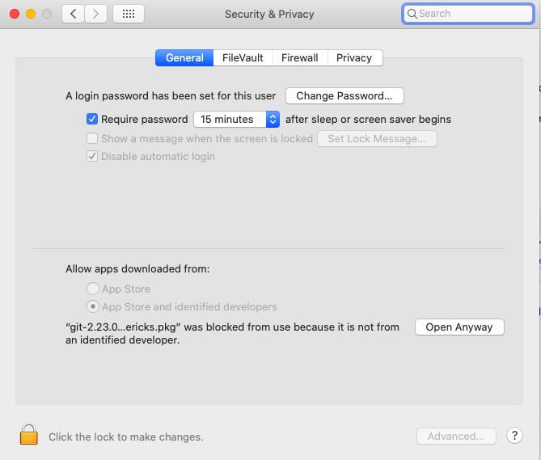
```

Click on "Open anyway" and in the next pop-up on "open".

***

## Updating R and RStudio

**Note: if you you haven't installed R and RStudio yet, you do not need to do this. Skip to [installing R](#installRhere).**

### Windows users

#### Update RStudio 

Go to Help > Check for Updates. 

#### Update R 

Open RStudio, and type in the console:

```{r, eval=FALSE}
install.packages("installr")
library(installr) 
```

Let it install and load, and type:

```{r, eval=FALSE}
updateR()
```

This will check whether you have the current version, and update if not. It will guide you through the decisions; say "yes", "OK" and/or "next" whenever it wants your opinion.

After this, skip the next two sections and continue to the page on [installing git](#installGIThere).

### Mac users

#### Update RStudio

Actually, just open RStudio. It will warn you if there are updates, unless you disabled this option in the preferences menu; in that case you can go to Help > Check for updates.

#### Update R

Type ```R.version.string``` in the console, check [here](https://cloud.r-project.org/) if that is correct. If it needs to be updated,  install the newest version of R as described on the next page. When you are done, close and reopen RStudio.

***

## Install R {#installRhere}

### Windows 

1. Go to [the R website](https://cloud.r-project.org/bin/windows/base/) and click on the download link on top. You will download a file called "R-3.6.3-win.exe" or very similar. 

```{r , echo=FALSE, message=FALSE, out.width = "70%"}
knitr::include_graphics("images/rwin_download.png")
```

2. Run this file and follow all steps using the default settings to install R on  your computer.

```{r , echo=FALSE, message=FALSE, out.width = "70%"}
knitr::include_graphics("images/wizardRwindows.png")
```


### Mac 

1. Go to [the R website](https://cloud.r-project.org/bin/macosx/).

    + If you have the latest OS X, ignore all text until "Latest release:", and click on the top .pkg file to download it.
    
    + If you do not have the latest OS X on your mac, consider updating it first. If you really do not want to, find the .pkg file for your OS X in the table and download it.

```{r , echo=FALSE, message=FALSE, out.width = "70%"}
knitr::include_graphics("images/rmac_download.png")
```


2. Open the .pkg file to start the installer and follow all steps using default settings to install R on your computer.

```{r , echo=FALSE, message=FALSE, out.width = "70%"}

```

Some functions in R that you may use in the future require something called X11, which used to be included in OS X, but isn't anymore. To prevent future trouble, let's install it via XQuartz while we are installing things anyway:

- Go to <https://www.xquartz.org/>, download the file under "quick download".
    
```{r , echo=FALSE, message=FALSE, out.width = "70%"}
knitr::include_graphics("images/xquartz.png")
```


- Open the downloaded disk image (.dmg file). 
    
```{r , echo=FALSE, message=FALSE, out.width = "70%"}
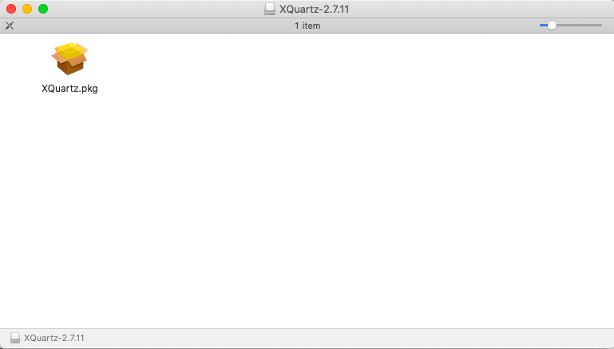
```

- Double click on XQuartz.pkg and follow the installation steps.
    
```{r , echo=FALSE, message=FALSE, out.width = "70%"}
knitr::include_graphics("images/xquarkwizard.png")
```

***


## Install RStudio

### Install RStudio itself 

Go to [the RStudio website](https://rstudio.com/products/rstudio/download/#download)

The website will probably suggest the correct download file for you (A). If not, look in the table lower down the page for the correct file (B): 

```{r , echo=FALSE, message=FALSE, out.width = "70%"}
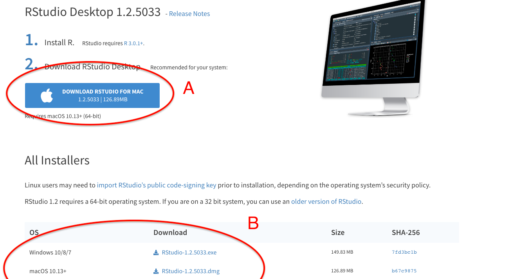
```

Download and run the installer with default installation options:

```{r , echo=FALSE, message=FALSE, out.width = "70%"}
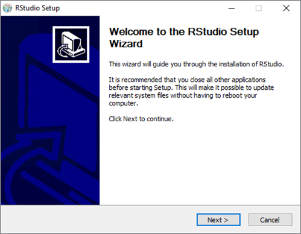
```

Now open your newly installed RStudio. It will look familiar:

```{r , echo=FALSE, message=FALSE, out.width = "70%"}
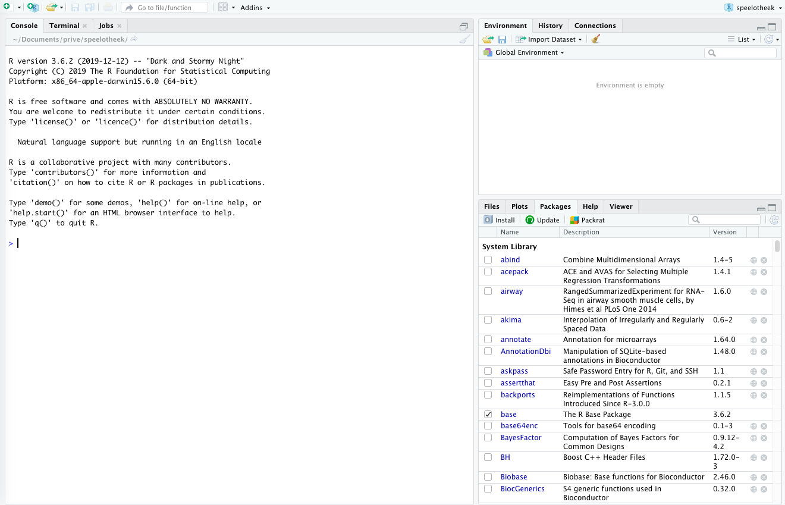
```

### Installing packages

However, not everything is up and running as it was on the server in DAUR1. First of all, not all packages that we use have been installed. You will have to install packages once on your computer, and load them within every script you want to use them. 

To install packages, use the **console**. Do not install packages from within a script (the figure below shows RStudio when a script is open to highlight the difference):

```{r , echo=FALSE, message=FALSE, out.width = "70%"}
knitr::include_graphics("images/installpackages.png")
```

Go ahead and **install the tidyverse package**, we will need it during the course. Type the following command in the console:

```{r, eval=FALSE}
install.packages("tidyverse")
```

If, in the future, R bugs you in the console with "Do you want to install from sources the packages which need compilation?" just answer no (n) for now.

### Loading packages

A quick note on loading packages, even though you don't have to do that now. Remember that packages (in this case the tidyverse package) can be loaded using:

```{r, eval=FALSE}
library(tidyverse)
```

Make it a habit to load all packages you need in the beginning of your script, instead of loading them where-ever you happen to need them. This makes it easier to keep track of all the packages you are loading and prevents you from loading and reloading packages every time you run a chunk of code along the way.

```{r , echo=FALSE, message=FALSE, out.width = "70%"}
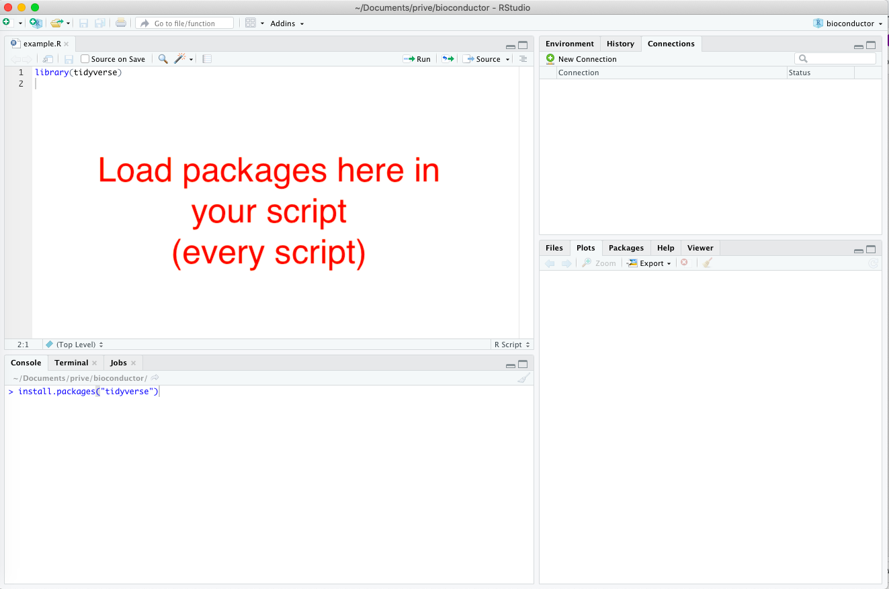
```

***

## If all is still not well

Are you experiencing technical problems, software that does not run or options that are not available, or any other type of problem, check below:

In the following order:

 1. Have you tried turning your computer off and on again? Turn off your computer and start it back up. Try if it works now.
 1. Try to find your problem on the internet. If RStudio gives you an error message, copy paste (part of) the error message to google and see if a solution comes up. Really: try, click around, see what you can come up with, using the help of the internet. Consider this part of what you gain from this course, being able to google and solve R trouble is a valuable skill. And you will get better in it the more you practice (we know, we've practiced a lot).
 1. If 1, 2 and 3 all fail, send us an e-mail describing your problem, including a copy-paste of the error message if there is one (no screenshot).


## reader

Obviously, you have already found the reader for the course. 

 - Try the following:
  - Open links in the reader in a new tab by holding ctrl (pc) or command (mac) when clicking on it.
  - You can click menu-items to see the different paragraphs. 
 
<!-- - try to log in at the [Rstudio server](`r serverurl`) with your HU credentials. -->

<!-- You will see the Rstudio environment. This is an environment for using R. -->

## Introduction to R

R is a language and environment for statistical computing and graphics. It is one of the most popular programming languages for data analysis and statistics, rapidly taking over software packages such as SPSS. Rather than using a GUI (Graphical User Interface, clicking buttons and menus), R is typically accessed through a command-line interpreter. So you will type for instance "2+2" and R will tell you the answer:

```{r}
2+2
```

However, you can also ask R to give you p-values for an ANOVA, print you a nice scatter plot, or give a summary of a large dataset. Once you know how, R will let you do these tasks a lot faster than Excel or SPSS could. Moreover, more advanced users will be able to ask R to do things like finding all the genes in an online database that are associated with a certain disease, fit deep learning models, build interactive web apps and analyse huge next generation sequencing datasets. 

R is thus extremely versatile, but can be a bit daunting when first encountered. But as you likely have some experience in SPSS and Excel, you already know the basics of data analysis. You will see that learning R will save you a lot of time in the future. Also, R has been adopted by many companies as the language of choice to analyze data, so it is an important skill to acquire.

Therefore, we will give you an introduction to the R language in this course. R is an open-source project supported by the user community, so please note that it is all free of charge. This also means that R changes fast depending on the needs of the user community. We may encounter instances where things have changed in the time window between the development of this course and you following the lessons. Consider these differences a valuable lesson in really getting to know R and its possibilities.

### Variables and functions

The standard R installation comes with base R and core packages that allow for a fully functioning statistical environment. Rather than allowing the user to look at data in a two-dimensional data table on screen, such as for instance in Excel or SPSS, R saves data in **variables**. Variables can contain arrays of numbers, or even lists of multiple data tables. These variables are stored, but not printed on the screen unless you ask R to do so. We will further discuss them in lesson 1. 

Once you have stored your data in variables, you can apply functions to your data. In programming, **functions** are sets of instructions that you want to use repeatedly. Many functions are stored and shared in packages. A **package** provides code, functions and data to execute certain tasks in R. There are hundreds of functions each performing a certain task. For example the function **sum()** from the base package calculates the sum of a series of numbers. You can find a complete list of base R function and their descriptions [on this website](https://stat.ethz.ch/R-manual/R-devel/library/base/html/00Index.html).

Beside the base R functions, R comes with some **core packages**. These core packages include the **stat package**, which can be used to perform statistical tasks. For example, the function **median()** calculates the median of a series of numbers.  

<!-- ### Additional packages -->

<!-- The base and core functions are readily available in the R console without the need for installing additional packages. To expand the functionality of R, additional packages can be installed in the R environment. Packages can be found at so called repositories, online places where the packages are stored. The main repositories are: -->

<!-- - [CRAN](https://cran.r-project.org/) (The Comprehensive R Archive Network).  -->
<!-- - [Bioconductor](http://bioconductor.org/) (packages for the analysis of high-throughput genomic data. We will use these a lot in DAUR2). -->
<!-- - [Github](https://github.com/) (GitHub is a development platform to host and review code, manage projects, and build software).  -->

```{r echo=FALSE, message=FALSE, out.width = "70%", fig.cap = "Organization of the R workflow"}
knitr::include_graphics("images/01_2_rworkflow.jpg")
```

<!-- ### This course -->

<!-- Within this course, you will run R on a server provided by the HU, and within Rstudio, an integrated development environment (IDE) for R. You will access the server/RStudio using a web browser. RStudio is designed to make it easy to write scripts, keep track of your variables and plot graphs. -->

<!-- ## The server -->
<!-- RStudio is an IDE that can run on your local Windows, Mac OS X, or Linux workstation. -->

<!-- However, for the current course, we will use a version of Rstudio that provides a web browser based interface to R: running on the server. This will ensure that everyone will have the correct packages installed and is using the same version of R:. -->

<!-- If you find yourself liking R: a lot and want to use it in the future, you will know enough by the end of the course to install your own local Rstudio version. -->

<!-- *The server can be found [here](`r serverurl`)*.  -->

<!-- ### first log-in -->
<!-- **Log into the server.** -->

## Rstudio

Open up your newly installed Rstudio program 

Rstudio provides a user-friendly interface with separate windows for everything you will be using: the console, scripts, environments, objects,  graphs, files  and so on. 

Your screen will look like this:
```{r Rlayout1, echo=FALSE, message=FALSE, out.width = "100%", fig.cap = "Rstudio layout"}
knitr::include_graphics("images/01_3_Rstudio.jpg")
```

### Console
In the bottom left you see the console window and terminal. You will be working mostly in the console window, in which the line should start with 

`>`

(if it starts with `root@something_something_your.name#` you are typing in the terminal. Go to the console by clicking on "console" in the bottom left menu bar).

Note (seriously!) that anything you type in the console **will not be saved**. This is just where you can tell R what to do right now, and where R will print the results of a command. You can use it as a calculator as well.


**try typing 2+2 in the console window and hit enter**

These commands typed directly into the console will be forgotten when you close the session. A session is in fact just this: R keeps track of your calculations and the variables you made (we'll get to that) until you explicitly quit the session.

Within the current session Rstudio will also remember your console commands. You can retrieve previous commands with the arrow keys:

* Up — Recall previous command(s)
* Down — Reverse of Up

**Try pressing the UP key. You will see that R retrieves the 2+2 command**. You can use this to repeat commands (or change them a bit if you want).


## Projects

Most of the time, we do want R to save what we are doing. Therefore, we will be working in scripts, and within a project.

If you start with R you should create a Project.  A project defines a folder where you store all the datafiles, Rscripts and RMarkdown files. When you open a Project your working directory will be the folder where your Project file is stored.

Projects can be exchanged between computers and researchers in time as it contains all the necessary packages, files and scripts to do the analysis. A project is self-contained. A researcher can define multiple Projects within Rstudio which run independently of each other.  A Project also guarantees that datafiles /scripts can be found in subfolders within the Project (even when executed on a different computer)

### Starting a new Project in Rstudio 

**Click on File and Select New Project**

```{r echo=FALSE, message=FALSE, out.width = "60%"}
knitr::include_graphics("images/01_4_Project_1.jpg")
```

**If you encounter this message Click on "Don't Save", otherwise  continue with the next instruction**

```{r echo=FALSE, message=FALSE, out.width = "60%"}
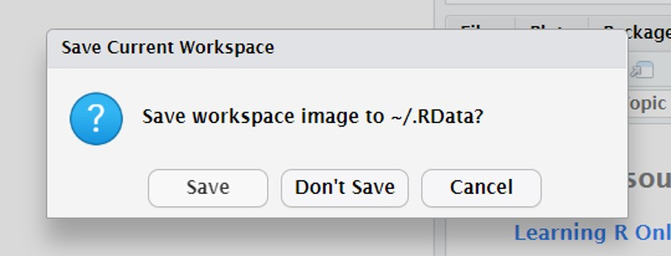
```

**Click on "new Directory"**

```{r echo=FALSE, message=FALSE, out.width = "60%"}
knitr::include_graphics("images/01_6_Project_3.jpg")
```

**Make a new directory for this course (for instance "daur" for Data Analysis Using R)**

**Click on "Create Project"**

```{r echo=FALSE, message=FALSE, out.width = "60%"}
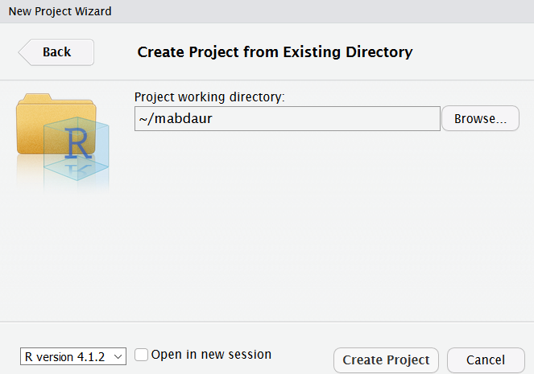
```

**Done**

### Opening a project in Rstudio
When starting an R session open the Project you want to work on. This will automatically set your working directory to the  folder containing the RProject file. The working directory is where R will look for any files (datafiles, scripts etc) you want to use.
If you want to switch projects, or you are not currently in a project, you can open one:

**Click on "Open Project". If you have opened the RProject before you can also select "Recent Projects"**

```{r echo=FALSE, message=FALSE, out.width = "60%"}
knitr::include_graphics("images/01_10_Open_Project_1.jpg")
```

**Select and open the folder containing the RProject file. In this instance daur**

**Select and open the daur.Rproj file to open the RProject**


We will continue working in Rstudio in lesson 1.

### More help
This course is based on the book "R for Data Science" of Garrett Grolemund and Hadley Wickham. [This book is freely available](https://r4ds.had.co.nz/index.html). We will refer to this book in the learning material providing extra (in depth) information / explanation.  

There are thousands of tutorials on R if you want to know more. Generally, online tutorials on R: are rather good. Good starting points are:
[bioconductor](https://www.bioconductor.org/help/course-materials/)

[Rstudio](https://www.rstudio.com/online-learning/)

[Coursera](https://www.coursera.org/learn/r-programming)

[Rmarkdown](https://rmarkdown.rstudio.com/)
 

The official documentation on R functions can be difficult to read / understand. To start searching for information on R, for example on how a particular function works you can use google (or your favourite searching engine) with the following search term:
R function() tutorial / example
So for example, google: 

R unique() tutorial / example

## DIY
In this course, we will give you a tour of R and we will discuss many functions using examples.

Every lesson will consists of a series of canvas pages with examples and explanations, followed by exercises. 

We expect you to try things yourself during this course. When reading the lessons, try all the examples in R. So open Rstudio on the server, copy-paste the examples in a script and run them. *Play around with the code.* You will not learn R: by watching someone else write it, or by reading about it. This is a skill that you will need to practice. 

Often, we will show you what the output of a piece of code should look like in lighter gray. You can also recognise code output by the ## in front of the lines:


###### Example
```{r}
sesamstraat <- c("ernie", "bert", "elmo", "pino", "grover", "kermit", "ms piggy", "koekiemonster")
sort(sesamstraat)
```

If your output looks different, such as:
`Error in sort(sesamstrat) : object 'sesamstrat' not found` 

you know something is going wrong.

**Make sure you code along with the examples.** Try to replicate what the reader is doing!


<!--chapter:end:les0_preparation.Rmd-->

# Lesson 1 - Introduction to R and RStudio

```{r include=FALSE}
load("course_urls.RData")
les<-1
```


## Learning objectives

After this lesson:

- you know how RStudio is organized;
- you can run R scripts in RStudio using R scripts;
- you know how to use R packages;
- and you know how you can find information (help function and vignettes) about the R functions you are using. 
- You will know the different data types and structures in R. 
- You can create your own R objects. 


**Make sure you code along with the examples.** Try to replicate what the reader is doing!

## Starting to work within a project

 - **In the preparation for this course, you made a project. Open this project.**

```{r echo=FALSE, message=FALSE, out.width = "60%"}
knitr::include_graphics("images/01_10_Open_Project_1.jpg")
```

### Running code in Rstudio

To execute R functions / code there are two options:

 * Directly in the R console  (the code is not saved)
 * Write a script. (the code can be saved)

The preferred method is to enter the code in a script. Writing and executing R code by using a script has several  advantages: 

1 The code can be saved and therefore is reproducible. 
2 The code can be shared between researchers
3 The code can be made clear by adding comments using the # sign
4 The code can be re-used for other purposes

In contrast to R script, your code will be lost if you directly enter and execute the code in the R console. 

**To create an R script: click on the "green" plus sign and select R script (see Figure \@ref(fig:openscript))**

```{r openscript, echo=FALSE, message=FALSE, out.width = "60%",fig.cap = "creating a new R script in Rstudio"}

```

A new script has opened in the upper left part of the screen.

**Try typing `2+2` in your new script**

To execute this command: **Put the cursor on the line of code of interest and press Ctrl + enter**

alternatively:

 - Make a selection of lines of code and press Ctrl + enter.
 - To source the entire script press ctrl + shift + s  
 - To run the entire script, click the green arrow with "run" next to it on the top right corner of your script.


The **OUTPUT** of the line of code will be visible in the R Console or if making a graph in the Plots panel in the lower right window (see Figure \@ref(fig:examplescript))**

```{r examplescript, echo=FALSE, message=FALSE, out.width = "90%",fig.cap = "Example of an R script"}
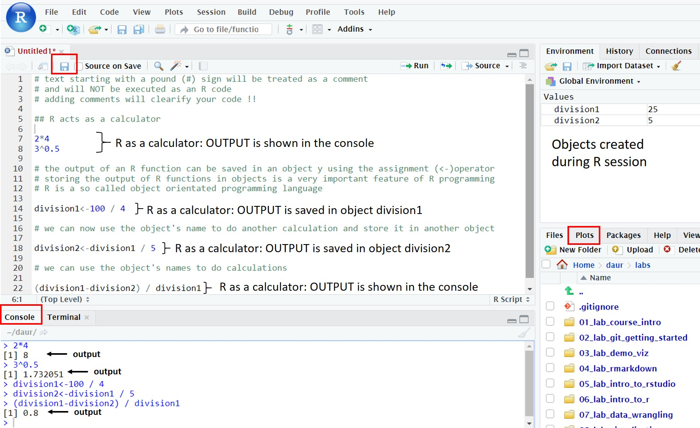
```

**Read the code + comments in figure  \@ref(fig:examplescript) carefully to understand the principle of an R script. Two object were created and saved in the Environment panel in the top right.

Importantly, within an R script any text starting with a # sign will be treated as text only. This is very useful to write comments on why you're using a particular code. The actual lines of code are:

```{r  results = 'hide'}
2*4
3^0.5                          ## ^ sign means to the power to
division1 <- 100 / 4           ## create an object named  division1
division2 <- division1  /  5   ## create an object named  division2 based on object division1
(division1 - division2) / division1 ## you can use brackets

```

To save an R script simply press Ctrl+S or click on file and click on the **save** or **save as** options. The code will be saved in your RProject folder 

### Variables

**Copy and paste the lines in the grey block above into a new script and run the script (select the lines and press ctrl+enter OR click on "Run" on the top right above your script).**

We have made two variables in the 5 lines of code (or objects, anything in R is an object. On the internet, you will see "variable" and "object" used interchangeably when talking about R:. What are known as objects in R are known as variables in many other programming languages). You can find all objects created in a session in the upper right window, within the "environment" tab. **(find the environment tab)** If you ran the script correctly, division1 and division2 should be visible there (see also figure  \@ref(fig:examplescript) above).

Objects are created with the assignment operator 
`<-`
It assigns the stuff on the right to an object on the left. So, after running `division1 <- 100 / 4` , the value of division1 is 25. We will dive into this in lesson 2. 

**Type division1 into the console window to see its contents.**


<div class="question">
##### Exercise `r les` {-} 

Write an R **script** (so not in the console) that calculates the 95% confidence interval from a sample  with 60 datapoints (n) with a given sample mean and sample standarddeviation. Follow the steps below.

The equation for a 95% confidence interval is:

$xgem \pm 1,96 * \frac{s}{\sqrt{n}}$

with: **$xgem$** : sample mean, **$s$**: sample standard deviation, **$n$** : amount of measurements

Do the following:

 - open a new R script
 - first make 3 objects, on 3 separate lines:
   - `xgem` contains the number 50
   - `s` contains the number 4
   - `n` contains the number 60
 - on the fourth line, make an object that contains the square root of n (remember that ${\sqrt{n} = n^{0.5}}$)
 - on the fifth and sixth line, write the equations for the lower and upper boundary of the 95% confidence interval. Use the objects you made. Don't forget the brackets () !

</div>

<details><summary>Click for the answer</summary>
```{r}
xgem <- 50
s <- 4
n <- 60
sqrootn <- n^0.5
xgem - (1.96*(s/sqrootn)) # lower
xgem + (1.96*(s/sqrootn)) # upper
```
</details>

### Functions

<div class="question">
##### Exercise `r les` {-} 
**Make a new variable called length_myname, which contains a number representing the length of your first name. For example, type in the script: `length_myname <- 7`**
</div>

<details><summary>Click for the answer</summary>
```{r, eval=F}
# for example if your name is "Bas" :
length_myname <- 3
```
</details>

We can actually ask R: to calculate the length if we want.

**Type in the script (replace my name with yours) and run the lines (select them and press Ctrl + enter):**

```{r  results = 'hide'}
myname <- "alyanne"
nchar(myname)

```

The number of characters in your name should appear in the console.

We have just used a **function**. Functions allow you to automate common tasks, such as count the characters in a word, or calculate the mean of a series of numbers. Functions generally want some input (such as the word or the numbers), which is placed between round brackets: 
`function_name(input)`

For instance, there is a function to calculate the square root of something, called `sqrt()`:

```{r  }
sqrt(25)
```

### Packages and libraries

R has many build in functions, but you add more by writing them yourself (we won't cover that in this course) or by installing *packages* with functions other people have written. The R: community is very active, and also very open-source. There are a lot (!) of packages available online for free.
 In this course we have already preinstalled most packages you need.

A package needs to be loaded in R though, by the function `library()`. 

<div class="tip">
A package only needs to be installed once but needs to be loaded every time you have closed Rstudio on the server.

Start all our scripts with loading the packages you are going to use.
</div>

A package that we will extensively use during this course is named "tidyverse". 

**So start your scripts within this course with:**
```{r eval = FALSE}
library(tidyverse)
```

### The help function

Each function in R operates with a set of arguments. To check how a function in R operates, type a question mark in the console followed by the name of the function. For example to generate a sequence of numbers we use the function seq(). **To see how it works type:**

```{r eval=FALSE}
?seq()
```

<!-- The OUTPUT of the help function will be displayed at the Help panel in the lower right corner of the screen. Often the text is a generic and technical description of the function and its arguments. It can be very hard to read and understand. (see Figure  \@ref(fig:seqhelp)). -->

<!-- ```{r seqhelp, echo=FALSE, message=FALSE, out.width = "60%",fig.cap = "Output of ?seq() in Rstudio"} -->
<!--  -->
<!-- ``` -->

<!-- The Arguments section describes the default values of the arguments. If the value of an argument =NULL, the argument is not used by default unless you invoke the argument by providing a value -->

<!-- We note that the seq() function minimally takes three arguments: -->

<!-- * The start of the sequence: from= -->

<!-- * The end of the sequence: to= -->

<!-- * The stepsize: by=  -->

<!-- The most useful part of the Help panel is to Scroll down to the Examples section (see Figure \@ref(fig:seqhelp2)).  -->

<!-- ```{r seqhelp2, echo=FALSE, message=FALSE, out.width = "60%",fig.cap = "Examples of how to use the seq() function "} -->
<!--  -->
<!-- ``` -->

<!-- Alternatively in google (or your favorite search engine), type,  "r seq function example" and select a page with examples. It takes a bit of practice to use the internet to search for good examples but it will certainly pay off in the long run. -->

<!-- ### DIY -->
<!-- As a reminder: -->

<!-- We expect you to try things yourself during this course. When reading the lessons, try all the examples in R. So open Rstudio on the server, copy-paste the examples in a script and run them. *Play around with the code.* You will not learn R: by watching someone else write it, or by reading about it. This is a skill that you will need to practice.  -->

<!-- So in the following example, first copy-paste the example (hoover and click in right corner) to your script and run the lines of code (select them and press ctrl-enter). R will print the characters in alphabetical order in the console window. What would you need to type to get the reverse order? type ?sort in the console or Google it and try it! -->

<!-- ###### Example -->
<!-- ```{r eval=F} -->
<!-- sesamstraat <- c("ernie", "bert", "elmo", "pino", "grover", "kermit", "ms piggy", "koekiemonster") -->
<!-- sort(sesamstraat) -->
<!-- ```  -->

<!-- Often, we will show you what the output should look like in lighter gray. You can also recognise code output by the ## in front of the lines: -->


<!-- ###### Example -->
<!-- ```{r} -->
<!-- sesamstraat <- c("ernie", "bert", "elmo", "pino", "grover", "kermit", "ms piggy", "koekiemonster") -->
<!-- sort(sesamstraat) -->
<!-- ``` -->

<!-- If your output looks different, such as: -->
<!-- `Error in sort(sesamstrat) : object 'sesamstrat' not found`  -->

<!-- you know something is going wrong. -->

<!-- The following code will give you an error. Do you see why? -->

<!-- ```{r, eval=F} -->
<!-- my_variable <- 10 -->
<!-- my_varıable -->
<!-- #> Error in eval(expr, envir, enclos): object 'my_varıable' not found -->
<!-- ``` -->

<!-- This may seem a bit annoying, now that we are all used to Googles machine learning algorithms fixing things like this for us. But R doesn't do that. In fact, it's the other way around:  you can build those machine learning algorithms with R. So we will have to keep an eye on the details ourselves! -->

<!-- **can you fix the code above?** -->

## Data types and structures in R

Now that you have met Rstudio, we can begin working with data!

<!-- ### Creating objects and assigning values -->

<!-- **Data types in R** -->

<!-- Depending on the experiment and type of measurement, a scientist will encounter different types of data. The most important **data types** in R are: -->

<!-- - character (text string of any length);   -->
<!-- - double (numeric: real or decimal);   -->
<!-- - integer (whole number);                           -->
<!-- - logical (TRUE or FALSE);                             -->
<!-- - and complex (imaginary numbers).  -->


**Data structures in R**

Data needs to be stored and therefore must be organized in (complex) data structures. The most important **data structures** in R are:

- vector; collection of values of the same data type.
- factors; a vector with **categorical** data, can contain only predefined values. 
- list; elements in lists can be of any type, including lists. 
- dataframes & tibbles : sort of like a table in excel. Tt has rows and columns (variables).


<div class="tip">
objects are created with the assignment operator: **<-**.

```{r, eval=F}
name_of_object <- what_you_want_to_store_in_it
```

</div>

**Object names** must start with a **letter** and can only contain letters, numbers, '_' (an underscore) and '.' (a dot). Object names must be **informative** so that you remember what kind of data is stored in the R object. A convention is to use **snake_case** where you separate lowercase words with underscores. For example, a possible object name for a gene expression dataset in stem cells could be 'rnaseq_mouse_24hrs_stemcells'.

<!-- In this lesson we will create some R objects with different data types and structures. -->

<!-- ### Vectors (part 1) -->

<!-- A **vector** is a collection of values of the same data type. You can make them with a function: `c()`. -->

<!-- ###### Example -->

<!-- ```{r} -->
<!-- # Create a vector with 5 numeric elements -->
<!-- vector_1 <- c(1, 2, 3, 4, 5)  -->
<!-- # use typeof() to check the data type of the values in the vector -->
<!-- typeof(vector_1) -->
<!-- # use length() to check the number of values in a vector -->
<!-- length(vector_1) -->
<!-- ``` -->

<!-- Vectors can contain other data than numbers: -->
<!-- ```{r} -->
<!-- # Create a vector with 4 character elements -->
<!-- vector_2 <- c("one", "two", "three", "four")  -->
<!-- typeof(vector_2) -->
<!-- # Display the number of characters of each element of the vector -->
<!-- nchar(vector_2)  -->
<!-- ``` -->

<!-- But a vector can contain only one type of data. Vectors = with different data types will be converted to a common data type. This conversion is called **coercion**. Values are converted to the simplest type required to represent all information. The ordering is roughly: logical < integer < numeric < complex < character.  -->
<!-- ```{r} -->
<!-- vector_3 <- c(1,2,3,4,"one", "two", "three", "four")  -->
<!-- vector_3 -->
<!-- typeof(vector_3) -->
<!-- ``` -->

<!-- A special type of vectors are sequences. To generate sequences we can use the `:` operator and the function `seq()` (see examples below).  -->

<!-- ###### Example -->

<!-- ```{r} -->
<!-- # Create a numeric sequence with step size of 1 -->
<!-- vector_3 <- 2:15   -->
<!-- vector_3 -->

<!-- # Create a numeric vector from 2 to 20 with step size of 2 -->
<!-- vector_4 <- seq(2, 20, by = 2)  -->
<!-- vector_4 -->
<!-- ``` -->


<!-- ### Pasting vectors with text together -->

<!-- To combine vectors we can use the `paste()` function or `paste0()` function. These two functions are very similar; the only difference is that the `paste0()` function does not introduce spaces when pasting together the vector elements (see examples below).  -->

<!-- ###### Example -->

<!-- ```{r} -->
<!-- # Paste the two vectors together separated by spaces -->
<!-- vector_5 <- letters[1:10]   -->
<!-- vector_6 <- paste(vector_4, vector_5) -->
<!-- vector_6 -->

<!-- # Paste the two vectors together separated by dashes -->
<!-- vector_6 <- paste(vector_4, vector_5, sep = "-")  -->
<!-- vector_6 -->

<!-- # Paste the two vectors together without spaces -->
<!-- vector_6 <- paste0(vector_4, vector_5)  -->
<!-- vector_6 -->
<!-- ``` -->

<!-- ### Sorting vectors -->

<!-- You may want to sort the vector alphabetically, numerically or both. Vectors can be sorted using the `sort()` function.  -->

<!-- ###### Example -->

<!-- ```{r} -->
<!-- sesamstraat <- c("ernie", "bert", "elmo", "pino", "grover",  -->
<!--                  "kermit", "ms piggy", "koekiemonster") -->
<!-- sort(sesamstraat) -->
<!-- ``` -->

<!-- <div class="question"> -->
<!-- ##### Exercise `r les` {-}  -->

<!-- Write an R code to create three vectors: -->

<!-- - vector1 contains "Hello" -->
<!-- - vector2 contains ","  -->
<!-- - vector3 contains "World" -->

<!-- Combine the three vectors with white spaces into a new vector4 to create "Hello , World" -->
<!-- </div> -->

<!-- <details><summary>Click for the answer</summary> -->
<!-- ```{r} -->
<!-- vector_h <- c("Hello") -->
<!-- vector_k <- c(",") -->
<!-- vector_w <- c("World") -->
<!-- vector_all <- paste(vector_h, vector_k, vector_w, sep=" ") -->
<!-- vector_all -->
<!-- ``` -->
<!-- </details> -->

<!-- ##### Exercise `r les` {-}  -->

<!-- <div class="question"> -->
<!-- Create the following vector: -->
<!-- ```{r} -->
<!-- vector_numeric <- c(1:10, "11") -->
<!-- ``` -->
<!-- (a) What is the data type of vector_numeric? -->
<!-- (b) Can you explain the answer of (a)? -->
<!-- </div> -->

<!-- <details><summary>Click for the answer</summary> -->

<!-- (a) -->
<!-- ```{r} -->
<!-- typeof(vector_numeric) -->
<!-- ``` -->

<!-- (b)     -->
<!-- "11" is a character and not a number, as it is between quotes. -->
<!-- </details> -->

##### Exercise `r les` {-} 

<div class="question">

Now that you know how to assign things to an object ( `<-` ) and use a function (`functionname(input)`), let's try the following: 

Write R code to calculate: 

(a) the sum of even numbers between 30 and 58.
(b) the square (power of 2) of the numbers 1 till 50.
Note: the power function in R is written as a^b meaning a to the power of b. For example 2^3 = 2x2x2 = 8.
(c) the square (power of 2) of the odd number between 50 and 100.
</div>

<details><summary>Click for the answer</summary>

(a)
```{r}
sum(seq(30,58,2))
```
(b)
```{r}
(1:50)^2
```
(c)
```{r}
odd_numbers <-seq(51, 100, by=2)
odd_numbers^2
```
</details>

<!-- <div class="question"> -->
<!-- ##### Exercise `r les` {-}  -->

<!-- Write R code to create a vector containing "26:z", "25:y", "24:x", "23:w" and so on untill "1:a" by combining two vectors.  -->

<!-- Make use of the `paste()` and the `sort()` function. To look up the options for the sort() function use `?sort()`. -->
<!-- </div> -->

<!-- <details><summary>Click for the answer</summary> -->
<!-- ```{r} -->
<!-- vector_numeric <- c(26:1) -->
<!-- vector_letters <- letters[1:26] -->
<!-- vector_letters_z_a <- sort(vector_letters, decreasing = TRUE) -->
<!-- vector_combined <- paste(vector_numeric, vector_letters_z_a, sep = ":") -->
<!-- ``` -->
<!-- </details> -->

## Indexing

Quite often, you will want to use a subset of a vector for further analysis. You can select elements from a vector by using an index inside a single square bracket "[]" operator. This index can be numbers (the positions of the elements to be selected), the first element of an vector has index 1 and so on. But it can also be for instance a function or logicals.

###### Example
```{r}
long_vector <- c(1:15,5,6,5,6)
long_vector

# Positional indexing: Display the second to fifth element of lange_vector
long_vector[2:5]

# Take the sum of the second to fifth element of lange_vector
sum(long_vector[2:5])

# Positional indexing: Display element 2, 6 and 8 of the built-in object letters
letters[c(2,6,8)]  

# function: Display the last element in lange_vector
lange_vector[length(lange_vector)]

# Logical: Display the elements in lange_vector that are equal to 5
lange_vector[lange_vector==5]
```

<!-- <div class="question"> -->
<!-- ##### Exercise `r les` {-}  -->

<!-- Write R code to select the 3rd item from lange_vector.  -->

<!-- And write a line to select the second-last item from lange_vector.  -->

<!-- </div> -->

<!-- <details><summary>Click for the answer</summary> -->
<!-- ```{r} -->
<!-- lange_vector <- c(1:15,5,6,5,6) -->
<!-- # third element of lange_vector -->
<!-- lange_vector[3] -->
<!-- # second-last of lange_vector -->
<!-- lange_vector[length(lange_vector)-1] -->
<!-- ``` -->
<!-- </details> -->

Most R functions are **vectorized**. That means that the functions can take vectors as input: the function operations are applied to all vector elements.

###### Example

```{r}
vector_1 <- c(1, 2, 3, 4, 5) 
vector_1 + 10
vector_1 * vector_1
sum(vector_1)
mean(vector_1)
```

To select elements of a vector based on a condition we can use indices `[]` and the function `subset()`. 
###### Example

```{r}
# Create a vector with the seq() function
# NB: length.out determines the number of elements
reeks <- seq(0, 10, length.out = 6) 

# Select the elements larger than 5
reeks[reeks > 5] 

reeks2 <- seq(100, -100, -10)

# Extract the vector elements smaller or equal to 30
subset(reeks2, reeks2 <= 30) 

# Extract the vector elements between -30 and 30
# NB: '&' means 'and'
subset(reeks2, reeks2 >= -30 & reeks2 <= 30) 

# Extract the vector elements smaller or equal to -50 or 
# larger or equal to 50
# NB: '|' means 'or'
subset(reeks2, reeks2 <= -50 | reeks2 >= 50)
```


To replace elements of a vector we use the square brackets []. 

###### Example

```{r}
# Create a new vector called sesamstraat_1
sesamstraat_1 <- c("pino", "elmo", "bert", "ernie") 
sesamstraat_1

# Replace the first element "pino" with "gonzo"
sesamstraat_1[1] <- "gonzo"
sesamstraat_1

# Replace element 3 ("bert") and 4 ("ernie") with "groover" and "kermit"
sesamstraat_1[3:4] <- c("groover", "kermit")   
sesamstraat_1
```

To add elements to a vector, we use the function `append()`. 

```{r}
# Add the elements "ernie" en "ms piggy" to the end of the vector
append(sesamstraat_1, c("ernie", "ms piggy"))

# Add the elements ernie" en "ms piggy" after the 3rd element of the vector
append(sesamstraat_1, c("ernie", "ms piggy"), after = 3) 
```

<!-- To delete elements of a vector, we use the square brackets [] in combination with the minus sign (-).  -->

<!-- ```{r} -->
<!-- sequentie <- 1:10 -->

<!-- # Delete the 3rd element of the vector (using minus sign) -->
<!-- sequentie[-3] -->

<!-- sequentie1 <- seq(10, 100, 10) -->

<!-- # Delete elements 6 to 10 of the vector -->
<!-- sequentie1[-c( 6:10 )]  ## delete 6th-10th element of the vector -->
<!-- ``` -->

<div class="question">
##### Exercise `r les` {-} 

Write R code to select the vowels from the R contant LETTERS. 
Use `subset()` and the bolean operator '|' .
</div>

<details><summary>Click for the answer</summary>
```{r}
subset(LETTERS, LETTERS =="A" | LETTERS =="E" | LETTERS =="I" | LETTERS =="O" | LETTERS =="U")
```
</details>


## Missing values

Most often you will import data in R containing missing values. Missing values are important to recognize because they interfere with arithmetic calculations. Missing values are generally denoted as NA in R objects.

###### Example

```{r}
# Create a vector containing 1 missing value (NA)
vector_with_na <- c(1, 2, 3, 4, 5, 6, 7, 8, 9, 10, NA) 

# The sum and median of the vector will be NA 
# (because there is an NA in the vector)
sum(vector_with_na) 
median(vector_with_na) 

# The summary of the vector will have NA as part of the output
summary(vector_with_na) 
```

There are several ways of dealing with [missing data](https://en.wikipedia.org/wiki/Missing_data) and which one is best will depend on why the data is missing. This is beyond the scope of the current course. The most common method is to just ignore the missing values. This can be a reasonable strategy.

There are several solutions to ignore missing values in R objects:

- Create a vector without the missing values.
- Ignoring the NA values during the calculation.

###### Example

```{r}
# Create a new vector without NA values
# NB1: we use the square brackets to select a part of vector_with_na[] 
# NB2: is.na() searches for NA values 
# NB3: the exclamation mark ! in front of is.na() means "not" 
# !is.na() searches for non NA values (of the vector vector_with_na)
vector_without_na <- vector_with_na[!is.na(vector_with_na)] 
mean(vector_without_na)

# Use the na.omit() function to remove NA values from a vector
vector_without_na <- na.omit(vector_with_na)  
median(vector_without_na)

# Use the na.rm option within the sum() function to ignore the NA values
sum(vector_with_na, na.rm = TRUE)  
```

## More complicated data
Usually, our datasets are more complicated than just a vector. 

## Lists 

Many datasets in R are stored as lists. A **list** is a collection of vectors and lists of any length and data type. Lists can contain:

- Single values of different types (single values are actually vectors with 1 element).
- A combination of vectors each with a different data type and length.
- Other lists (which may contain vectors and other lists).
- Any combination of the above. 

Lists provide a way of storing hierarchical complex data (like the folder/subfolder structure on your computer with combinations of different file types and the number of files in each folder/subfolder). A list is created with the function `list()`. 
The structure of a list can be checked by the function `str()`. To check if an object is a list use `is.list()` or `class()`. 

###### Example

```{r}
# Create a list composed of a numeric, character, vector, and  logical element
list_1 <- list(1, "bert", c( 1:10 ), TRUE)
class(list_1)
is.list(list_1)

# Show for each element of the list the type of data
str(list_1)

# Add object list_1 as an element to list_2
list_2 <- list(2, "ernie", c( 11:20 ), FALSE, list_1) 
str(list_2)
```

### Selecting list elements

To select element(s) of an R list we use square brackets for indexing: [index]. Element(s) that are subtracted from a list using the square brackets are returned as a separate list. 

###### Example

```{r}
# Select 2 elements (elements 1 and 2) from list_2
list_2_element_1_2 <- list_2[c( 1,2 )] 
str(list_2_element_1_2)
typeof(list_2_element_1_2)  
```

To select element(s) of an R list we can also use double square brackets for indexing: [[index]]. Element(s) that are subtracted from a list using double square brackets are not returned as a separate list. In other words the returned element is not part of a list anymore. This way we can easily substract elements of an element from a list (to get deeper in the hierarchical data structure).

###### Example

```{r}
# Use single square brackets [index]
list_2_element3 <- list_2[3]                   
typeof(list_2_element3)

# Use double square brackets [[index]]
list_2_element3 <-list_2[[ 3 ]]                  
typeof(list_2_element3)
list_2[[3]][5]   
```

<div class="question">
##### Exercise `r les` {-} 

Write R code to create a list containing the following 5 elements:
     
- a vector containing the sequence 1 to 360 with stepsize 1;
- a vector containing the alphabet in capital letters;
- a vector containing 2pi / divided by each element of the sequence 1 to 360 with stepsize 1;
- a vector containing the first 20 numbers of the exponential sequence 2n (2, 4, 8, 16 and so on);
- and a list containing the following 3 elements:
  * a vector containing "Hello,";
  * a vector containing "World";
  * and a vector containing the log10 values of the sequence 1 to 100 with stepsize 1.
</div>

<details><summary>Click for the answer</summary>
```{r}
list_4.1 <-list(1:360,
                LETTERS,
                2*pi/1:360,
                2^(1:20),
                list("Hello,",
                     "World",
                     log10(1:100)
                     )
                )
```
</details> 

<div class="question">
##### Exercise `r les` {-} 

(a) Extract the value of 2^10 from the list of the previous exercise using indices.
(b) Extract the value of log10(99) from the list of the previous exercise using indices.
</div>

<details><summary>Click for the answer</summary>

(a)
```{r}
list_4.1[[4]][10]
```
(b)
```{r}
list_4.1[[5]][[3]][99]
```
</details> 

### Headers

It is good practice to name the different elements of a list with headers. The headers are very useful in referring to the different elements in the list by using indexing as shown for the vectors.

###### Example

```{r}
# Create a list with named elements "a", "b", "c", "d" and "e"
list_3 <- list(a = 2, b = "ernie", c = c(11:20), 
               d = FALSE, e = list_1) 

# Extract an element by refering to the name of the element
list_3[["a"]] 

# Check if elements of a list have names
names(list_3) 

# Change the name of the 4th element of list_3 to "pino"
names(list_3)[4] <- "pino" 
names(list_3)
```

An alternative way of extracting elements of a "named" list is to directly refer to the name of an element using the $ sign. It works similar as the double square brackets [[index]] but without the quotes.

###### Example

```{r}
# Use the $ sign to extract a named element from a list
list_3$a 
list_3$e[[3]][10]
```


## Dataframes

Experimental data is often organized into a **dataframe**: rows represent  all the **observations** of a single unique "entity". Each column represents a variable and the data values of each column are stored as a vector of equal length (in contrast to the list structure which can contain vectors or list of any length). You will have encoutered this 2-dimensional format before when using Excel or SPSS. Separate columns can store different kinds of values such as numeric or characters, but within a column the values are of the same type.  

Below you can see an example of a dataframe:

```{r echo = FALSE}
df <- data.frame(
  sample = paste0('human', 1:6),
  treatment = c(rep('control', 3), rep('50 ng/mg', 3)), 
  weight = c(80, 82, 78, 76, 83, 81), 
  blood_pressure = c('80/120', '85/110', '78/115', '90/125', '92/120', '87/119'),
  cholesterol = c(20, 25, 32, 45, 43, NA)
)
```

```{r echo = FALSE}
knitr::kable(df)
```

In R, several functions for dataframes are available:

- `data.frame()` is used to create a dataframe.
- `str()` is used to check the structure of a dataframe.
- You can check if an R object is a dataframe using `is.data.frame()` or `class()`.
- `dim()` can be used to check the dimensions of the dataframe.
- `names()` can be used to check to column names (names of the variables).
- `View()` can be used to see the contents of a dataframe as a spreadsheet in R studio.
- You can see the first part of the dataframe using `head()`; similarly, you can see the last part of the dataframe using `tail()`. 

###### Example

```{r}
df1 <-data.frame(var1 = 1:5, var2 = c("a", "b", "c", "d", "e"), var3 = c(rep("bert", 3) , rep("ernie", 2)))
df1

# R has some built-in datasets, like mtcars, which are dataframes
mtcars 
class(mtcars)
```

```{r, eval=FALSE}
# Check the first 6 lines of the dataframe
head(mtcars)
```

### Data analysis using dataframes

After the initial inspection of the dataframe, we start with the actual data analysis and ask interesting questions. For example, for the mtcars dataset, we can ask the following questions:

- What is the average of the mpg?
- What is the min / max value of the hp?
- What is the correlation between hp and mpg?
- What is the difference in mpg between cars with different gears (using a boxplot)?

We can also calculate for each variable in the dataset a summary (see example below).

###### Example

```{r}
# Use the $ sign to select a variable
mean(mtcars$mpg)
max(mtcars$hp)

# Load the package tidyverse to use the ggplot() function
# (NB: we will explain ggplot() in the next lessons)
library(tidyverse) 
mtcars %>% ggplot(aes(x = hp, y = mpg)) +   
           geom_point() +  
           geom_smooth(se = FALSE)
summary(mtcars)
```


<!--  ```{r echo = FALSE} -->
<!--  knitr::kable(df) -->
<!--  ``` -->

<!-- <div class="question"> -->
<!-- ##### Exercise `r les` {-}  {#dataframe_question} -->

<!-- Make the example dataframe (see above; the dataset with the blood values for different humans) in R.  -->
<!-- </div> -->

<!-- <details><summary>Click for the answer</summary> -->
<!-- ```{r} -->
<!-- df <- data.frame( -->
<!--   sample = paste0('human', 1:6), -->
<!--   treatment = c(rep('control', 3), rep('50 ng/mg', 3)),  -->
<!--   weight = c(80, 82, 78, 76, 83, 81),  -->
<!--   blood_pressure = c('80/120', '85/110', '78/115', '90/125', '92/120', '87/119'), -->
<!--   cholesterol = c(20, 25, 32, 45, 43, NA) -->
<!-- ) -->
<!-- ``` -->
<!-- </details> -->

<!-- <div class="question"> -->
<!-- ##### Exercise `r les` {-}  -->

<!-- (a) What are the data types in each column of the dataframe of the previous exercise? -->
<!-- (b) Are the data types of each column similar to what you expect? -->
<!-- </div> -->

<!-- <details><summary>Click for the answer</summary> -->

<!-- (a): -->
<!-- ```{r} -->
<!-- str(df) -->
<!-- typeof(df) -->
<!-- ``` -->
<!-- </details> -->

## Tibbles

Dataframes are part of base R and have some typical behaviors which are not always useful. During this course, we will extensively work with the tidyverse package. To make dataframes compatible with the tidyverse package, we have to change an R base dataframe to a tibble. A **tibble** is also a dataframe but with different behavior. 

There are several useful functions when working with tibbles:

- `tibble()` can be used to create tibbles from scratch. 
- `as_tibble()` can be used to convert an existing dataframe to a tibble. By default, the function removes rownames, if they were present. Tibbles do not support rownames: all values, including rownames, are stored in vectors of equal length as variables.
- You can check if an object is a tibble using `is_tibble()` or `class()`.

###### Example

```{r message=FALSE}
library(tidyverse)
```
```{r}
# Create a new tibble object with three columns
tibble_1 <- tibble(number = 1:10, letters = letters[1:10], random = runif(10))  
is_tibble(tibble_1)
```

```{r eval=FALSE}
# Show Rstudio spreadsheet of the mtcars dataframe including rows
View(mtcars) 
```

```{r message=FALSE}
# Check the data structure of the object
class(mtcars)  

# Convert an existing R dataframe to a tibble
tibble_2 <- as_tibble(mtcars)  
class(tibble_2)

# Show first rows of the tibble structure
tibble_2 

# select a specific variable of the tibble with the $ sign
tibble_2$gear
                      
```

It is possible for a tibble to have column names that are not valid R variable names, a.k.a. non-syntactic names. For example, they might not start with a letter, or they might contain unusual characters like a space. *To refer to these variables, you need to surround them with backticks:* `. You will use it later in the course.

###### Example

```{r}
weird_column_names <- tibble(`0` = 1:10, `@` = seq(102, 120, 2), `&*(` = letters[1:10])
colnames(weird_column_names)
weird_column_names$`&*(`
```

<!-- By using tibbles we can apply functions of the tidyverse packages. These functions will be further explained in lesson 5. For example, we can calculate the average "mpg" based on the number of gears in the cars (see example below). -->

<!-- ###### Example -->

<!-- ```{r} -->
<!-- tibble_2 %>% group_by(gear) %>% summarize(average = mean(mpg, na.rm = TRUE)) -->
<!-- ``` -->

<!-- <div class="question"> -->
<!-- ##### Exercise `r les` {-}  -->

<!-- (a) Make a tibble of the example dataframe in the section 'Dataframes' (see also [this dataframe exercise](#dataframe_question)). -->
<!-- (b) What are now the data types in each column of the tibble? -->
<!-- </div> -->

<!-- <details><summary>Click for the answer</summary> -->

<!-- (a) -->
<!-- ```{r} -->
<!-- ex7_tbl <- tibble( -->
<!--   sample = paste0('human', 1:6), -->
<!--   treatment = c(rep('control', 3), rep('50 ng/mg', 3)),  -->
<!--   weight = c(80, 82, 78, 76, 83, 81),  -->
<!--   blood_pressure = c('80/120', '85/110', '78/115', '90/125', '92/120', '87/119'), -->
<!--   cholesterol = c(20, 25, 32, 45, 43, NA) -->
<!-- ) -->
<!-- ``` -->
<!-- (b) -->
<!-- ```{r} -->
<!-- ex7_tbl -->
<!-- ``` -->
<!-- </details> -->

## Factors

Experimental research involves "entities" that are measured. What is being measured (the variable) depends on the research question: what do we want to know of the "entity"? Many variables are continuous variables: the value is obtained by measurement and can be any value within a certain range (e.g. blood pressure, weight,concentration of bacterial toxins etc.).  

Variables can also be **categorical**. Categorical variables take on values (**levels**) that are names. The names have a fixed number of possibilities such as gender (male, female), political party, type of car, color. 

When dealing with categorical data, you could use vectors with "character" elements to describe the different levels of categorical data, like you would for example in Excel. However in R, **factors** can be used to describe the different levels of categorical data. To work with factors, we will use the forcats package (which is regrettably not about cats but about categorical data):

```{r message = FALSE}
# first load the package (and tidyverse too for good measure)
library(tidyverse)
library(forcats)
```

With factors, we can:

- control the sorting behavior of the categorical levels;
- modify categorical levels;
- and prevent typos in the categorical levels. 

Let's demonstrate the behavior of factors with an example. A researcher wants to know which month has the highest flu incidence rate in the Netherlands and counts for each month the number of registered people with flu.  

```{r}
flu_month <- tibble(patient = paste0(c("patient"), 1:16),
                    month = c("jan", "jam", "mar", "nov", "nov", "dec", "feb", 
                              "apr", "jun", "sept", "dec", "feb", "aug", "may", 
                              "jul", "sep"))
flu_month
```

There are three problems with this dataset:

1. If we want to summarize the data, the variable "month" is ordered alphabetically. 
2. One month is misspelled as "jam".
3. One month is spelled as "sep" or "sept".

Let's summarise the data with the function `count()`.

```{r}
flu_month %>% count(month)
```

The `count()` function returns the month in alphabetical order which is not useful. Also, there are two levels for January: "jam" and "jan" each with a value. In addition, there are two levels for September: "sep" and "sept" each with a value.

To prevent these issues, we can create a factor data structure. On forehand, levels of the categorical variable are defined with a character vector. To view the values in the dataset that are not part of the predefined level list, we can use the function `parse_factor()`. This function comes with two arguments:

- a character vector to be analyzed; 
- and the levels of the categorical value.

```{r}
# Create a vector containing the level definition
month_levels <- c("jan", "feb", "mar", "apr", "may" ,"jun", 
                  "jul", "aug", "sep", "oct", "nov", "dec") 
parse_factor(flu_month$month, levels = month_levels)

# Correct the misspellings
flu_month$month[flu_month$month=="jam"] <- c("jan") 
flu_month$month[flu_month$month=="sept"] <- c("sep") 
```

We can now convert the character variable "month" to a factor variable:

```{r}
# Convert the variable 'month' to a factor
flu_month$month <- factor(flu_month$month, levels = month_levels) 
flu_month
```

To view the levels of a "factor" variable use the function `levels()`:

```{r}
levels(flu_month$month)
```

Let's summarise the data again with the function `count()`:

```{r}
flu_month %>% count(month)
```

The months are now in the right order. Note that October is omitted because no values were recorded for this month. 


## using functions: drc

We will use the `drc` package for the following exercises. Packages contain functions and data, and can be installed using the command line (or click tools --> install packages):

Type and run in the console to install and load the drc package:

```{r, eval=F}
install.packages("drc")
library(drc)
```

This package contains functions and data for the analysis of dose-response curves. For instance, it contains a dataset of part of a study to investigate the joint action of phenolic acids on root growth inhibition of perennial ryegrass (*Lolium perenne L*).

Look at the data by typing `ryegrass` in the console.

You will see a dataset with 24 measurements and 2 variables.

rootl is the root length of perennial ryegrass measured in cm.,  conc is the concentration of ferulic acid is in mM. 


<div class="question">
##### Exercise `r les` {-} 

Using a function, calculate the avergae root length of the measured plants.
</div>

<details><summary>Click for the answer</summary>
```{r}
library(drc)

mean(ryegrass$rootl)

```
</div>

With a few lines of code, we can ask R to fit a 4-parameter log-logistic model to the data, and give us a dose response curve.

We use the function `drm()` (Dose Response Model), which takes in this case 3 inputs:

 - formula : which effect are we interested in?
 - data: which data to use
 - fct: which function to fit

```{r}
model<- drm(formula = rootl~conc, # we are interested in rootlength as a function of (~) concentration
            data=ryegrass, # input
            fct=LL.4(names = c("Slope", "Lower Limit", "Upper Limit", "ED50"))) 
            #LL.4 means 4-parameter log-logistic

summary(model)

```

And we can plot our model by using the plot() function. The plot will appear in the lower right of your screen. 
```{r}
plot(model, type="all")
```

You can also calculate the EC10, EC20, EC50 etc with the ED() function. (type `?ED` in the console to see why we set the type of confidence interval to "delta". )

```{r}
ED(model, c(10,20,50), interval="delta")
```

Of course, you can compare different models (see `getMeanFunctions()` for a complete list). for instance:

```{r}
# W2.3: a weibull type 2 function with 4 parameters

model.W24 <-  drm(rootl~conc, data=toxdata, fct=W2.4(names = c("Slope", "Lower Limit", "Upper Limit", "ED50")))


# a Log logistic model with 3 parameters
# (3 parameters means fixing the lower limit at zero. Which makes sense as rootlength can't be negative)
model.LL3 <-  drm(rootl~conc, data=ryegrass, fct=LL.3(names = c("Slope", "Upper Limit", "ED50")))

plot(model.LL4, broken = TRUE, xlab="Concentration", ylab="Percent Response", type='all',lty=1, lwd=2)
plot(model.W24, add=TRUE,col="orange",lty=1, lwd=2)
```

You can calculate the Akaike’s information criterion and the residual variance (smaller = better) with the `mselect()` function, to make an informed decision between different models:

```{r}
mselect(model.LL3, fctList = list(W2.4()), linreg=TRUE) 
```

## scripts and Rmarkdown

So far, we have run a lot of code in the console. Or perhaps you used a script to save some commands. Usually though, you will be working on a specific dataset, rather than playing around with course material. To save all the steps for a specific analysis, you can save your code in a script, or in a markdown file.

### scripts

Scripts have been introduced before. Quite simply, they are just all R code, but in a tekst file so you can save your code for later (and importantly: for reproducability).

All regular tekst in a .r script will be regarded as R code. Comments can be added by putting a hashtag in front of the tekst. Any plots will be displayed in the window at the lower right of the screen.


<div class="question">
##### Exercise `r les` {-} 

If you haven't already, make a new script with the code for fitting dose response curves we used in the previous examples. Save you script on your computer.

</div>


<details><summary>Click for the answer</summary>

- click file --> new file --> R script (or click the empty paper with green + in the upper left corner)
- copy paste your code from the examples to your script.
- run the script (upper right corner, press Run) to check if it is still working.
- save the script to your computer.

```{r, eval=F}
library(drc)
library(tidyverse)

# fit a 4-parameter log-logistic model
model<- drm(formula = rootl~conc, # we are interested in rootlength as a function of (~) concentration
            data=ryegrass, # input
            fct=LL.4(names = c("Slope", "Lower Limit", "Upper Limit", "ED50")))
            #LL.4 means 4-parameter log-logistic

# give me the estimates
summary(model)

# plot the dose response curve
plot(model, type="all")

# calculate ED10, 20 and 50
ED(model, c(10,20,50), interval="delta")

# compare 2 different models
model.W24 <-  drm(rootl~conc, data=toxdata, fct=W2.4(names = c("Slope", "Lower Limit", "Upper Limit", "ED50"))) # W2.3: a weibull type 2 function with 4 parameters

model.LL3 <-  drm(rootl~conc, data=ryegrass, fct=LL.3(names = c("Slope", "Upper Limit", "ED50"))) # a Log logistic model with 3 parameters

# plot the comparison
plot(model.LL4, broken = TRUE, xlab="Concentration", ylab="Percent Response", type='all',lty=1, lwd=2)
plot(model.W24, add=TRUE,col="orange",lty=1, lwd=2)

# calculate IC
mselect(model.LL3, fctList = list(W2.4()), linreg=TRUE)


```

## Rmarkdown

If you want to present your findings you can either share your code and ask fellow researchers to reproduce your results or alternatively only show the output of your results. Both have their downsides, and Rmarkdown tries to comine the best of both methods. It is a reproducible manner of building documents (such as .pdf, .html and even .docx) which directly includes your code. So when you use code to generate a plot, it is included in the Rmarkdown-file you use to write the paper. It containis both code (method) and output. 

RMarkdown can be used in three ways:

- to communicate only the output and conclusions of your analysis to decision makers (and not the code behind the conclusions);
- to communicate the output and conclusions, as well as the code behind the conclusions to fellow scientists;
- as an environment in which to do data science, as a modern day lab notebook where you can capture not only what you did, but also what you were thinking.

Although here we focus on R code, RMarkdown documents can also integrate Python, Bash, SQL and other (programming) languages into one document showing both code and output. RMarkdown is also frequently used to produce (e-)books. And also, this reader.

Let's start with a simple RMarkdown document to examplify the concept of RMarkdown:

To open an existing RMarkdown file, perform the following steps:

(1) Click on *file > Open File*.

```{r echo=FALSE, message=FALSE, out.width = "70%", fig.align = "center"}
knitr::include_graphics("images/07_2_screenshot.jpg")
```

(2) Navigate to the folder you downloaded the course data to and select file **lesson1_example1.Rmd** (note: RMarkdown files have the extension .Rmd).

(3) Open RMarkdown file **lesson1_example1.Rmd**.

The contents of the file will be displayed in the upper left panel in RStudio and contains the following lines of code:

```{r echo=FALSE, message=FALSE, fig.align = "center"}
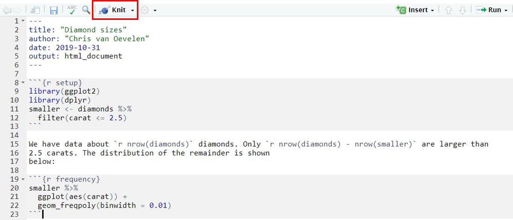
```

An R markdown file consist of different sections of code each marked with different characters: 

- The first **header** section starts and ends with ---
- Sections containing code (**chunks**) start and end with ```
- **Plain text** does not have marking characters
- Code within plain text starts and ends with `

To render an RMarkdown file (meaning to make an output file) simply click on the knit button located just above the RMarkdown file (see figure above). The output file will be shown in a separate RStudio panel. 

(4) Knit the RMarkdown file and take a close look at the output file.

The output document is saved in the same folder as the original RMarkdown file with the extension '.html'. This is the default output format but can be changed to, for example, a PDF or Word format.

IMPORTANT: by default the output file contains the code itself, messages and the output of the code. The default behavior of what to show in the output file can be changed and will be discussed later in this lesson. But first we will explain the lay-out of the RMarkdown file. 

## YAML header

The first section of the RMarkdown example is the YAML header. The YAML header provides general information of the output document:

- **title**: can be filled in when creating a new RMarkdown file.
- **author**: can be filled in when creating a new RMarkdown file.
- **date**: automatically set when creating a new RMarkdown file.
- **output**: by default RMarkdown creates an output file in HTML format. If you want another output format change output: to another file format such as PDF or Word (although you need additional packages).

If you want to make different RMarkdown output files from an existing RMarkdown, it is advisable to set the date in the YAML header as follows:

```{r eval = FALSE}
'`r Sys.Date()`'
```

This R function sets the current date. Note that the function is between a pair of single quotes and backticks (see also later in this lesson).

The YAML header provides many other options to control “whole document” settings. However, this is beyond the scope of this course.

###### Example

```{r echo = FALSE, comment = ""}
cat(htmltools::includeText("rmarkdown/lesson1_example1.Rmd"))
```

## Code chunks

The RMarkdown example above contains two chunks. A chunk is a section in the RMarkdown file containing the actual code. A chunk of code starts and ends with three backtick marks. To define the beginning of the code the three backtick marks are minimally followed with {r}. The r signals that the code is R. Remember that we can also use code of other languages such as bash or python. In that case the chunk header will be {bash} or {python}, respectively.

Within the {r} header, you can optionally provide a name of the header. In the example above, the first header is named "setup" and the second header is named "frequency". Naming chunks has the advantage that your RMarkdown becomes organized so that is will be easy to search for and navigate to a specific chunk. To search for a chunk, click on search button below the RMarkdown file (see figure below).

```{r echo=FALSE, message=FALSE, out.width = "50%", fig.align = "center"}
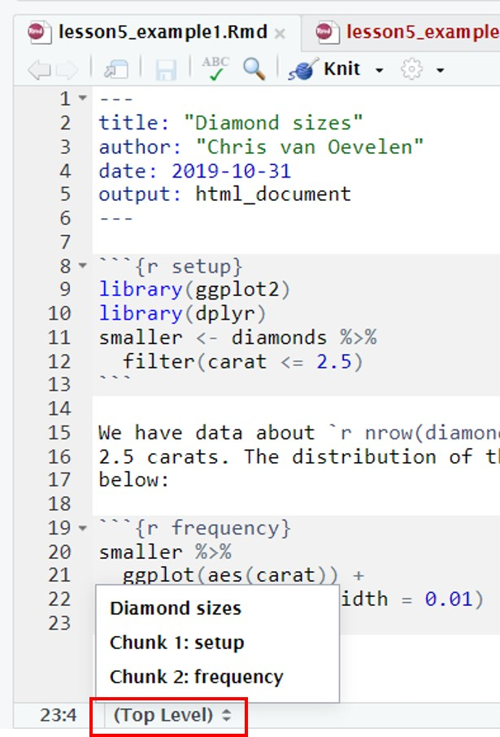
```

Another use of named chunks is to save figures. If a chunk creates a figure, the figure can also be saved separately on your server. This option will be discussed in the next section.

## Output control

When rendering an RMarkdown file, by default the R code in a chunk is executed and the output file will contain the code, messages and output of the code. Most often this is not what you want. (NB: plain text is always printed.)

To control what will be shown in the output file we will use chunk options. If you want to apply a similar set of options for all "chunks", you can use knitr::opts$set as shown below. Put this chunk, named 'setup' at the beginning of your RMarkdown file. The chunck options defined here will be generally applied to the whole document:

```{r echo = FALSE, comment = ""}
cat(htmltools::includeText("rmarkdown/lesson1_example2.Rmd"))
```


It is also possible to set options for a single chunk. Simply put the options in the header of the chunk you want to modify, as shown below. General chunk options as shown above will be overwritten by the single chunk options.

```{r echo = FALSE, comment = ""}
cat(htmltools::includeText("rmarkdown/lesson1_example3.Rmd"))
```

There are more than [60 options](https://yihui.org/knitr/options/) to add to a chunk header. Some of these options determine what happens with the chunk code:

- **eval** = FALSE: the code is not executed. The chunk code is shown in the output file. This is useful for displaying example code.
- **include** = FALSE: the code is executed, but the chunk code and all of its output (results, figures, messages and warnings) are not shown in the output file. This is useful for chunks performing data wrangling, for example data filtering or creating new variables, which are later used in graphs or summary tables.
- **echo** = FALSE: the code is executed, but the chunk code is not in the output file. All output of the chunk is shown in the output file. This is useful for showing the final results (graphs) of your data analysis and not how you achieved your results. Use this when writing reports aimed at people who do not want to see the underlying R code.

Note that the option "include = FALSE" [supresses](https://yihui.org/en/2017/11/knitr-include-false/) all output of a chunk. To specifically control what should not be be in the output file you can make use of the following options:

- **results** = "hide": the code is executed and the chunk code is shown in the output file. The results of R functions are not shown in the output file.
- **fig.show** = "hide": the code is executed and he chunk code is shown in the output file. Figures of R functions are not shown in the output file.
- **message** = FALSE: the code is executed and the chunk code is shown in the output file. R messages are not shown in the output file.
- **warning** = FALSE: the code is executed and the chunk code is shown in the output file. R warnings are not shown in the output file.

Table with different chunk output options. **yes** means present in the output file.

Option |	Run code |	Show code |	Output |	Plots |	Message |	Warning
:----|:-----|:---|:---|:---|:---|:---
eval = FALSE |	no |	**yes** |	no |	no |	no |	no
include = FALSE |	**yes** |	no |	no |	no 	| no |	no
echo = FALSE | 	**yes** |	no |	**yes** |	**yes** |	**yes** |	**yes**
results = "hide" |	**yes** |	**yes** |	no |	**yes** |	**yes** |	**yes**
fig.show = "hide" |	**yes** |	**yes** |	**yes** |	no |	**yes** |	**yes**
message = FALSE |	**yes** |	**yes** |	**yes** |	**yes** |	no 	| **yes**
warning = FALSE |	**yes** |	**yes** |	**yes** |	**yes** |	**yes** |	no

<div class="question">
##### Exercise `r les` {-}

(a) Modify RMarkdown file **lesson1_example1.Rmd** to only show the figure in the output file.
(b) Modify RMarkdown file **lesson1_example1.Rmd** to only show the chunk code in the output file (not the output of the chunks).

Save the Rmd files as **lesson1_exercise_1a.Rmd** and **lesson1_exercise_1b.Rmd** respectively in the server folder **daur/rmarkdown**.
</div>

<details><summary>Click for the answer</summary>

(a)
```{r eval = FALSE}
{r setup, echo = FALSE, message = FALSE}
{r frequency, echo = FALSE}
```
(b)
```{r eval = FALSE}
{r setup, message = FALSE}
{r frequency, fig.show = "hide"}
```
</details>

-------------

There are also several options for dealing with figure output and layout:

- **fig.width** = n and **fig.height** = n (where n is a number representing inches): to change the width and height of the figures in your output file.
- **fig.cap** = "name of the caption": to add a caption to the figure plot (a caption is a numbered label, such as "Figure 1").
- **fig.path** = "figures/": to create separate files of figures created by a chunk. First create a figures folder in the rmarkdown directory. The file containing the figure will be stored in this folder with a similar name as the chunk name.

<div class="question">
##### Exercise `r les` {-}

(a) Modify RMarkdown file lesson1_example1.Rmd to:

- Show only the figure in the output file.
- Modify the figure width to 6 and the height half of the width.
- The figure in the output file has an caption.

(b)

Modify RMarkdown file lesson1_example1.Rmd to:

- Show only the plain text.
- Save the figure in a separate file stored in the server folder daur/rmarkdown/figures.

Save the Rmd files as **lesson1_exercise_2a.Rmd** and **lesson1_exercise_2b.Rmd** respectively in the server folder **daur/rmarkdown**
</div>

<details><summary>Click for the answer</summary>

(a)
```{r eval = FALSE}
{r setup, echo = FALSE, message = FALSE}
{r frequency, echo = FALSE, fig.height = 3, fig.width = 6, fig.cap = "Figure1: Distribution of carat values"}
```
(b)
```{r eval = FALSE}
{r setup, include=FALSE}
{r frequency, include=FALSE, fig.path ="figures/"}
```
</details>

------------

In the RMarkdown output file, data frames (tibbles) are printed in the same way as you would see them in the RStudio console. To change this behavior, you can use the knitr::kable() function as demonstrated in RMarkdown file **lesson1_tables.Rmd**.

Open and knit this RMarkdown file. Study the code and the RMarkdown output format.

There is an example in the .Rmd file on how to make APA format tables.

## Plain text formatting

An RMarkdown document contains a YAML header and chunks of code to be executed. In addition, plain text can be added to describe your analysis, results or whatever you think is useful to understand your RMarkdown document. Plain text will always be shown in the output file (unless you put it in a chunk as comments, starting with a # sign).

The output of plain text can easily be formatted by a set of simple formatting rules:

- to print plain text in italics surround the text with 1 underscore: \_text\_ will become _text_.
- to print plain text in bold surround the text with 2 underscores: \_\_text\_\_ will become __text__.
- to print superscript use \^2\^: 10\^2\^ will become 10^2^.
- to print subscript use \~2\~:  H\~2\~O will become H~2~O.

To print headers use the pound sign in front of the header text:

\# 1st Level Header
\#\# 2nd Level Header
\#\#\# 3rd Level Header

A quick reference guide can be found in RStudio: *Help > Markdown Quick Reference*. A complete reference guide can be found in RStudio: *Help > Cheatsheets > R markdown Reference Guide*.

Within plain text, R code can be executed. To incorporate R code within plain text, use r code surrounded by backticks `. The code will be evaluated and printed in the output document. Note that the original code will not be shown in the output document!

<div class="question">
##### Exercise `r les` {-}

Modify RMarkdown document **lesson1_exercise_3.Rmd** to include:

- Plain text describing the source of the dataset. Write the package name in italics and the name of the dataset in bold.
- the sentence: "the infant mortality has dropped from ' [R code showing the max infant_mortality in 1960] ' in 1960 to ' [R code showing max infant_mortality in 2015] ' in 2015." NB: the parts between square brackets is R code you have to include; this R code will be evaluated within the plain text section after rendering the output file.

Save the RMarkdown file in the server folder **daur/rmarkdown** as **lesson1_exercise_4.Rmd**.
</div>

<details><summary>Click for the answer</summary>

```{r echo = FALSE, comment = ""}
cat(htmltools::includeText("rmarkdown/lesson1_exerciseAnswer2.Rmd"))
```

</details>

## Here package

To exemplify the idea of RMarkdown we have used a built-in dataset to show the different display options of code and output. However, most often you will refer to datasets or scripts in your RMarkdown file that are stored on the server. This will cause a problem because RMarkdown and knit will not search for files in the project folder but instead in the folder were the RMarkdown file is stored. To solve this problem we will make use of the "here" package.

In the beginning of this course we have created an Rproject and before each session you should open the Rproject you are working on. Within the project folder (in this case **daur**) you organize your data files, scripts files, RMarkdown files and output files in different folders (see figure below). By using an Rproject you are guaranteed that when executing R code / scripts from the server folder **scripts**, all of your (data) files are read in properly. This is because by definition, within your Rproject environment, R will set the working directory to the project folder and start looking for folders and files relative from the Rproject folder (the folder that contains the .Rproj file, in this case the daur folder).


```{r echo=FALSE, message=FALSE, out.width = "50%", fig.align = "center", fig.cap = "Data organisation on the server. Always create an Rproject to do data analysis."}
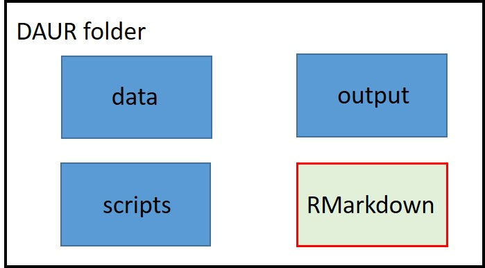
```

When using RMarkdown, the default behavior is to only look in the folder where the RMarkdown file is stored. This will cause errors when knitting an RMarkdown file because RMarkdown can not find the data files stored in the data folder outside the RMarkdown folder.

For example, you source (execute) a script from the **scripts** folder and this script imports a dataset present in the **data** folder. Because you work within your Rproject, R will start looking for folders and files relative to the project folder (in this case the daur folder). Contrary, if you are knitting an RMarkdown file and this RMarkdown imports a dataset present in the **data** folder, RMarkdown will only start looking in the RMarkdown folder and will never find the data folder. This will cause an error and the knitting of the RMarkdown document stops.

###### Example

Open via Rstudio the RMarkdown file **lesson1_here_example1.Rmd** present in server folder **daur/rmarkdown**. The file contains the following RMarkdown code:

```{r echo = FALSE, comment = ""}
cat(htmltools::includeText("rmarkdown/lesson1_example5.Rmd"))
```

Click on the knit button to render the output file. You will get the following error message:

```{r echo=FALSE, message=FALSE, out.width = "80%"}
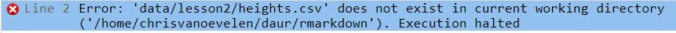
```

You notice that the current working directory is set to the **rmarkdown** folder. RMarkdown start looking for folder "data/lesson2/heights.csv" in this folder but can not find it. It throws an error and exits the knitting process.

To change the default behaviour of RMarkdown, we will use the **here** package. The **here** package recreates a file path to the Rproject folder. The **here** package is already installed on the server.

###### Example

In Rstudio, open the RMarkdown file **lesson1_here_example2.Rmd** present in server folder **daur/rmarkdown**. The markdown file contains the following RMarkdown code:

```{r echo = FALSE, comment = ""}
cat(htmltools::includeText("rmarkdown/lesson1_example6.Rmd"))
```

The output file will be displayed in a separate RStudio panel. In addition, an output file named **lesson1_here_example2.html** is created and saved in the **rmarkdown** folder.

<div class="question">
##### Exercise `r les` {-}

Use dataset **c10_gene_expression.txt** from the course data. This file contains gene expression values after 0h, 3h, 12, 24h and 48h (hours) of induction of the c10 celline. After induction, the cell undergoes a massive change in gene expression.

Show the genes that become highest upregulated after 48 hours (48h) of induction compared to the start condition (= 0h). Only list genes which have a difference of 8 or more between 48h and 0h.

Write an RMarkdown document. The RMarkdown document should contain:

- YAML header.
- Plain text describing the source of the dataset.
- Chunks containing R code to create a table of the highest expressed genes after 48h.

The RMarkdown output file only contains the table. Save the RMarkdown file in the server folder **daur/rmarkdown** as **lesson1_exercise_5.Rmd**.
</div>

<details><summary>Click for the answer</summary>

```{r echo = FALSE, comment = ""}
cat(htmltools::includeText("rmarkdown/lesson1_exerciseAnswer3.Rmd"))
```

</details>

## Creating a new RMarkdown file

To create your own Rmarkdown documents in RStudio, perform the following steps:

1. click *File > New File > R Markdown*.

```{r echo=FALSE, message=FALSE, out.width = "60%", fig.align = "center"}
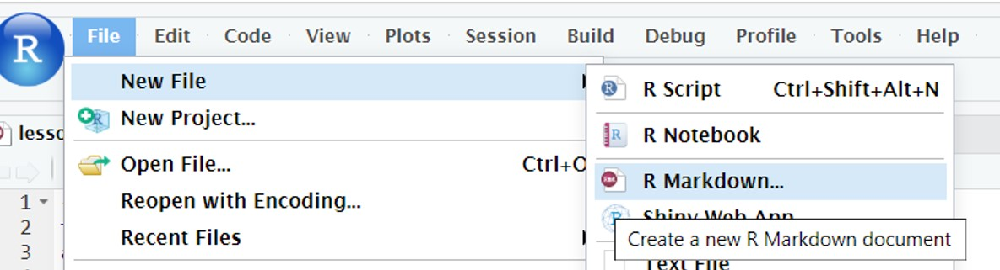
```

2. Fill out the Title and Author which will be displayed in the YAML header (this step is optional).

```{r echo=FALSE, message=FALSE, out.width = "60%", fig.align = "center"}
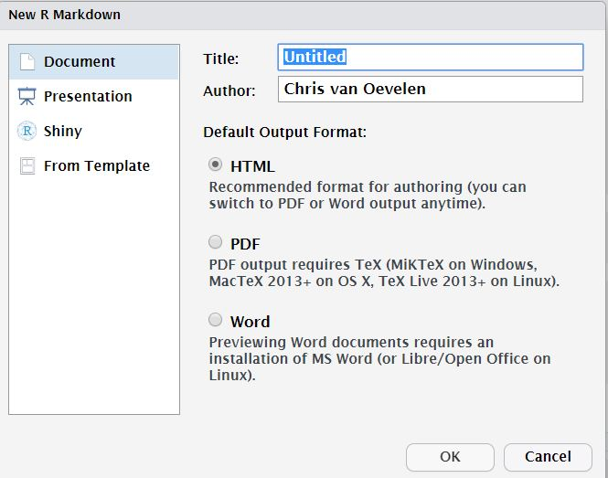
```

3. Click on OK. A default template will be opened in RStudio showing the YAML header and instruction on how to use RMarkdown:

```{r echo=FALSE, message=FALSE}

```

4. Remove the instructions but leave the YAML header.
5. Start writing your RMarkdown document.
6. Save your document in a folder called rmarkdown in your server project folder.
7. To render your RMarkdown document, click on the knit button.

<div class="question">
##### Exercise `r les` {-}

Create a new RMarkdown document. In this document, create R chuncks to perform the following tasks:

- Read in the dataset **c10_gene_expression.txt** from the course data.
- Convert this dataset to a tidy dataset. Set the time variable as a factor and set the levels of this factor in a logical order.
- Create a scatter plot (ggplot) that shows the results for the genes "Slfn4" and "Cd14".

The RMarkdown output file contains the code to make the scatter plot and the plot itself. All other R code used for data transformation and wrangling is not shown in the output file. Save the RMarkdown file as **lesson1_exercise_genexp.Rmd**.
</div>

<details><summary>Click for the answer</summary>

```{r echo = FALSE, comment = ""}
cat(htmltools::includeText("rmarkdown/lesson1_exerciseAnswer4.Rmd"))
```

</details>

<div class="dagopdracht">
Practice in the following week on building Rmarkdown reports with data chunks analysing a certain research question.

You can use the build-in datasets in R (type `data()` to see them)
</div>


<!--chapter:end:les1.Rmd-->

# Lesson 2 - Data types and structures in R

```{r include=FALSE}
load("course_urls.RData")
les <- 2
```


## Learning objectives

After this lesson:

-        

## Data in R

Yesterday we played around with vectors in R. Vectors are one of the simpelest ways to store information in R. But 
<div class="question">
##### Exercise `r les` {-} 

Use the built-in dataset gss_cat from the forcats package to answer the following questions. gss_cat is a sample of data from the General Social Survey, which is a long-running US survey conducted by the independent research organization NORC at the University of Chicago.

(a) Which variables are factors?
(b) What are the levels of the "marital" variable?
</div>

<details><summary>Click for the answer</summary>

(a)
```{r}
gss_cat
```
(b)
```{r}
levels(gss_cat$marital)
```
</details>

<div class="question">
##### Exercise `r les` {-} 

Run this code in R to create a tibble with categorical data:

```{r}
marital_status <- readRDS("data/lesson2/lesson2_exercise_8.2.rds")
```

The levels of this dataset are: "No answer", "Never married", "Separated", "Divorced", "Widowed" and "Married". Use this dataset and the levels to answer the following questions.

(a) Search for data values that are not in the level list.
(b) Correct the misspellings. 
(c) How many data values are in each of the categorical levels?
</div>

<details><summary>Click for the answer</summary>

(a)
```{r}
marital_levels <- c("No answer", "Never married", "Separated", "Divorced", "Widowed", "Married")
parse_factor(marital_status$marital, levels = marital_levels)
```
(b)
```{r}
marital_status$marital[1001] <- c("Divorced")
marital_status$marital[5001] <- c("Married")
marital_status$marital[10001] <- c("Never married")
```
(c)
```{r}
marital_status %>% count(marital)
```
</details>

<div class="tip">
Always think about the variables in your dataset. Are they categorical, continuous or discrete? Let's say we test different variables in the people in this class:

 - **continuous variables**: numeric variables that can have any value between any two values. Examples: the hair length (can be anything from 0 to let's say 400 cm, including for instance 15,36791 cm.), body temperature, pH of a magic potion.
 - **discrete variables**: also numbers, but these numbers can't be anything between certain limits. They have discrete options. Typically, this is count data, but not always. For instance: the number of people wearing blue shirts (can be 3, 5 or 8, but can't be 5,36791 or 2,6), the result of rolling a die.
 - **categorical variables**: contain a finite number of categories or distinct groups. For instance, eye colour (blue, brown, green, grey, etc), home town (Utrecht, Amsterdam, Zuidlaren, etc), marital status (married, unmarried).

When you are working with a categorical variable, do store it as a factor! R will then recognise it being categorical, and handle it as such when doing calculations or making plots. 
</div>

## Oefenopdracht (thuis) 

<div class="dagopdracht">

Maak de onderstaande opdrachten m.b.v. R. Noteer de gebruikte R code in een R script. Zorg ervoor dat je de code voorziet van uitleg in de vorm van comments (regels die beginnen met `#`) en dat je ook de antwoorden op de vragen in de vorm van comments in het R script noteert. Komende les bespreken we deze opdracht.

1.	In deze opdracht ga je werken met de Glass dataset. Deze dataset is een onderdeel van de `mlbench` package. Dit package is al geïnstalleerd. 

    a.	Laad het package in R m.b.v. de `library()` functie.
    b.	Open de Glass dataset in R via deze regel code: `data(Glass)`.    

2.	Nu je de dataset hebt geopend in R, kun je informatie over de dataset gaan verzamelen:

    a.	Wat voor data type (vector, list, data.frame, tibble etc.) is de Glass dataset?
    b.	Wat zijn de dimensies (aantal rijen/kolommen) van de Glass dataset?
    c.	Gebruik de help functie om informatie te vinden over de Glass dataset. Beschrijf kort in eigen woorden wat voor data deze dataset bevat.     

3.	We gaan nu twee kleinere datasets maken uit de Glass dataset:

    a.	Maak een nieuwe dataset met daarin alleen de data voor glastype 1. Je kunt hiervoor de volgende code gebruiken: `glass1 <- Glass[Glass$Type == 1,]`. 
    b.	Maak ook een nieuwe dataset met daarin alleen de data voor glastype 5. Pas hiervoor de code zoals genoemd bij vraag (a) aan. 
    c.	Hoeveel metingen (= aantal rijen) zijn er gedaan voor glastype 1? En hoeveel metingen voor glastype 5?    
    
4.	We willen kijken wat de verschillen zijn tussen glastype 1 en glastype 5:

    a.	Wat is het gemiddelde ijzergehalte voor glastype 1? En wat is het gemiddelde ijzergehalte voor glastype 5? 
    b.	Wat is het minimale siliciumgehalte van glastype 5? En wat is het maximale siliciumgehalte van glastype 5?
    c.	Is er een verschil in brekingsindex tussen glastype 1 en 5? Beargumenteer je antwoord. Bereken hiervoor de gemiddelde waarden en de standaardafwijking (`sd` functie in R). 
    d.	Maak een tibble waarin je de resultaten van opgave 4c samenvat. De kolommen van de tibble zijn ‘glastype’, ‘brekingsindex_gemiddelde’, en ‘brekingsindex_stdev’. 


</div>


## Overview R functions first two lessons


#### To create an object 

function | package
:------ | :--------
c()       | base
list()    | base
data.frame() | base
tibble()  | tibble
as_tibble() | tibble
factor() | forcats

#### To inspect type of datastructure 

function | package
:------ | :--------
is.vector() | base
is.data.frame() | base
is.list() | base
is_tibble() | tibble
typeof() | base
str() | utils
class() | base
parse_factor() | readr

#### Properties of object

function | package
:------ | :--------
dim() | base
length() | base
nchar() | base

#### View contents of object

function | package
:------ | :--------
View() | utils
names() | base
head() | utils
tail() | utils

#### Arithmetic

function | package
:------ | :--------
sum() | base
mean() | base
median() | stats
summary() | base
na.omit() | stats
min() | base
max() | base
runif() | stats
seq() | base
count() | tidyverse

#### Data transformation

function | package
:------ | :--------
sort() | base
paste() | base
paste0() | base
append() | base


<!--chapter:end:les2.Rmd-->

# Lesson 3 - Importing data & tidy data

```{r include=FALSE}
load("course_urls.RData")
les <- 3
```

```{r echo=FALSE, message=FALSE, out.width = "50%", fig.align = "center"}
knitr::include_graphics("images/03_01_tidy.jpg")
```

## Learning objectives

After this lesson:

- You can import data into the R environment
- You know how to inspect your data
- You can make your data "tidy"

## Importing text files

So far, we have worked with built-in datasets. In real life you will generate data yourself or you will obtain data from other researchers or public sources such as [NCBI](https://www.ncbi.nlm.nih.gov/).

To start working with your own datasets, data needs to be read by R and stored as R objects. We can use a variety of  `read_function()` from the the [tidyverse](https://www.tidyverse.org/) packages to import plain text datafiles as tibbles (sort of like a data table). These functions work the same. If you have mastered one  you can use the other functions in a similar way:

```{r eval=F}
read_csv()       ## comma separated values
read_csv2()      ## semicolon separated values
read_tsv()       ## tab separated values
read_delim()     ## custom defined delimiter, for example: 
read_delim("voorbeeld.csv", delim="&")
read_fwf()       ## fixed width fields
read_table()     ## white space separated 
```

### separators 

Before choosing the right `read_function()` you need to know how the values of your dataset are separated. 

You can view files by clicking on them in the files tab (lower right corner of the screen). 
```{r echo=FALSE, message=FALSE, out.width = "80%"}
knitr::include_graphics("images/01_3_Rstudio.jpg")
```

**Navigate to the folder data/lesson3.**

**try clicking on a few txt files and inspect what they look like.**

**click on heights.csv, select view**

Values of the heights.csv file are separated by comma's. Even though the filename ends on csv (comma separated values) always inspect the contents of a datafile before loading it into R! 

We can use the read_csv() function:

###### Example
```{r}
library(tidyverse)
heights <- read_csv("data/lesson3/heights.csv")
```

you can view the data by typing the object name in the console (or in a script and run that line):

```{r, eval=F}
heights
```

R assumes the decimal separator is a "point". If your datafile has a comma as a decimal separator (most european datafiles) you have to tell the `read_function()` this!

We will use a datafile which is present in the server folder **data/lesson3** named **heights3.txt**. Inspect the datafile heights3.txt. As you can see, 
the values are tab separated and the decimal separator is a comma.

We will first use the `read_tsv()` function with default settings:

###### Example
```{r}
heights_3 <- read_tsv("data/lesson3/heights3.txt")
heights_3
```

The values of variable height are not shown correctly:

* row1 original value = 74,4244387818035. 
* row1 converted value = 7.44e14

We have to instruct `read_tsv()` that the comma acts a decimal separator by using the locale argument in combination with the `locale()` function:

###### Example
```{r}
heights_3 <- read_tsv("data/lesson3/heights3.txt", 
                      locale = locale(decimal_mark = ","))
heights_3
```

Now the values of the height variable are read in correctly.

### extracting numbers
The `read_function()` (in this case `read_tsv`) guesses the datatype of each column and tries to read and convert the data in the right format. A problem you might encounter are numbers surrounded by non-numerical characters such as % of currency characters. For example $1,23 or 31%. To extract only the number we can use two options:

* The function `parse_number()`
* The argument **col_types** in combination with the `function cols()`.  

To demonstrate number extraction out of a character value we will use file **dollar.txt** in the server folder **data/lesson3**

###### Example
```{r}
dollar <- read_tsv("data/lesson3/dollar.txt")
dollar                                        # variable amount is of data type character (chr)
parse_number(dollar$amount[1])            # parse_number() extracts numeric value out of $100 
dollar$amount <- parse_number(dollar$amount)  # replace all character strings for numeric values of the variable "amount"
dollar                                        # check that numeric values are extracted and returned 
```

The alternative solution is to use the `read_function()` and change the **col_types** argument.  The **col_types** argument is used in combination with the `col()` and the `col_number()` function (of which the latter is equivalent to the `parse_number()`  function). The `col()` function is used to  select all variables and the `col_number()` function is used to select a specific variable (in this case "amount") to extract the number out of a character vector.

###### Example
```{r}
dollar_2 <- read_tsv("data/lesson3/dollar.txt",  col_types = cols(amount = col_number()))
dollar_2  # numeric values are extracted and returned . Data type is double (dbl)
```

<div class="question">
##### Exercise `r les` {-} 

Import data datafile heights4.txt in server folder data/lesson3 into R.
</div>

<details><summary>Click for the answer</summary>
```{r}
heights4 <- read_delim("data/lesson3/heights4.txt", delim="@", locale = locale(decimal_mark = ","))
heights4
```
</details>

<div class="question">
##### Exercise `r les` {-} 

Import data datafile salary.csv in server folder data/lesson3 into R. 

Convert character vectors with numbers to numeric values only. The thousand separator is a dot !
</div>

<details><summary>Click for the answer</summary>
```{r}
salary <- read_csv2("data/lesson3/salary.csv", 
                   col_types = cols(Salary_2018 = col_number(), 
                                    Increase_in_salary_2018 = col_number()))
salary
```
</details>


## Setting variable (column) names

By default `read_function()` uses the first line of a dataset as variable names (column names). 

There are two situations where we have to change the behaviour of the `read_function()`

<div class="tip">
If a dataset doesn't contain variable names (=column names) use the option col_names = FALSE.
</div>

The first line of the dataset will be ignored as variable names. The columns will be labelled automatically from X1 to Xn. If you want to manually add variable names you can provide a vector with the variable names tot the col_names option: col_names = c("variable_name1", "variable_name2", "variable_name3")

Download dataset [heights1.csv](downloaddata/heights1.csv) and move the file to the server folder data/lesson3. To move files between the server and your computer:

**Go to the server, select the folder you want to upload something to.**

**click on Upload**

```{r , echo=FALSE, message=FALSE, out.width = "60%"}
knitr::include_graphics("images/03_3_uploadles.PNG")
```

**In the upload menu, click Choose File and select heights.csv where you just downloaded it.**

**inspect heights.csv**

This file lacks variable names:

###### Example
```{r include=FALSE}
heights_1 <- read_csv("downloaddata/heights1.csv", col_names = FALSE) 
```
```{r eval=FALSE}
heights_1 <- read_csv("data/lesson3/heights1.csv", col_names = FALSE)  # first line will not be used as variable names 
```
```{r}
head(heights_1)
```

```{r include=FALSE}
heights_1_1 <- read_csv("downloaddata/heights1.csv",  col_names = c("name1", "name2", "name3", "name4", "name5", "name6"))  
```
```{r eval=FALSE}
heights_1_1 <- read_csv("data/lesson3/heights1.csv",  col_names = c("name1", "name2", "name3", "name4", "name5", "name6"))  
# added custom variable names by providing a vector containing the names of the variables
# in this case: "name1, name2  name3 etc"
```
```{r}
head(heights_1_1)
```

Variables names can always be modified by using:

* The function `colnames()`
* The function `rename()`


###### Example
```{r eval=FALSE}
heights_1 <- read_csv("data/lesson3/heights1.csv", col_names = FALSE) 
```
```{r}
colnames(heights_1)<- c("name1", "name2", "name3", "name4", "name5", "name6")   # change all column names 
colnames(heights_1)[3] <- "new_name3"   # change the name of a specified column using an index
heights_1_1 <-rename(heights_1_1,  new_name4 = name4) # change the name of a specified column using rename() 
```

<div class="tip">
**(2) if variable names are present but not at the first line use te options skip=N or comment = "#"**
</div>

Download dataset [heights2.txt](downloaddata/heights2.txt) and move the file to the server folder data/lesson3. This file contains variable names but not at the first row. Note that the values are separated by tabs!

**First we have to inspect the datafile: click on the file.**

The first two lines are comments starting with the # sign. The variable names are present at row3.  To read in the file we will use read_tsv()

###### Example
```{r include = FALSE}
heights_2<-read_tsv("downloaddata/heights2.txt", skip = 2) 
```

```{r eval=FALSE}
heights_2<-read_tsv("data/lesson3/heights2.txt", skip = 2) # first two rows are not imported in object heights_2
```
```{r}
heights_2
```

Alternatively we can use the comment = "#" option

###### Example
```{r include = FALSE}
heights_2<-read_tsv("downloaddata/heights2.txt", comment = "#")
```
```{r eval=FALSE}
heights_2<-read_tsv("data/lesson3/heights2.txt", comment = "#")      ## lines starting with a # sign are ignored for read in
```
```{r}
heights_2
```

<div class="question">
##### Exercise `r les` {-}  
Import datafile iris in server folder data/lesson3 into R.

This file lacks column names and starts with comments. Import the datafile without the comment lines and add columns names "Sepal.Length", "Sepal.Width",  "Petal.Length", "Petal.Width", "Species" to the imported dataset.
</div>

<details><summary>Click for the answer</summary>
```{r}
iris_flower<-read_tsv("data/lesson3/iris",
           comment = "#",
           col_names = c("Sepal.Length", "Sepal.Width", "Petal.Length", "Petal.Width", "Species"))
```
</details>


## Importing Excel files

To import Excel files directly into R we can use `read_excel()` function of the readxl package which is part of tidyverse. When Using `read_excel()` Excel datasheets will be converted to a tibble. `read_excel()` reads both xls and xlsx files and detects the format from the extension.

More information about the readxl package can be found at [tidyverse.org](https://readxl.tidyverse.org/)

NOTE: Sometimes it's more convenient to organise your data in Excel and copy the values as plain text in a text editor such as notepad. Subsequently, import the file using the appropiate read_function() described on the previous page.


###### Example
```{r}
library(tidyverse)
library(readxl)                               # you have to explicity load the readxl library
excel_sheets("data/lesson3/datasets.xlsx")    # inspect how many datasheets are present in the excel file
                              
datasets_iris<-read_excel("data/lesson3/datasets.xlsx")    # default behaviour is to import the first datasheet. 
```

Excel files can have multiple datasheets. To specifically select a datasheet use the sheet = "sheetname" or sheet = number option

###### Example
```{r}
datasets_mtcars<-read_excel("data/lesson3/datasets.xlsx", sheet = "mtcars")  # select Excel datasheet named "mtcars"
datasets_quakes<-read_excel("data/lesson3/datasets.xlsx",  sheet = 4)        # select the 4th Excel datasheet (= "quakes")
```

Datafiles in Excel might not always contain column names (=variable names). If the first row doesn't contain column names we have to tell read_excel() to treat the first row as values and not as variable names by using the col_names=FALSE option. 

###### Example
```{r}
datasets_iris_2<-read_excel("data/lesson3/datasets.xlsx", sheet = 5, col_names = FALSE) 
```

If you want to rename the column names you can use the rename() or the colnames() functions (see [Setting variable (column) names])

<div class="question">
##### Exercise `r les` {-} 
Import sheet "quakes_1" from datafile datasets.xlsx  in server folder data/lesson3 into R. Column names are not listed in datasets.xlsx. Import the datafile and add columns names "lat" "long" "depth" "mag" "stations" to the imported data.
</div>

<details><summary>Click for the answer</summary>
```{r}
library(readxl)
read_excel("data/lesson3/datasets.xlsx",
    sheet = "quakes_1",
    col_names = c("lat", "long", "depth", "mag", "stations"))
```
</details>

## Saving and importing R_Objects

* To import data in plain text  format we use the function read_function() 
* To import data in Excel format we use the function read_excel()

It is also possible to save an R object directly to the server and to read the file from the server in the R environment:

To save an R object to the server use the function `saveRDS()`

To import data that is stored as an R object we make use of the function `readRDS()`

###### Example
```{r eval=FALSE}
library(dslabs)                              # we will use a dataset called olive from the dslabs package                       
View(olive)
saveRDS(olive, "data/lesson3/olive.rds")     # object olive is saved as file olive.rds in server folder data/lesson3   
```

To import this R object from the server into RStudio use `readRDS()`. This function takes 1 argument. Assign the R object from the server to a new object name in Rstudio!

###### Example
```{r eval=FALSE}
olive_from_server <- readRDS("data/lesson3/olive.rds")                    ## the path to the file must be quoted
```

## Inspecting your data

Data wrangling: the process of transforming and mapping data from a "raw" data format into another format with the intent of making it more appropriate and valuable for a variety of downstream purposes such as analytics and visualization ([wikipedia] (https://en.wikipedia.org/wiki/Data_wrangling))

The first step in data wrangling is to inspect the structure of the dataset.  We've already seen some functions to inspect the data. Important questions are:

* What is the datastructure?
* How many variables does the dataset contain?
* What are the names of the variables?
* What are the data types of the variables?
* What are possible categories (factors)?
* What are the levels of the categories?
* Are there NA values?
* Is the data **tidy**?

Let's recall some previously used functions to inspect the data. We will use data from the "dslabs" package.

###### Example
```{r message=FALSE}

library(tidyverse)
library(dslabs)
```
```{r eval=FALSE}
?divorce_margarine      # information about the divorce_margarine dataset from the "dslabs" package
```
```{r message=FALSE}
divorce_margarine_tbl <- as_tibble(divorce_margarine)      # converting dataframe to tibble                    
divorce_margarine_tbl 
```


Let's inspect another dataset from the dslabs package: gapminder

###### Example
```{r eval=FALSE}
?gapminder                                       # information about the "gapminder" dataset
```

```{r}
gapminder_tbl <- as_tibble(gapminder)            # converting dataframe to tibble
gapminder_tbl
levels(gapminder_tbl$continent)                # categories in the continent variable
sum(is.na(gapminder_tbl$infant_mortality))   # count the missing (NA) values
```

The last question of the inspection list is:

Is the data **tidy**?

Before we can answer this question we have to know what tidy data is.

***

## What is tidy data?

Tidy data is a way of organising your data in a neat and structured way. If you make your data tidy, it is ensured that it is compatible with data analysis tools from the [tidyverse](https://www.tidyverse.org/) package. A detailed explanation can be found in [chapter12](https://r4ds.had.co.nz/tidy-data.html) in the e-book R for Data Science

However, it is important to note that data does not always need to be tidy. Other R packages require different data organisation formats!

So what is tidy data:

1. Each variable must have its own column.  
1. Each observation must have its own row. 
1. Each value must have its own cell.

*Table1: Example of tidy data*

| country 	| year 	| population 	| birth rate 	|
|:---------	|:-----	|:----------	|:-----------	|
| mali    	| 2001 	| 10.000.000 	| 6.88       	|
| mali    	| 2010 	| 15.000.000 	| 6.06       	|
| sweden  	| 2001 	| 9.000.000  	| 1.57       	|
| sweden  	| 2010 	| 10.000.000 	| 1.85       	|


Each variable must have its own column.  

```{r , echo=FALSE, message=FALSE, out.width = "60%"}
knitr::include_graphics("images/03_4_tidy1.jpg")
```

Each observation must have its own row. 

```{r , echo=FALSE, message=FALSE, out.width = "60%"}
knitr::include_graphics("images/03_5_tidy2.jpg")
```

Each value must have its own cell.

```{r , echo=FALSE, message=FALSE, out.width = "60%"}
knitr::include_graphics("images/03_6_tidy3.jpg")
```

So the following table would by untidy, as there are multiple observations per row:

*Table2: Example of untidy data*

| student  	| EDCC 	| molbio 	| immunologie 	| BID 	|
|:----------	|:------	|:--------	|:-------------	|:-----	|
| Pietje   	| 7.5  	| 6      	| 8.2         	| 8   	|
| Marietje 	| 8    	| 7.9    	| 5           	| 9   	|


This would be the tidy version:

*Table3: Example of untidy data made tidy*

| student  	| course      	| grade 	|
|:----------	|:-------------	|:-------	|
| Pietje   	| EDCC        	| 7.5   	|
| Pietje   	| molbio      	| 6     	|
| Pietje   	| immunologie 	| 8.2   	|
| Pietje   	| BID         	| 8     	|
| Marietje 	| EDCC        	| 8     	|
| Marietje 	| molbio      	| 7.9   	|
| Marietje 	| immunologie 	| 5     	|
| Marietje 	| BID         	| 9     	|

<div class="question">
##### Exercise `r les` {-}    {#onderzoektidyvraag}
The package tidyverse contains the built-in datasets:

* table1
* table2
* table3
* table4a
* table4b

Write code to inspect the data and argue if the tables are tidy
</div>

<details><summary>Click for the answer</summary>

To inspect for instance **table1**, just write `table1` in the console window.

There are three rules to make a dataset tidy:

* Each variable must have its own column.
* Each observation must have its own row.
* Each value must have its own cell.

**table1**: tidy

**table2**: non-tidy, violation of rule2. An observation is a country in a year, but each observation is spread across two rows.

**table3**: non-tidy, violation of rule3. The "rate" column contains both cases and population variables

**table4a/b**: non-tidy, violation of rule 1 and 2. The column names "1999" and "2000" represent values of the year variable, and each row represents two observations, not one.
</details>

## Making your data tidy: gathering

In [this exercise](#onderzoektidyvraag) we noted that table4a is not tidy: the column names '1999' and '2000' represent values of the year variable, and each row represents two observations, not one.

```{r , echo=FALSE, message=FALSE, out.width = "80%"}
knitr::include_graphics("images/03_7_nontidy_table4a.jpg")
```

To merge columns '1999' and '2000' into 1 column we can use the tidyverse function `pivot_longer()`:

```{r}
table4a_tidy <- pivot_longer(data = table4a, cols = c('1999', '2000'),  
                             names_to = "year",  values_to = "cases")
table4a_tidy
```

Alternatively we can use the pipe to redirect data to the `pivot_longer()` function:

###### Example
```{r}
table4a_tidy <- table4a %>% pivot_longer(cols = c('1999', '2000'),  
                                         names_to = "year",  values_to = "cases")
```


<div class="rstudio-tip">
Important: from now on we will often use the pipe %>% to redirect data into an R function: 
</div>

The %>% pipe symbol can be read as "followed by". The %>% symbol directs the **OUTPUT** of one R function as **INPUT** to the following R function.

dataset %>% function() %>% function() .. and so on

This way the steps of data manipulation are easier to follow for the reader. It is good practice to write clean / clear code that can be understand by other people. 


<div class="question">
##### Exercise `r les` {-} 
(a) Import datafile the first sheet gene_expression_c10.xlsx into R (it is already in the server folder data/lesson3)

(b) What are the dimension of the dataset?
</div>

<details><summary>Click for the answer</summary>
```{r}
#(a)
library(readxl)
gene_expression <- read_excel("data/lesson3/gene_expression_c10.xlsx")

#(b)
dim(gene_expression) # or look in the environment panel, upper right part of the screen
```
</details>

<div class="question">
##### Exercise `r les` {-} 
(a) Make the dataset of exercise_5.1 tidy

(b) What are now the dimension of the tidy dataset?
</div>

<details><summary>Click for the answer</summary>
```{r}
#(a)
gene_expression_tidy <- pivot_longer(data = gene_expression,
                                     cols = c('0h', '3h','12h', '24h', '48h'), 
                                     names_to = "time(hrs)", 
                                     values_to = "expression")
# or: 
gene_expression_tidy <- gene_expression %>% 
  pivot_longer(cols = c('0h', '3h','12h', '24h', '48h'), 
               names_to = "time(hrs)", values_to = "expression")

#(b)
dim(gene_expression_tidy)
```
</details>

## Making_your_data_tidy: spreading

In the [this exercise](#onderzoektidyvraag) we noted that table2 is not tidy: 2 row represents 1 observation.

```{r , echo=FALSE, message=FALSE, out.width = "60%"}
knitr::include_graphics("images/03_8_nontidy_table2.jpg")
```

Note that variable column "Type" contains the names of the variables "Cases" and "Population". This is the reason that two rows represent 1 observation. 

To merge the two rows, representing 1 observation, into 1 row we use the tidyverse function `pivot_wider()`. 

```{r}
table2_tidy <- pivot_wider(data = table2, names_from = "type", values_from = "count")
table2_tidy
```

Alternatively we can use the pipe to redirect the data to the pivot_wider() function:

###### Example
```{r}
table2_tidy <- table2 %>% pivot_wider(names_from = "type", values_from = "count")
```

<div class="question">
##### Exercise `r les` {-} 

(a) Import the second data sheet from datafile gene_expression_c10.xlsx (from the previous question, in server folder data/lesson3) into R

(b) Make the dataset tidy

</div>

<details><summary>Click for the answer</summary>
```{r}
#(a)
gene_expression_sheet2 <- read_excel("data/lesson3/gene_expression_c10.xlsx", sheet=2)

#(b)
gene_expression_sheet2_tidy <- pivot_wider(data = gene_expression_sheet2, 
                                           names_from = "assay", 
                                           values_from = "value")
# or: 
gene_expression_sheet2_tidy <- gene_expression_sheet2 %>% 
  pivot_wider(names_from = "assay", values_from ="value")
```
</details>


## Making_your_data_tidy: separate

In [this exercise](#onderzoektidyvraag) we noted that **table3** is not tidy: 2 values are present in 1 cell.

###### Example
```{r}
table3
```

To separate the values in two cells we use the tidyverse function `separate()`:

```{r}
table3_tidy <- separate(table3, rate, into = c("cases", "population"))
table3_tidy
```

The original variable "rate" contained "character" values, namely the two combined values separated by a forward slash. After the separation each new column ("cases" and "population") contain **numeric** values but the value types are still denoted as **characters**. To convert the character values into numeric values we use the **convert** option. 

###### Example
```{r}
table3_tidy <- separate(table3,  rate,  into = c("cases", "population"), convert = TRUE)
```

Normally you have to specify where the values need to be separated. In this case the forward slash character ("/"). The default option of the `separate()` funtion is to separate values based on any non-alphanumeric character (i.e. a character that isn’t a number or letter).  It is good practice though to write the separation character explicity in your code by using the sep="character" option. 

###### Example
```{r}
table3_tidy <- separate(table3, rate, into = c("cases", "population"), convert = TRUE,  sep = "/")
```

By using the **sep=** option we can also split values based on the a specific **number** of characters. For example we want to use the first three character of each country in our column instead of the full names. We can split the country names by the first three characters. 

###### Example
```{r}
# only 1 variable is defined: first 3 characters are stored in variable "country" replacing the original variable "country"
separate(table3_tidy, country, into = c("country"), sep = 3)
```


<div class="question">
##### Exercise `r les` {-} 

(a) Import datafile gene_expression_c10 (the one without the .xlsx) in the server folder data/lesson3 into R. The data colums are separated by a semicolon. 

(b) Make the dataset tidy

</div>

<details><summary>Click for the answer</summary>
```{r}
#(a)
gene_expression_1 <- read_csv2("data/lesson3/gene_expression_c10")

#(b)
gene_expression_1_tidy <- separate(gene_expression_1, "0h-3h-12h-24h-48h",
                             into = c("0h", "3h", "12h", "24h", "48h"),  sep = "!",  convert = TRUE)
# or: 
gene_expression_1_tidy <- gene_expression_1 %>% separate("0h-3h-12h-24h-48h",
                             into = c("0h", "3h", "12h", "24h", "48h"),  sep = "!",  convert = TRUE)
```

First we separate the values in 5 new variables. But the data is not tidy yet. We have to apply the function `pivot_longer()` because the new variables are not true variables but values of the variable "time_after_induction"
```{r}
gene_expression_1_tidy2 <- gene_expression_1_tidy %>%  pivot_longer(
  cols = c('0h', '3h', '12h', '24h', '48h'),
  names_to = "time_after_induction", values_to = "gene_expression")
```

</details>

## Checking normality

An important part of data analysis is to perform a statistical test to demonstrate that differences between experimental conditions are significant. In this course we will show how to perform a range of statistical test in R. These tests have been explained in detail in the 2nd year course TLSC-BID3V-17_Dataverwerking (see the figure below) and will only be briefly discussed again during this course. You previously executed them in SPSS or Excel, now we will show how to do them in R.

<div class="tip">
If you realise you have quite forgotten what you learned in TLSC-BID3V-17_Dataverwerking and/or TLSC-EV1V-17, revisit the course content and refresh your knowledge! 

BID: canvas should be still up

EV1V: [click here for online reader](https://lesmaterialen.rstudio.hu.nl/statistiek-en-excel-reader/)
</div>

```{r flowscheme, echo=FALSE, message=FALSE, out.width = "80%", fig.cap = "Decision scheme for statistical testing"}
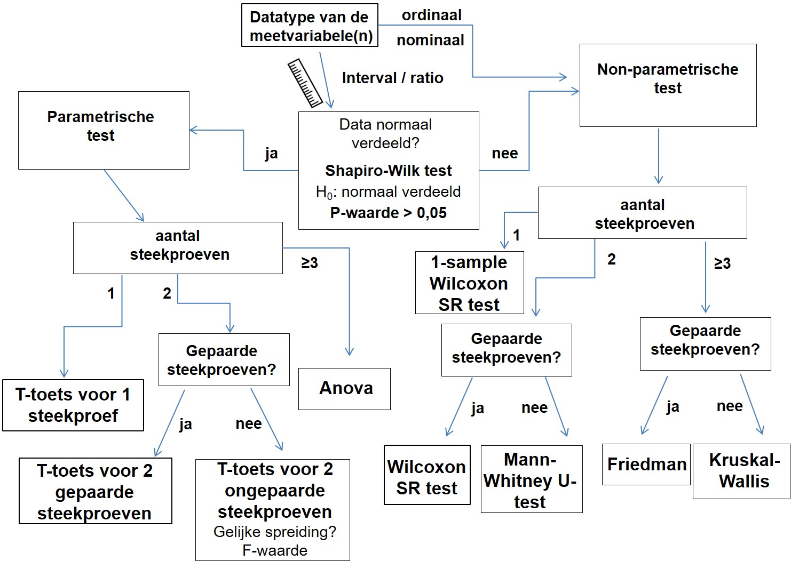
# linkin: This is a figure \@ref(fig:flowscheme)
```

<div class="tip">
Non-parametric tests in R actually just use the exact same syntax (way of writing the code) as the parametric equivalent, but using a different function name. Therefore, we will only cover the parametric tests within this course, en provide you with a table of non-parametric equivalent function names. 
</div>


The most common parametric statistical tests rely on the assumption that the residuals are normally distributed. (Not a clue what we're talking about? Check the 1th year course on statistics [here](https://lesmaterialen.rstudio.hu.nl/statistiek-en-excel-reader/meten.html#eerstekeernorm) and also [here](https://lesmaterialen.rstudio.hu.nl/statistiek-en-excel-reader/kansverdeling.html#andere-verdelingen)).

In the cases you will encounter here, this just means the same as the data within each group or variable coming from a population with a normal distribution. You will have learned in the 2nd year course on dataverwerking to perform a **Shapiro-Wilk test** to check this assumption when dealing with interval / ratio data. If any variable or any group data column is not normally distributed, Shapiro-Wilk test will give you a p-value below 0.05 and you have to make use of a non-parametric test.


<div class="tip">
The Shapiro-Wilk test is used to determine whether your data are is normally distributed.
</div>

First, let's perform a Shapiro-Wilk in R:. 

To analyze the normality of a dataset is we will make use of the Shapiro-Wilk test (see figure 2). A statistical test serves to either accepts or reject the null-hypothesis. In the case of the Shapiro-Wilk test the null-hypothesis (H0) is defined as:

* H0: the sample came from a population that is **not different from** a normally distributed population.
* H1: the sample came from a population that **is different from** a normally distributed population.

This means that if the p-value is > 0,05 the H0 is accepted and we are allowed to perform a parametric test. (So in contrast to most statistical tests, we generally "want" a p>0.05 here...) It is important to note that all variables being compared must be normally distributed in order to perform a parametric test. 

So if you want to investigate the correlation between the length of ears and the maximum running speed in rabbits, both your columns with data on ear length and maximum running speeds need to be "passing the Shapiro Wilk test" if you want to do parametric tests. 

And if you are interested in investigating whether mice who inhaled cigarette smoke for quite a while differ in stamina from a control group of mice, you will perform the Shapiro Wilk test on the data from both groups.  

<div class="tip">
Remember null hypothesis testing from previous statistics courses:

 - The H0 (null hypothesis) generally states that there is **no** effect or difference.
 - The p-value gives you the probability of seeing the data when the H0 would be true.
 - If the p-value is below a value you agreed on before doing the testing ($alpha$, generally 0.05) then you reject the H0. So, for example in a two sample design: if the data was very, very unlikely (low p-value) in the situation that there is no actual difference between groups (H0), we should reject the idea that there is no actual difference between groups (reject H0) and accept that there is probably a difference between groups (alternative hypothesis, H1).
 - so: if p<0.05, there is a significant effect/difference/etc.
 - so: if p>0.05, we cannot say there is a significant effect/difference/etc.
</div>


***
To perform the Shapiro-Wilk test of normality for one variable at a time, use the function `shapiro.test()`. 

The function `shapiro.test()` takes a numeric vector as input and performs the shapiro-wilk test.

The output of shapiro.test() is a list with fixed column names:

> [1] "statistic" "p.value" "method" "data.name"

***

Let's demonstrate the shapiro-wilk test with a dataset named **smoking** present in server folder **"data/lesson3"**. The smoking dataset is an unpaired experiment containing two different mice groups: control mice ("Controle") and a group of mice continuously exposed to cigarette smoke ("Rook"). The measurement values represent minutes of swimming until exhaustion. 

###### Example
```{r, message=F, error=F}
library(tidyverse)
smoking <- read_tsv("data/lesson3/smoking")
smoking #remember there are more rows, you only get shown the first few
```

To perform a Shapiro-Wilk test, simply type:
```{r, message=F, error=F}
shapiro.test(smoking$Controle)

shapiro.test(smoking$Rook)
```

Both variables of the dataset "smoking" have a p-value > 0,05 meaning we can perform a parametric test. 

## map functions
In the example we performed the Shapiro-Wilk test twice. This is because the `shapiro.test()` function accepts one vector at a time. This makes the code repetitive and generally in coding we want to avoid repetitive code as it is prone to errors. 

If we want to perform the same function on all variables of a dataframe (tibble) we can make use of a series of map functions:

> `map()`       makes a list.

> `map_lgl()`   makes a logical vector

> `map_int()`   makes an integer vector

> `map_dbl()`   makes a numerical vector 

> `map_chr()`   makes a character vector


<div class="question">
##### Exercise `r les` {-} 
Make sure you understand the difference between logical, integer, numerical, and character. Google it.
</div>

For example, if we want the sum of each variable in dataset smoking we will use `map_dbl()`. The output of the `sum()` function will be stored in a numeric vector of type dbl (double)

###### Example
```{r }
smoking %>% map_dbl(sum)
```

If we want to perform the Shapiro-Wilk test on each variable of dataset smoking we will use `map()` as the output of the `shapiro.test()` function is a list. For each variable of the smoking dataset, a list is produced and these lists are combined and stored in a new list (thus, the elements of the final list consist of lists!)

###### Example
```{r }
# shapiro.test() outputs multipe lines: use map() to store as list
SW_smoking <- smoking %>% map(shapiro.test)         
class(SW_smoking)                                                                                      

# the output of map() is a list containing two list elements
# each list element contains the p-value of the Shapiro-Wilk test
str(SW_smoking)
```

We see that the output of the Shapiro-Wilk test is stored as a list containing two elements, one for each variable. The elements in the list are lists themselves containing the summary information of the Shapiro-Wilk test.

What we are really interested in is the p-value (NOTE: in the list stored as p.value). We can automatically substract the p-values by adding another `map()` function. As the p-values are numbers we select the `map_dbl()` function so the p-values will be stored in a numeric vector.

###### Example
```{r }

smoking %>% map(shapiro.test) %>% map_dbl("p.value")
```

We see that both p-values are above 0,05. We accept the H0 and conclude that both samples are normally distributed. We are allowed to perform a parametric test.

<div class="question">
##### Exercise 7
Dataset Shapiro_Wilk present in server folder /data/lesson3 contains 10 samples with hematocrit values.  
Write an R code to determine which samples are not normally distributed.
 
</div>

<details><summary>Click for the answer</summary>


```{r}
library(tidyverse)
# load the data
SW <- read_tsv("data/lesson3/Shapiro_Wilk")

SW_pvalues <- SW %>% 
  map(shapiro.test) %>% # perform Shapiro-Wilk test
  map_dbl("p.value") %>% # extract p-values
  round(digits = 3) #round them down to 3 digits

# select those that are significant (ie: not normally distributed)
SW_pvalues[SW_pvalues < 0.05]
```

</details>

<!--- To be finished and included later if I ever have the time
https://towardsdatascience.com/stop-testing-for-normality-dba96bb73f90

### Q-Q plots
Now, there are some issues with using a Shapiro-Wilk. Mainly in the next course (DAUR2) you will encounter very large datasets. Remember what the p-value of a null hypothesis test means: it is the probability of finding the data that you found, if the null hypothesis was correct. What happens when you use such null hypothesis testing with big datasets is that the larger amount of data increases your ability to detect very small deviations from what you would have expected to see when the null hypothesis would be correct. Therefore, at sufficiently large dataset sizes, even tiny effects may become statistically significant. 

But why?
Perhaps you will remember how to calculate z-values from the first year course on Statistiek&Excel. You will remember that 


Shapiro-Wilk is not any different in this sense, so with datasets over about 200 datapoints, Shapiro Wilk will nearly always tell you you have non-normally distributed data (residuals).Luckily, there are other ways to inspect your data: 
-->


## Histograms

A **histogram** is a representation of the distribution of numerical (continuous) data. A histogram divides the x-axis into equally spaced bins and then uses the height of a bar to display the number of observations that fall in each bin. Histograms are often used to inspect the distribution of a dataset. A fundamental skill in data science is to visualize your data clearly and honestly. 

We will use the package **ggplot2** to make graphs in R (part of  the **tidyverse** , so doesn't have to be loaded separately from tidyverse). 

```{r eval=FALSE}
library(tidyverse)   
```

ggplot graphics are build with layers. In different layers, you provide ggplot with information about the data (**data**), how you want the graph to look like (**aesthetics**), and what kind of graph it should be (**geom function**). 

We will take a look at a hypothetical follow up experiment on the smoking data we used previously, using 200 mice who got nicotine patches or not. The dependent variable was minutes of swimming until exhaustion. I will spare the poor mice the exhaustion and generate the data for this example. Run this code to generate the fake data:
```{r}
set.seed(123)
smoking2 <- tibble(
  controle = rnorm(200,180,15),
  patch = rnorm(200,160,25)
)
```

Let's look at the minimum and maximum swimming times in the patch group:
```{r}
min(smoking2$patch) ## minimum minutes of swimming until exhaustion
max(smoking2$patch) ## maximum minutes of swimming until exhaustion
```

In order to see the distribution of the swimming times between the minimum and maximum values we will make a distribution plot, a histogram. It is build as:

 1. a layer with the data and aesthetics (aes)
 1. a layer telling ggplot we want a histogram
 1. a layer setting the title and axes

```{r}
ggplot(data = smoking2, aes(x = patch)) + 
  geom_histogram()+
  labs(
    title = "Distribution of swimming times of patch mice",
    x= "swimming time (min)",
    y= "count")
```

We can choose the bin size. The bin size, is the range on the x-axis that represents the width of each bar in the histogram. We can change it if we like:

```{r}
ggplot(data = smoking2, aes(x = patch)) + 
  geom_histogram(binwidth = 10)+
  labs(
    title = "Distribution of swimming times of control mice",
    x= "swimming time (min)",
    y= "count")
```

To make separate histograms for the control and the patch group in the same figure, we could make the data tidy and add an extra layer to ggplot called `facet_wrap()`:

```{r}
# tidy data: each variable in 1 column
smoking2_tidy <-  pivot_longer(data = smoking2, cols = c(controle, patch),  
                             names_to = "group",  values_to = "swimming_time")

# create histograms
ggplot(data = smoking2_tidy, aes(x = swimming_time)) + 
  geom_histogram(binwidth = 10)+
  labs(
    title = "Distribution of swimming times of control mice",
    x= "swimming time (min)",
    y= "count")+
  facet_wrap(~ group) 
```

This is your first time using ggplot! Nice.

<div class="question">
##### Exercise `r les` {-} 

To generate random numbers of the standard normal distribution we make use of the function `rnorm()`. To generate 1000 random values of the standard normal distribution run rnorm(n = 1000).

(a) Use the function rnorm() to generate a tibble with 1000 random values of the standard normal distribution.
(b) Create a histogram of the 1000 random values of (a). Use a binwidth of 0.2.
</div>

<details><summary>Click for the answer</summary>

(a)
```{r}
normal_dist <- tibble(x = rnorm(1000))
```
(b)
Note that as we randomly generated numbers, your graph will look a bit different. You almost certainly generated different random nnumers than we did when we made this reader.
```{r}
ggplot(data = normal_dist, aes(x = x)) +
  geom_histogram(binwidth = 0.2)
```
</details>


## Overview R functions


#### Data import of plain text files

function | package
------ | --------
read_csv()   |  tidyverse
read_csv2()  |  tidyverse
read_tsv()   |  tidyverse
read_delim() |  tidyverse
read_fwf()   |  tidyverse
read_table() |  tidyverse
colnames()   |  tidyverse
rename()     |  tidyverse
saveRDS()    |  base
readRDS      |  base

#### Data import of Excel files

function | package
------ | --------
read_excel()    |   readxl
excel_sheets()  |  readxl

#### Inspecting your data

function | package
------ | --------
system()    |   base
as_tibble() |   tidyverse
is.na()     |   base
levels()    |    base

#### Tidy Data

function | package
------ | --------
pivot_longer()      |   tidyverse
pivot_wider()      |   tidyverse
separate()    |   tidyverse

<!--chapter:end:les3.Rmd-->

# Lesson 4 - Answering research questions

```{r include=FALSE}
load("course_urls.RData")
les <- 4
```

```{r echo=FALSE, message=FALSE, out.width = "50%", fig.align = "center"}
knitr::include_graphics("images/04_1_ggplot.png")
```

## Learning objectives

After this lesson:

- You will have a basic understanding of different graph types and when to use them.
- You can visualize categorical data with ggplot.
- You can visualize continuous data with ggplot.
- You can summarize data using boxplots.
- you can perform the most common statistical tests with R.

Note: this lesson assumes that youo have followed previous courses on statistics. We know you did, as we were teaching them! If you forgot all about them, please revisit BID and/or EV1V ([click for online reader](`r ev1vurl`))

note: if your data is not in a folder /data/, just ignore that part of the path name!

## Difference Questions

When your research question is about a possible difference between samples (e.g. groups, conditions, etc) you often  make a bar chart, and perform a t-test or ANOVA (if your data is normally distributed, see previous lesson).

### Practice making bar charts

To start this lesson, we will first practice a bit with using ggplot2. We used it before to make histograms, but ggplot can make a lot of different graphs. 

A **bar chart** is a graph that presents categorical (nominal) data with rectangular **bars** with heights or lengths proportional to the values that they represent. The bars can be plotted vertically or horizontally.

To create a bar chart we can either use:

- `geom_bar()`:  by default, geom_bar() accepts one variable (categorical) as x-value. The number of occurrences for each category is calculated by default.
- `geom_col()`: by default, geom_col() accepts one variable (categorical) as x-value and one variable (values of each category such as occurences, mean, median, proportion, min, max and so on) as y-value.

Note: arguments in the ggplot() function will be applied to all layers whereas arguments in the geom_function() layer will only be applied to that specific layer. 

###### Examples

Let's plot the amount of penguins per species in the `palmerpenguins` dataset (install it if needed):

```{r message=TRUE}
# Load the tidyverse package (only once for each R session)
library(tidyverse) 
```
```{r}
library(palmerpenguins) #let's use some penguin data. Penguins are cool.

# Create a bar graph showing the counts based on variable species

penguins %>% # penguins is a datagframe within the palmerpenguins package
  ggplot() + 
  geom_bar(aes(x = species)) +
  theme_minimal() +
  labs(title = 'Penguins per Species in the Palmerpenguins data')

```

If we want to change the color of the bars based on the variable 'species' (3 different colours, because there are 3 different species), we can add an extra aestheti(c) 'fill'. If we want to generally change the color of the bars, we can add 'fill' outside of the aesthetic.

###### Examples

```{r}
## "fill" is placed inside aesthetic
penguins %>%
  ggplot() + 
  geom_bar(aes(x = species, fill = species)) +
  theme_minimal() +
  labs(title = 'Penguins per Species in the Palmerpenguins data')

## "fill" is placed outside the aesthetic
penguins %>%
  ggplot() + 
  geom_bar(aes(x = species), fill = "magenta") +
  theme_minimal() +
  labs(title = 'Penguins per Species in the Palmerpenguins data')

## "color" defines border color
penguins %>%
  ggplot() + 
  geom_bar(aes(x = species), fill = "magenta", colour="black") +
  theme_minimal() +
  labs(title = 'Penguins per Species in the Palmerpenguins data')
```

Each geom_funtion has a standard way of calculating and presenting the data. This is defined by the 'stat' argument. The default for `geom_bar()` is 'count', meaning `geom_bar()` displays the number of occurences of each category in variable "class" on the y-axis. 

Alternatively, the `geom_bar()` can also calculate and display the proportion of each category (relative to the total number) on the y-axis. To do so we must explicitly instruct `geom_bar()` to change the default stat of count to proportion (..prop..). An alternative way to create a graph showing the proportion of each category is to first calculate the proportion values by using some handy functions of the tidyverse packages (see also lesson 5). The new values are then stored in a separate variable. 

###### Examples

```{r}
# Create a bar graph plotting the proportions (using ..prop..)
# NB: 'group = 1' indicates that the proportions are based on entire population
ggplot(data = penguins) + 
  geom_bar(aes(x = species, y =..prop.., group = 1)) +
  labs(title = 'proportions of Penguins per Species')

# Calculate the counts of each category of the class variable using count() and
# add a new variable that is a function of existing columns using mutate(). Use
# the new variable to create a bar graph.
# NB: count() creates a new variable 'n' containing the counts
penguins  %>%  count(species) %>%  
  mutate(proportion = n / sum(n)) %>% 
  ggplot() +
  geom_col(aes(x = species, y = proportion, fill = species)) +
 labs(title = 'Also proportions of Penguins per Species')
```

<!-- By first calculating the proportion values manually, we can display the counts of each category in ascending or decending order. In combination with the `reorder()` function we change the order of the x-axis value based on the counts. To show the bars in descending order, we can simply put a minus sign before the variable in the `reorder()` function (see examples below). -->

<!-- ```{r} -->
<!-- # Create a bar graph after calculating the counts using count() -->
<!-- # NB: the x-axis categories are reordered based on the counts. -->
<!-- penguins %>% count(species) %>%   -->
<!--   ggplot() +  -->
<!--   geom_col(aes(x = reorder(species, n), y = n,  fill = species)) -->


<!-- # Fix the axis titles by setting them manually in labs: -->

<!-- penguins %>% count(species) %>%   -->
<!--   ggplot() +  -->
<!--   geom_col(aes(x = reorder(species, n), y = n,  fill = species))+ -->
<!--     labs(title = "penguin count per species", -->
<!--        subtitle = "in ascending order", -->
<!--        x = "species", -->
<!--        y = "count")  -->

<!-- # Similar to previous example, but with bars in descending order -->
<!-- # and bar-labels on the bars -->
<!-- penguins %>% count(species) %>%   -->
<!--   ggplot() +  -->
<!--   geom_col(aes(x = reorder(species, -n), y = n, fill = species))+ -->
<!--       labs(title = "penguin count per species", -->
<!--        subtitle = "in descending order", -->
<!--        x = "species", -->
<!--        y = "count") + -->
<!--   geom_label(aes(x = species, y = n, label = n)) #add labels -->
<!-- ``` -->

<div class="question">
##### Exercise `r les` {-} 

Stars are classified by their spectra (the wavelengths that they absorb) and their temperature. There are seven main types of stars based on decreasing temperature. The categories are: O, B, A, F, G, K, and M. Use the dataset 'stars' from the 'dslabs' package to answer the following questions:

(a) Make a graph to show the number of stars for each type.
(b) Make a graph to show the number of stars for each type. Each bar has a different color.
(c) Add a black line to the different coloured bars of graph (b).
</div>

<details><summary>Click if you want to see what the graphs should look like</summary>

(a)
```{r echo=F}
library(dslabs)
ggplot(data = stars, aes(x = type)) + 
  geom_bar()+
       labs(title = "Number of stars for each type")
```
(b)
```{r echo=F}
ggplot(data = stars, aes(x = type)) + 
  geom_bar(aes(fill = type))+
  labs(title = "Number of stars for each type")
```
(c)
```{r echo=F}
ggplot(data = stars, aes(x = type)) + 
  geom_bar(aes(fill = type), colour = "black")+
  labs(title = "Number of stars for each type")
```
</details>

<details><summary>Click if you really tried and can't replicate the graphs from the answer above</summary>

(a)
```{r eval=F}
library(dslabs)
ggplot(data = stars, aes(x = type)) + 
  geom_bar()+
       labs(title = "Number of stars for each type")
```
(b)
```{r eval=F}
ggplot(data = stars, aes(x = type)) + 
  geom_bar(aes(fill = type))+
  labs(title = "Number of stars for each type")
```
(c)
```{r eval=F}
ggplot(data = stars, aes(x = type)) + 
  geom_bar(aes(fill = type), colour = "black")+
  labs(title = "Number of stars for each type")
```
</details>

<!-- <div class="question"> -->
<!-- ##### Exercise `r les` {-}  -->

<!-- Make a graph to show the number of stars for each type in descending order. Each bar has a different color and a black line. -->

<!-- Hint: first calculate the numbers for each category of the variable 'type'. To make the graph use `geom_col()` instead of `geom_bar()`. -->
<!-- </div> -->

<!-- <details><summary>Click for the answer</summary> -->
<!-- 1.2: -->
<!-- ```{r, echo=F} -->
<!-- stars %>% count(type) %>% -->
<!--   ggplot(aes(x = reorder(type , -n), y = n)) + -->
<!--     geom_col(aes(fill = type), colour = "black")+ -->
<!--     labs(title = "Number of stars for each type") -->
<!-- ``` -->
<!-- </details> -->

<!-- <details><summary>Click if you really tried and can't replicate the graph from the answer above</summary> -->

<!-- 1.2: -->
<!-- ```{r, eval=F} -->
<!-- stars %>% count(type) %>% -->
<!--   ggplot(aes(x = reorder(type , -n), y = n)) + -->
<!--     geom_col(aes(fill = type), colour = "black")+ -->
<!--     labs(title = "Number of stars for each type") -->
<!-- ``` -->
<!-- </details> -->

#### Grouped bar graphs

In the examples above, the bar graphs consisted of single bars. In some cases you want to create **grouped bar graphs**. For example, given the penguin dataset introduced above, suppose that you want to know how many male and female penguins there are for each species. You can create a bar graph in a similar way as before, but now specifying 'fill' to be determined by 'sex':

```{r}
penguins %>% count(species, sex) %>%  
  ggplot(aes(x = species, y = n, fill = sex)) + 
  geom_col()
```

We now created a grouped bar graph. However, the default of ggplot is to plot the different bars on top of each other and this is difficult to read. To plot the different bars next to each other, we can use the `position_dodge()` argument:

```{r}
penguins %>% count(species, sex) %>%  
  ggplot(aes(x = species, y = n, fill = sex)) + 
  geom_col(position = position_dodge())
```

#### Bar graphs with mean ± standard deviation
Quite often, you will want to depict an average and standard deviation in a bar graph. For instance, the average flipper length in the different penguin species.

To make a bar graph with the average flipper length, we will need to calculate it first. We will do a lot more data wrangling in the next lesson, so for now, we will just make a new tibble with the averages we need, grouped per species. There are some missing values for flipper length (I imagine not all penguins cooperated nicely when their feet were measured), and we remove those using `na.rm=TRUE`. Look at the content of `flipper_summary` by typing it in the console.

```{r}
flipper_summary <- penguins %>%
  group_by(species) %>%
  summarize(mean_flipper=mean(flipper_length_mm, na.rm=TRUE), stdev=sd(flipper_length_mm, na.rm=TRUE))
```

And we can plot this using:

```{r}
flipper_summary %>%
  ggplot(aes(x=species,y=mean_flipper, group=species, fill=species)) + 
  geom_col(stat="identity")+ 
    geom_errorbar(aes(ymin=mean_flipper-stdev, ymax=mean_flipper+stdev), width=.2)+ # the error bars
  labs(title = "Figure X. average flipper length of penguins", 
       subtitle = "errorbars depict 1 standard deviation",
       x="penguin species", 
       y="average flipper length (mm)") +
  theme(legend.position = "none", text = element_text(size=16)) # legend is not needed
```


### Two sample t-tests

Often, bar graphs are used to visualise possible **differences** between samples (e.g. between groups, conditions, etc). Generally, we then have a **categorical variable on the x-axis** (such as penguin species), and a **continuous variable on the y-axis** (such as flipper length in mm.).

But as you have learned previously in statistics courses, you will have to do some statistics before we can confidently proclaim we see any differences between the conditions.   
(If you completely forgot what a t-test is, please refresh your memory [here]((`r ev1vurl`).)

Before running a t-test in R we need to know:

1. The experimental set-up (i.e. unpaired vs paired)

```{r pairedfig, echo=FALSE, message=FALSE, out.width = "80%", fig.cap = "Unpaired or paired experimental set-up examples"}
knitr::include_graphics("images/08_5_paired_unpaired.jpg")
```

2. whether the samples have equal variances (NOTE: only relevant with an unpaired experimental set up)

***

### Unpaired two sample t test
As unpaired experiments are a bit more intuitive, we will start with an unpaired two sample t-test.

#### 1. Get the data and prepare the data
Here is some artificial data on ear length of rabbits:
```{r}
rabbit_ears <- tibble(
  rabbitnr = seq(1,20),
  colour = c(rep("beige", 10),rep("brown", 10)),
  earlength = c(17.5, 13.0, 18.6, 19.4, 20.9, 18.9, 22.8, 20.3, 22.1, 20.4, 23.0,
24.1, 26.1, 25.2, 27.8, 28.5, 26.5, 21.5, 20.2, 18.8)
)

colour_rabbits_summary <- rabbit_ears %>%
  group_by(colour) %>%
  summarize(mean_ear=mean(earlength), stdev=sd(earlength))
```

#### 2. Plot the data
```{r, echo=F}
colour_rabbits_summary %>%
  ggplot(aes(x=colour,y=mean_ear, group=colour, fill=colour)) +
  geom_col(stat="identity")+
    geom_errorbar(aes(ymin=mean_ear-stdev, ymax=mean_ear+stdev), width=.2)+ # the error bars
  labs(title = "Figure X. average ear length of rabbits",
       subtitle = "errorbars depict 1 standard deviation",
       x="rabbit colour",
       y="average ear length (cm)") +
  ylim(0, 30) +
  theme(legend.position = "none", text = element_text(size=16)) # legend is not needed
```

Looking at the bar graph, the ear length brown rabbits seems to be a bit longer, on average, than in beige rabbits. Let's investigate this. 

#### 3. Check normality

- Research question: Is there a difference in ear length between brown and beige rabbits?

<div class="question">
##### Exercise 7
As you have learned in lesson 3, we first need to check whether the data is normally distributed. Please check.

</div>

<details><summary>HINT</summary>

You need to use `shapiro.test`. 

We have two groups of rabbits, so **both** groups need to have normally distributed ear lengths. The ear length is currently in a tidy format, bu we previously mapped shapiro.test() to data in wide format...

You have several options, all of which are fine.

 - 1. manually split the data using indexing (lesson 1) (specifically, look at the homework assignment after lesson 2). Realise that the colour variable is text data, not a number.
 - 2. use `pivot_wider` to make separate columns for ear length in the two groups (lesson 3) and then index the column you want (lesson 1)
 - 3. magically already know how to summarise (lesson 5)

</details>

<details><summary>Click for the answer</summary>

Let's do option 1 for now. 
```{r, eval=F}
brown_ears <- rabbit_ears[rabbit_ears$colour=="brown",]
beige_ears <- rabbit_ears[rabbit_ears$colour=="beige",]

brown_ears$earlength %>% shapiro.test()
beige_ears$earlength %>% shapiro.test()
```

The shorter option 3 you have not learned yet
```{r}
rabbit_ears %>%
  group_by(colour) %>%
  summarise(p.value.sw = shapiro.test(earlength)$p.value)

```

Both have a p-value > 0,05 meaning we can perform a normal parametric t-test.
</details>

#### 4. Check the variances
Next, as we have an unpaired design, we need to know if the variance in ear length in the two groups of rabbits is very different.

To test for equal variances we will make use of **levene's test**. In the case of Levene's test the null-hypothesis (H0) is defined as:

**H0: var1 = var2** (samples come from populations with variances that are **not different**.)

**H1: var1 ≠ var2** (samples come from populations with variances that are **different** from each other.)

<div class="tip">
Levene's test can be used to check for equal **variances**. 
</div>

To perform levene's test use the function `leveneTest()` from the "car" package ("car" stands for "Companion to Applied Regression", this package is not about cars.)

###### Example
```{r eval = FALSE}
# load the package and check out the function
library(car)
?leveneTest()   # check the arguments for running this function
```

You can see that the input for `levenetest()` requires 1 vector with the data and another vector describing the groups. Our rabbit data is already in the correct format, but we have to convert the group variable (rabbit colour) to a **factor** to make sure R understands this is a categorical variable.

<div class="tip">
Tip: If R is absolutely refusing to cooperate, make sure you defined your variables correctly as categorical (factor), numbers or text.
</div>

###### Example
```{r message = FALSE, warning = FALSE}
library(car)
leveneTest(rabbit_ears$earlength, as.factor(rabbit_ears$colour), center = mean)
```

```{r echo=F, message = FALSE, warning = FALSE}
lv_ears <- leveneTest(rabbit_ears$earlength, as.factor(rabbit_ears$colour), center = mean)$`Pr(>F)`[1]
```

We find a p-value (**Pr(>F)**) of `r round(lv_ears,3)`, which is >0.05, so H0 is accepted. The groups have equal variance.

#### 5. Perform the t-test
Finally we can perform a unpaired t-test with samples having equal variance. The `t.test()` function takes the following arguments:

* x : a (non-empty) numeric vector of data values.
* y : an optional (non-empty) numeric vector of data values.
* paired : a logical indicating whether you want a paired t-test.(determine by looking at the experimental design)
* var.equal : a logical variable indicating whether to treat the two variances as being equal (determine with a Levene's test)
* conf.level : default 95%
* formula : optional formula defining the data and the groups written as data ~ groups (when your data is in tidy format)

Before we perform the t.test we have again to define the H0 and H1:

**H0: μ1 = μ2** (brown and beige rabbits **do not differ** in mean ear length)

**H1: μ1 ≠ μ2** (brown and beige rabbits **do differ** in mean ear length)

###### Example
```{r}
t.test(formula = rabbit_ears$earlength ~ rabbit_ears$colour, 
        paired = FALSE, var.equal = TRUE)
```

Or if you just want the p-value, rounded down to 3 digits:
```{r}
t.test(formula = rabbit_ears$earlength ~ rabbit_ears$colour, 
        paired = FALSE, var.equal = TRUE)$p.value %>% round(.,3)
```

```{r, include=F}
ms <- rabbit_ears  |> 
  group_by(colour) |> 
  summarise(mean=round(mean(earlength),0), sd=round(sd(earlength),0))
```

#### 5. Draw a conclusion
Based on this p-value being below 0.05, we can conclude that there **is a significant difference** in ear length between brown rabbits (mean±sd = 24 ± 3 cm) and beige rabbits (19± 3 cm.), with brown rabbits having the on average longer ears.

***

Note, the `t.test()` function has the option to enter the data separately. So, we don't have to make the dataset tidy. It works on separate columns with data as well:

```{r, eval=F}
brown_ears <- rabbit_ears[rabbit_ears$colour=="brown",]
beige_ears <- rabbit_ears[rabbit_ears$colour=="beige",]

# note that we don't use "formula = " now, and note the comma's
t.test(brown_ears$earlength, beige_ears$earlength,
        paired = FALSE, var.equal = TRUE)$p.value %>% round(.,3)
```


<div class="question">
##### Exercise `r les` {-} 

Here is some hypothetical data on the tail length of Siameze and Abyssinian cats. We are wondering if siamese cats have **longer tails** than Abyssinian cats. Run the following code to generate the data, and inspect the dataframe we get.

```{r}
# make up some data
set.seed(672022)
n<-20
staartlengtes <- rnorm(n, 30, 4)
noise <- rnorm(n, 0, 2.5)
noise2 <- rnorm(n, 0, 8.5)
staartlengtes_S <- staartlengtes + noise
staartlengtes_A <- staartlengtes*0.8 + noise2

cat_tails <- tibble(breed = rep(c("Siamese","Abyssinian"),each=n), 
       tail_length = c(staartlengtes_S,staartlengtes_A))

```

 A) Which of the two variables is categorical? Tell R that it is.
 B) Make a bar graph depicting this data.
 C) check the assumptions (normality and if relevant, equality of variances)
 D) perform the t-test. Note that we have a one-sided research question here, note the word "longer". You can use the argument `alternative = ` within `t.test()`. Check ?t.test
 E) formulate a conclusion.

</div>

<details><summary>Click for answer A</summary>
```{r}
cat_tails$breed <- as.factor(cat_tails$breed)
```
</details>

<details><summary>Click for answer B</summary>
```{r,messages=F}

plot_table <- cat_tails %>%
  group_by(breed) %>% summarize(average = mean(tail_length, na.rm = TRUE),
                                sd = sd(tail_length, na.rm = TRUE) )

# Plot data

plot_table %>% ggplot(aes(x = breed, y = average)) +
  geom_col(stat="identity", fill="steelblue")+
  geom_errorbar( aes(x=breed, ymin=average-sd, ymax=average+sd), width=0.2)+
  theme_classic() + # not necessary, I just like the white background
  labs(title = "Tail length of Abyssinian and Siamese cats",
       subtitle = "errorbars depict 1 standard deviation",
       x="cat breed",
       y="average tail length (cm)") 
```
</details>

<details><summary>Click for answer C</summary>

```{r message = FALSE, warning = FALSE}
# normality
s_df <- cat_tails[cat_tails$breed=="Siamese",]
a_df <- cat_tails[cat_tails$breed=="Abyssinian",]
shapiro.test(s_df$tail_length)$p.value
shapiro.test(a_df$tail_length)$p.value

# equality of variances
library(car)
leveneTest(cat_tails$tail_length, cat_tails$breed, center = mean)

```

Both data columns are normally distributed, but the variances are not equal! 
</details>

<details><summary>Click for answer D</summary>

 - note `var.equal = FALSE` because of the unequal variances
 - note ` alternative = "greater"` because of the one-sided question
 - If you use the formula-statement in t.test, check the order of the factors with `levels(cat_tails$breed)`! (or type `cat_tails$breed` and look at the bottom at the factors. )

```{r, eval=F}
# siamese (first) "greater than" Abyssinian (second)?
t.test(s_df$tail_length, a_df$tail_length, var.equal = FALSE, alternative = "greater")
#or: (less, because of the order of the factors in breed: Abyssinian is first)
t.test(formula=cat_tails$tail_length~cat_tails$breed, var.equal = FALSE, alternative = "less")
```
</details>

<details><summary>Click for answer E</summary>
```{r, include=F}
cat_tails  |> 
  group_by(breed) |> 
  summarise(mean=round(mean(tail_length),0), sd=round(sd(tail_length),0))
```
As p<0.05, we can conclude that Siamese cats (mean± sd = 34±3cm) have significant longer tails than Abyssinian cats (mean±sd=25±7cm).
</details>

### Paired two sample t test

To investigate a difference question on paired data, we will make use of the dataset **hematocrit_paired** present in server folder **data/lesson4**.  This dataset contains the hematocrit values (in %) of a group of athletes before and after altitude workout. Notice that each element (person) of the group is measured twice (before and after) and therefore this is a paired experimental setup.

We want to know whether there is a difference in hematocrit values before vs. after the altitude workout.

#### 1. Load the data 
We will load the data from a datafile on the server:
```{r}
#check which separator is used between the columns
#We will use read_csv2() to import data file hematocrit_paired into R

hematocrit_paired <-read_csv2( "data/lesson4/hematocrit_paired" )

hematocrit_tidy <-  pivot_longer(data = hematocrit_paired, cols = c(voor, na),  
                             names_to = "condition",  values_to = "hematocrit")

```

#### 2. Plot the data

We can make a bar graph:

```{r}
hematocrit_tidy_summary <- hematocrit_tidy %>%
  group_by(condition) %>%
  summarize(mean=mean(hematocrit), stdev=sd(hematocrit))

hematocrit_tidy_summary %>%
  ggplot(aes(x=condition,y=mean)) +
  geom_col(stat="identity")+
    geom_errorbar(aes(ymin=mean-stdev, ymax=mean+stdev), width=.2)+ # the error bars
  theme_classic()+
  labs(title = "Hematocrit before and after altitude workout ",
       subtitle = "errorbars depict 1 standard deviation",
       x="workout condition",
       y="average hematocrit (%)") +
  theme(legend.position = "none", text = element_text(size=14)) # legend is not needed
```

<!-- Kan heel geod dat er best verschillen zijn maar dat je die in een bar graph door paired design niet ziet. Voor nu laat ik het zo. -->

#### 3. Check normality
First we have to check the assumption for doing a t-test: normally distributed residuals. However, which residuals should we be looking at here? 

In a paired experimental setup, data in the two conditions that are to be compared are not independent. Rather, they appear in pairs. In the hematocrit-dataset, data in each row (2 datapoints) belongs to the same participant. Some athletes in the experiment may just have a higher hematocrit than others, but this is not what we are interested in. We are interested in the difference between before and after the workout, regardless of individual baseline differences between athletes. 

If we would just do a normal unpaired t-test, effects of the workout (within subject effects) would be a lot harder to see because of all the individual differences (between subject effects) in which we are not interested. In a normal unpaired t-test, these sources of variance would be mixed. Luckily, we can get rid of the between subject variance by looking at the difference in hematocrit between the two measurements for each athlete and test if these differences are significantly different from 0. This is exactly what a paired-sample t-test does. 

Now, as a paired sample t-test is in fact a one-sample t test on the difference between conditions (before and after in this case), the normality assumption also considers these difference scores:

```{r}
hematocrit_difference <- hematocrit_paired$na - hematocrit_paired$voor

shapiro.test(hematocrit_difference)$p.value
```

p-value > 0,05. Accept H0: The differences are normally distributed. 

#### 4. Perform the t-test

We can now perform a paired t-test. Before we can conduct the t-test we have to formulate the H0 and H1:

**H0: μ1 = μ2** (hematocrit values before and after workout **do not differ**)

**H1: μ1 ≠ μ2** (hematocrit values before and after workout **do differ**)

###### Example
```{r}

t.test( hematocrit_paired$voor , hematocrit_paired$na , 
        paired = TRUE )$p.value %>% 
  round( digits = 3 )
```

Compare this to the one sample t-test on whether the individual differences between before and after differ from 0. It will be the same:

###### Example
```{r}

t.test( hematocrit_difference, mu=0)$p.value %>% 
  round( digits = 3 )
```

#### 5. Draw a conclusion
The p-value is > 0,05: accepts H0. There is no statistically significant difference in hematocrit levels between the samples before and after altitude workout.


### Plotting significance

We previously tested the difference in ear length between brown and beige rabbits, which was significant:
```{r}
p_to_plot <- t.test(earlength ~ colour, data=rabbit_ears)$p.value %>% round(3)
```

Let's put an asterix in the plot to communicate the the difference is in fact significant, using the `ggsignif` package
_Install the package first!_

You can also use `annotate()` to put text in a ggplot anywhere you like:

```{r}

library(ggsignif)

colour_rabbits_summary %>%
  ggplot(aes(x=colour,y=mean_ear, group=colour, fill=colour)) + 
  geom_col(stat="identity")+ 
    geom_errorbar(aes(ymin=mean_ear-stdev, ymax=mean_ear+stdev), width=.2)+ # the error bars
  labs(title = "Figure X. average ear length of rabbits", 
       subtitle = "errorbars depict 1 standard deviation",
       x="rabbit colour", 
       y="average ear length (cm)") + 
  ylim(0, 35) + 
  geom_signif(
    comparisons = list(c("beige", "brown")),
    y_position = 30, tip_length = 0, vjust = 0.2,
    annotation = c("*")
  ) +
  annotate("text", x = 1.5, y = 35, label = "two sample t-test p=0.002")
  
```

### ANOVA
If we want to compare whether three (or more) samples are significantly different we make use of an ANOVA test. In one-way ANOVA test, a significant p-value indicates that some of the group means are different, but we don’t know which pairs of groups are different!

<div class="tip">
ANOVA can be used to compare three or more groups/conditions.
</div>

The R function to perform the ANOVA test is `aov()` in combination with the function `summary.aov()`

#### 1. Load data, prepare data
We will use the built-in dataset ***PlantGrowth***. This dataset contains the results from an experiment to compare yields (as measured by dried weight of plants) obtained under a control and two different treatment conditions. 

```{r}
# dataframe contains 2 variables: the group variable contains three groups
head(PlantGrowth)

plantgrowth_graph <- PlantGrowth %>%
  group_by(group) %>%
  summarise(mean=round(mean(weight),2), sd=round(sd(weight),2))

```


#### 2. Plot using bargraph 

```{r}
plantgrowth_graph %>%
  ggplot(aes(x=group, y=mean, group=group, fill=group)) +
  geom_col(stat="identity")+ 
    geom_errorbar(aes(ymin=mean-sd, ymax=mean+sd), width=.2)+ # the error bars
  labs(title = "Average dried plant weight ", 
       subtitle = "control and two treatment conditions",
       x="treatment", 
       y="yield (grams)") +
  theme(legend.position = "none", text = element_text(size=16)) # legend is not needed

```

#### 3. Check normality (Shapio-Wilk) of groups separately
To conduct an ANOVA test data values in each group have to be normally distributed: 

The `shapiro.wilk()` function takes one group at a time. If we add the group variable then the shaprio-wilk test will be performed on the data of the three groups together. We first have to separate the three groups into three different variables.

###### Example
```{r}
PlantGrowth_ctrl <- PlantGrowth %>% filter(group == "ctrl")
PlantGrowth_trt1 <- PlantGrowth %>% filter(group == "trt1")
PlantGrowth_trt2 <- PlantGrowth %>% filter(group == "trt2")
PlantGrowth_tibble <- tibble(ctrl = PlantGrowth_ctrl$weight,
                              trt1 = PlantGrowth_trt1$weight,
                              trt2 = PlantGrowth_trt2$weight)
PlantGrowth_tibble %>% 
  map(shapiro.test) %>% 
  map_dbl("p.value") %>% 
  round(digits = 3)
```

You can see that we have normally distributed data.

#### 4. Perform ANOVA

The `aov()` function minimally takes the following arguments:

1. formula : A formula specifying the model.
2. data : A data frame in which the variables specified in the formula will be found. 

The formula defines the group variables and the measurement variables to be test and is written as measurements ~ group. In our case the measurements are stored in the "weight" variable and the group information is stored in the "group" variable in the original dataset PlantGrowth.

Before conducting the ANOVA test we have to define the H0 and the H1 :

**H0: μ1 = μ2 = μ3** (mean dried weight of plants in the 3 conditions is equal)

**H1: The means are not all equal** (notice that this one is harder to write in mathematical symbols as this test won't tell us **which** means are unequal!)

###### Example
```{r}
plant_weight <- aov(weight ~ group, PlantGrowth)
summary.aov(plant_weight)
```
Pr(>F) is the p-value, you can see that it is <0.05


#### 5. Draw a conclusion

P-value < 0,05. So H0 is rejected and H1 is accepted: there is a significant difference between the groups in weight (although we don't know exactly between which groups).

#### 6. Post hoc tests

**If** there is a significant effect of group here, we may want to check which groups differ. We do this by performing multiple two sample t-tests commparing each combination of two conditions. There is a convenience function to compare them all at once:

```{r}
pairwise.t.test(PlantGrowth$weight, PlantGrowth$group, p.adj = "none")
```

The numbers are the p-values for the t-test with each combination of groups.

However, as we perform multiple t-tests here, we need to lower the $alpha$ (more on why this is needed in lesson 7.). We will lower it from the general 0.05, to 0.05 / amount_of_t_tests. So 0.05/3 = 0.017.

Only p-values below 0.017 will now indicate a significant difference.

The table shows that the difference between treatment 1 and treatment 2 is significant (p=0.0045) at an $/alpha$ of 0.017.


<div class="question">
##### Exercise `r les` {-} 
Chemistry students determine the weight percentage of sodium in bags of potatos using an analytical instrument. Four groups of students divide each bag of chips into 4 equal part for a total of 12 bags. Each group measures the weight / weight % of sodium. The results are listed in the datafile **potato** present in server folder **data/lesson4** 

(a) Make a boxplot of the data

(b) Write an R code to perform all required statistical test to test the following H0 and H1:

H0 : There is no difference in sodium weight/weight % between the 4 groups

H1 : There is a difference in sodium weight/weight % between the 4 groups 
</div>

<details><summary>Click for the answer</summary>
```{r}
#(a)

## first data import
potato <- read_delim("data/lesson4/potato", delim = ":", locale = locale(decimal_mark = ","))

## use map() to parse each column into a number. Convert output list to tibble
potato <- potato %>% map(parse_number, locale = locale(decimal_mark = ",")) %>% as_tibble()
potato_tidy <- potato %>% pivot_longer(cols = c(group1, group2, group3, group4), 
                                       names_to = "group", values_to = "weight_%")

potato_tidy %>% ggplot(aes(x = group, y =`weight_%`, fill = group)) +
geom_boxplot() +
  labs(title="sodium in bags of potatos measured by 4 groups of students",
        y= "weight / weight % sodium")+
  theme_classic() + #remove the gray background if you think it is ugly 
  theme(legend.position = "none") #legend is redundant, also increase text size

#(b)
## shapiro-wilk test
potato %>% map(shapiro.test) %>% map_dbl("p.value") %>% round(digits = 3)

## ANOVA: use the tidy object
potato_tidy_aov <- aov(`weight_%` ~ group, potato_tidy)
summary.aov(potato_tidy_aov)

## if you only want to show the p-value of the ANOVA

potato_tidy_aov_pvalue <- summary.aov(potato_tidy_aov)
potato_tidy_aov_pvalue[[1]]$`Pr(>F)`[1] %>% round(digit = 3)
```

p>0.05, so there is no significant difference in sodium weight/weight % between the 4 groups.

</details>

***


### One sample t-test
A one sample design is actually just a research question regarding a difference, however instead of commparing two samples to each other, you compare one sample to a number / reference value. 

Suppose we test a new method for determining mercury and we test this method on a reference material that we know contains 29% mercury

#### 1. Load data, prepare data
We measured the material 30 times and obtained the following percentages:
```{r, include=F}
set.seed(1234)
mercury = round(c(rnorm(30,30.5,1)),1)
#dput(mercury)
```

```{r}
c(30.6, 30, 30.1, 31, 29.8, 29.1, 31.1, 29.5, 30.5, 29.6, 31.6, 
30, 29.8, 30, 28.9, 29.3, 28.3, 29.2, 30.2, 30, 31.9, 29.4, 29.6, 
30.2, 29.5, 29.5, 29.4, 29.2, 30, 30)

m_data<- tibble(mercury=mercury)
```

Question: Is there a systematic error in our new method? So: is there a significant difference between our measurements and 29%?

#### 2. Plot the data
<div class="question">
##### Exercise `r les` {-} 

Plot the data in a histogram. 
</div>

<details><summary>Click for the answer</summary>
Looking at the graph, there could be a slight overestimation of the mercury content using our new method.

```{r}
ggplot(data = m_data, aes(x = mercury)) +
  geom_histogram(binwidth = 0.2) + 
  theme_classic()+
    labs(title = "Distribution of mercury measurements", 
       subtitle = "using the new method",
       x="% mercury", 
       y="count")  
```
</details>

#### 3. Check normality 

<div class="question">
##### Exercise `r les` {-} 

Check if the mercury measurements are normally distributed
</div>

<details><summary>Click for the answer</summary>
```{r}
shapiro.test(m_data$mercury)
```

They are. We can perform normal parametric tests.
</details>

#### 4. Perform one sample t-test

To test if the measurements obtained with this new method significantly differ from the known mercury content, you can do a one sample t-test:

```{r}
t.test(m_data$mercury, mu = 29)
```

It gives us a p-value far lower than 0.05. So we indeed find a systematic error in our measurements. 

#### 5. Draw a conclusion

The average of our measurements is `r round(t.test(m_data$mercury, mu = 29)$estimate,1)` and p<0.05, so we have a significant overestimation of the mercury content with our new method.

***

### Detection 

You could of course use the same statistical test to see if there is for instance any mercury in a different material that should contain none at all. Then you just fill in zero for the mu.

Let's say we used the old, calibrated method and measured 5 times: 0.12, -0.23, 0.20, -0.14, 0.2. 

Let's test this as well, even though it is not a lot of data:
```{r}
t.test(c(0.12, -0.23, 0.20, -0.14, 0.2), mu = 0)
```

Given these few measurements, we find no convincing evidence to say that there is any mercury in this material, as the p-value is larger than 0.05. We will however look at the possible trouble arising from these statements based on very low sample sizes in lesson 7.

## Descriptive Questions 

Some research questions do not necessarily rely on inductive statistics, but rather you are interested in for instance the spread or the distribution of a dataset. We covered descriptive statistics (mean, standard deviation etc) in the previous lesson, as well as histograms, but will focus a bit more on line graphs and boxplots here.

### Line graphs

A **line graph** is a graph that connects data points with a line to visualise a (local) trend. The x-axis variable is continuous, preferably with similar intervals and most often involves time series but also concentrations, doses or any other increasing unit. For example, measurement of tumor size per week after treatment, number of species per increasing area unit or a calibration line with fixed increasing concentrations on the x-axis. 

<div class="tip">
Note: the x-values of a line graph should always be numeric!! (so no groups, factors etc. No qualitative variables, only quantitative.)

Also, values inbetween the measured x-axis values should theoretically be possible. So the variable needs to be continuous.
</div>

To create a line chart, we use the function `geom_line()`.

We will use a new dataset called 'gapminder', which is part of the **dslabs** package. We will create a line graph showing the change in life expectancy from 1960-2016 in the Netherlands.

###### Example

```{r message = FALSE}
library(dslabs)
```
```{r}
gapminder %>% 
  filter(country == "Netherlands") %>% ## select data from the Netherlands
  ggplot(aes(x = year, y = life_expectancy)) +
  geom_line()
```

We add points to the graph by adding an extra `geom_point()` layer.

###### Example

```{r}
gapminder %>% 
  filter(country == "Netherlands") %>% ## select data from the Netherlands
  ggplot(aes(x = year, y = life_expectancy)) +
  geom_line() +
  geom_point()
```

Next, we compare the average life_expectancy per continent. 

###### Example

```{r}
gapminder %>% 
  group_by(year, continent) %>% ## data is grouped for each continent
  mutate(life_exp = mean(life_expectancy, na.rm = TRUE)) %>% 
  ggplot(aes(x = year, y = life_exp)) + 
  geom_line(aes(colour = continent)) # no need to factorise as continent is text, not a number
```

An important feature to show in a graph is the standard deviation (stdev) of your measurements. We will illustrate this with a repeated measures example.

Let's say we measured $Ca^{2+}$ levels in mg/L in the same pond for 5 days after a mining incident. However, as the $Ca^{2+}$ levels also change with rain levels, etc, we measure 6 times a day and calculate a daily average.

You can just copy paste this code to generate some fake data, we will discuss how to do these kind of steps in following lessons.
```{r}
# generate some fake data
set.seed(12345)
CA_norm_rand <- c(round(rnorm(6,600,runif(1,20,50)),0),
                  round(rnorm(6,580,runif(1,10,40)),0),
                  round(rnorm(6,370,runif(1,10,30)),0),
                  round(rnorm(6,300,runif(1,10,50)),0),
                  round(rnorm(6,320,runif(1,10,30)),0)
                  )

CA_data<- tibble(day = rep(seq(1:5),each=6), 
                           measurement = rep(seq(1:6),5),
                           CA=CA_norm_rand)

CA_perday <- CA_data %>% group_by(day) %>% summarise(mean_CA = mean(CA),
                                        stdev_CA = sd(CA))

```

Now we will make the graph. Make sure you do understand these lines:

```{r}
CA_perday %>% ggplot(aes(x = day, y = mean_CA)) +
  geom_line() +
  geom_point() +
  geom_errorbar(aes(ymin = mean_CA - stdev_CA, ymax = mean_CA + stdev_CA), 
                width = 0.2, colour = "black")+
    labs(
    title = "CA2+ levels in the duck pond",
    subtitle= "20-25 november 2021",
    x= "days after incident",
    y= "average Ca2+ concentration (mg/L)")+
  theme_classic(base_size = 12) + # text size and overall theme
  theme(axis.text.y = element_text(size=12), #font y axis tick labels
        axis.text.x = element_text(size=12), #font x axis tick labels
        axis.title.x = element_text(vjust = -1)) #lower x-axis title a little
```

<!-- <div class="question"> -->
<!-- ##### Exercise `r les` {-}  -->

<!-- Use dataset 'gapminder' from the **dslabs** package to answer the following question.  -->

<!-- Make a line graph with points showing the population for Rwanda in time. What happened in 1995? -->
<!-- <!-- (b) Make a line graph to compare the average fertility per region. --> -->
<!-- </div> -->

<!-- <details><summary>Click for the answer</summary> -->


<!-- ```{r} -->
<!-- gapminder %>% filter(country =="Rwanda") %>% -->
<!--   ggplot(aes(x=year, y=population)) + -->
<!--   geom_line() + -->
<!--   geom_point() -->
<!-- ``` -->
<!-- <!-- (b) --> -->
<!-- <!-- ```{r} --> -->
<!-- <!-- gapminder %>% group_by(year, region) %>% --> -->
<!-- <!--   mutate(mean_fertility = mean(fertility, na.rm = TRUE)) %>% --> -->
<!-- <!--   ggplot(aes(x=year, y=mean_fertility, colour=region)) + --> -->
<!-- <!--   geom_line() --> -->
<!-- <!-- ``` --> -->
<!-- </details> -->

<div class="question">
##### Exercise `r les` {-} 

Below are the measurements of an experiment on hand trembling as a side effect of using a new drug (TBA) at different doses (in nM). Trembling frequency (in Hz) was measured in triplo.

```{r echo = FALSE}
trembling <- tibble(conc_nM = c(0, 25, 50, 100, 150, 200),
                           meting1 = c(1.1,3.1,5.1,6.1,7.1,8.1),
                           meting2 = c(1.2,2.9,5.3,5.7,7.2,8.1),
                           meting3 = c(0.8,3.4,5.0,6.1,6.8,7.7))

knitr::kable(as.data.frame(trembling), digits = c(1, 1, 1,1))
```

(a) Put the table into R as a tibble.
(b) Make the data tidy.
</div>

<details><summary>Click for the answer</summary>

(a)
```{r}
trembling <- tibble(conc_nM = c(0, 25, 50, 100, 150, 200),
                           meting1 = c(1.1,3.1,5.1,6.1,7.1,8.1),
                           meting2 = c(1.2,2.9,5.3,5.7,7.2,8.1),
                           meting3 = c(0.8,3.4,5.0,6.1,6.8,7.7))
```
(b)
```{r}
trembling_tidy <- trembling %>%
  pivot_longer(cols = c("meting1", "meting2", "meting3"),
               names_to = "measurement",
               values_to = "trembling_Hz")
```
</details>

<div class="question">
##### Exercise `r les` {-} 

(a) Calculate the average and standard deviation of the trembling frequency for each concentration. Use the trembling_tidy object of the previous exercise in combination with the R functions `group_by()` and `summarize()` from the tidyverse package. We used them in lesson 2 to get the average "mpg" per amount of gears in the car dataset:

###### example:
```{r}
as_tibble(mtcars) %>% group_by(gear) %>% summarize(average = mean(mpg, na.rm = TRUE))
```

Use `group_by()` on the conc_nM variable of object trembling_tidy

(b) Make a line graph of the average values and standard deviation.
</div>

<details><summary>Click for the answer</summary>

(a)
```{r}
trem_line_mean_sd <- trembling_tidy %>% group_by(conc_nM) %>%
  summarize(mean = mean(trembling_Hz, na.rm = TRUE),
            stdev = sd(trembling_Hz, na.rm = TRUE))
```
(b)
```{r}
ggplot(data = trem_line_mean_sd, aes(x = conc_nM, y = mean)) +
  geom_point() +
  geom_line() +
  geom_errorbar(aes(ymin = mean - stdev, ymax = mean + stdev), 
                width = 5, colour = "black")+
  labs(
    title = "Hand trembling at different doses of medicine TBA",
    subtitle = "errorbars denote 1 standard deviation",
    x= "average TBA concentration (nM)",
    y= "Hand trembling (Hz)"
    )+
  theme_classic(base_size = 12) + # text size and overall theme
  theme(axis.text.y = element_text(size=12), #font y axis tick labels
        axis.text.x = element_text(size=12), #font x axis tick labels
        axis.title.x = element_text(vjust = -1)) #lower x-axis title a little
```
</details>


### Boxplots

A **boxplot** (box and whisker plot) is a graph that shows the spread of quantitative data based on quartiles and outliers (see figure below). Quartiles are just the datapoints, devided in 4 sections of equal amounts of datapoint. So the upper value of the lowest 25% of datapoints is the 25th percentile. The upper value of the lowest 50% of datapoints is the median. The upper value of the lowest 75% of datapoints is the 75th percentile.

```{r echo=FALSE, message=FALSE, out.width = "50%", fig.align = "center", fig.cap = "Interpretation of a boxplot. IQR = Inter Quartile Range."}
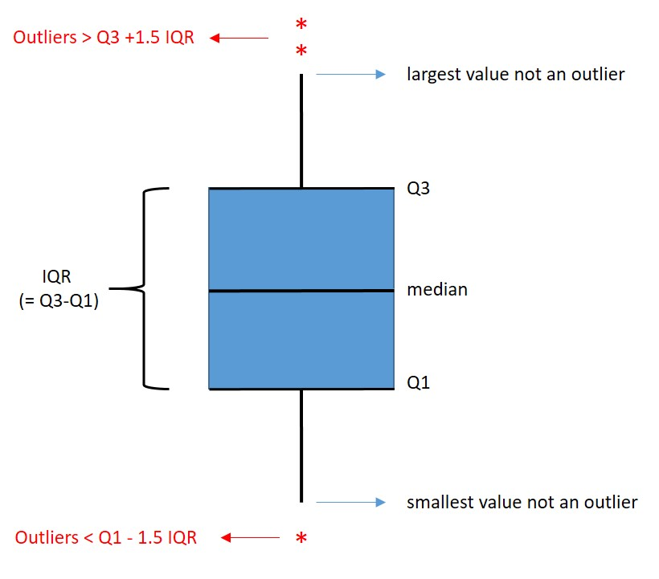
```

Now R calculates the difference between the 75th percentile and the 25th percentile. This is the Interquartile range (IQR). The upper whisker (vertical stripe) extends from the hinge (the box) to the largest value no further than 1.5 * IQR from the hinge. So  1.5 * IQR above the 75th percentile on top, and  1.5 * IQR below the 25th percentile on the bottom.

To create a boxplot, we can use the function `geom_boxplot()`. We will use the `airquality` dataset which is built-in in R and contains daily air quality measurements in New York, May to September 1973. The variable "Ozone" contains mean ozone concentration in parts per billion from 13:00 to 15:00 hours at Roosevelt Island. We will put the data in a tibble:

```{r}

airdf <- as.tibble(airquality)
head(airdf)
```

We can see that "Month" is saved as a number. However, suppose we want to group measurements per month and create a box for each month. We have to tell R to treat Month as factor rather than numeric with `as.factor()`.

###### Example

```{r, error=F, warning=F}
ggplot(data = airdf, aes(x = as.factor(Month), y = Ozone)) +
  geom_boxplot(aes(fill = as.factor(Month)))
```

<div class="question">
##### Exercise `r les` {-} 
ggplot has been giving us an warning:

> Warning message:
Removed 37 rows containing non-finite values (stat_boxplot). 

Why?
</div>
<details><summary>Click for the answer</summary>
There are 37 missing values in the "Ozone" column.

```{r}
sum(is.na(airdf$Ozone))
```
</details>

Box plots can be used to look for outliers. Outliers are datapoints that differ significantly from the distribution of the rest of the data.

In boxplots, any datapoint that is more than 1.5 * IQR above the 75th percentile or  1.5 * IQR below the 25th percentile is considered a potential outlier. They are plotted as individual points.

To change to colour of the potential outliers use *outlier.colour*. To change to shape of the outliers use *outlier.shape*.

###### Example 

```{r}
ggplot(data = airdf, aes(x = as.factor(Month), y = Ozone)) +
  geom_boxplot(aes(fill = as.factor(Month)), outlier.colour = "red", outlier.shape = 8)
```

</br></br>
Boxplots are often presented with flipped coordinates. Also, a legend here is not needed:

###### Example

```{r}
ggplot(data = airdf, aes(x = as.factor(Month), y = Ozone)) +
  geom_boxplot(aes(fill = as.factor(Month)), 
               outlier.colour = "red", outlier.shape = 8,show.legend = FALSE)+
  coord_flip()
```

Now this isn't a usable graph. To finish your graph for communication, informative labels are required as well as putting some effort into making it look nice!

###### Example

```{r}
ggplot(data = airdf, aes(x = as.factor(Month), y = Ozone)) +
  geom_boxplot(aes(fill = as.factor(Month)), 
               outlier.colour = "red", outlier.shape = 8,show.legend = FALSE) +
  scale_x_discrete(
    labels=c("May","June","July","August","September")) +
  theme_classic(base_size = 12) + # text size and overall theme
  theme(axis.text.y = element_text(size=12, angle = 0, vjust = 0), #font y axis tick labels
        axis.text.x = element_text(size=12, angle = 0, vjust = 0), #font x axis tick labels
        axis.title.x = element_text(vjust = -2))+ #lower x-axis title a little
  labs(
    title = "Mean ozone concentration at Roosevelt Island",
    subtitle= "per day, measured 1300 to 1500h, May to September 1973",
    x= "Month",
    y= "average [Ozone] (ppb)"
    )
```

<div class="question">
##### Exercise `r les` {-} 

Use the built-in dataset 'iris' to answer the following question. Make a boxplot showing the summary data of the variable "Sepal.Lenght" for the different iris species listed in the "Species" variable. Each boxplot has a different color.
</div>

<details><summary>Click for the answer</summary>
```{r}
ggplot(data = iris, aes(x = Species, y = Sepal.Length)) +
  geom_boxplot(aes(fill = Species))+
    labs(
    title = "Sepal Lenght of different iris species",
    y= "Sepal Length"
    )+
  theme(legend.position = "none", text = element_text(size=16))
```
</details>


<!-- <div class="question"> -->
<!-- ##### Exercise `r les` {-}  -->

<!-- Use the built-in dataset 'mpg' to answer the following question. Make a boxplot showing the summary data of the variable "hwy" for the different cars listed in the "class" variable. Use `?mpg` to find information about this dataset. Color the outliers purple and flip the boxplot 90 degrees. -->
<!-- </div> -->

<!-- <details><summary>Click for the answer</summary> -->
<!-- ```{r} -->
<!-- ggplot(data = mpg, aes(x = class, y = hwy)) + -->
<!--   geom_boxplot(aes(fill = class), outlier.colour = "purple") + -->
<!--   coord_flip()+ -->
<!--   labs( -->
<!--     title = "efficiency of different car types", -->
<!--     subtitle= "car models 1999 - 2008", -->
<!--     x= "class", -->
<!--     y= "efficiency (highway miles per gallon)" -->
<!--     )+ -->
<!--   theme(legend.position = "none", text = element_text(size=16)) -->
<!-- ``` -->
<!-- </details> -->

## Outliers

<!-- Hier zou wel meer aandacht naar mogen maar past nu niet -->

Potential outliers are easy to spot in a boxplot. Outliers can be an underlying reason that a Shapiro-Wilk test is telling you the data are not normally distributed, while you would have expected normally distributed data. 

<!-- ### Repeated measures of the same item: -->
<!-- You have met the Dixon's q-test before for repeated measures of the same individual! So for instance when you measure the ear length of the same single rabbit (named Flappie, lives in your garden, brown tail, likes cucumber) 5 times, you can check for outliers using the Dixon's q test. This test only works for repeated measures of the same item and low sample numbers, between 3 and 30 datapoints.  -->

<!-- ```{r} -->
<!-- library(outliers) -->
<!-- example_ears <- c(17.5, 17.4, 18.6, 17.3, 17.4) -->
<!-- dixon.test(example_ears) -->
<!-- ``` -->

<!-- 18.6 is an outlier as p<0.05, and it should be removed from the dataset. As Dixon's q test is only done on very low sample sizes, we can easily do this manually: -->

<!-- ```{r} -->
<!-- example_ears[example_ears==18.6] <- NA -->
<!-- example_ears -->
<!-- ``` -->

When doing data analyis, you will have to decide on what to do with potential outliers. A common strategy is to set boundaries within which you consider data points valid data, and reject datapooints that are outside of your boundaries. Similar to the approach in the box plots. But there are other possibilities: you can for instance keep all your data but use non-parametric statistical tests. And there are a couple of nullhypothesis-tests that investigate whether datapoints are outliers or not.

In this example we will follow the boxplot, and consider any point further than 1.5*IQR from the 25th or 75th percentile an outlier. Let's say we measured the ears of 22 white rabbits:

```{r}
white_rabbit_ears= tibble(ear_length=c(17.5, 13.0, 18.6, 19.4, 20.9, 18.9, 22.8, 20.3, 62.1, 20.4, 23.0,
24.1, 26.1, 25.2, 27.8, 28.5, 76.5, 21.5, 20.2, 18.8))

ggplot(data = white_rabbit_ears, aes( y = ear_length)) +
  geom_boxplot()+
    labs(
    title = "Ear Lenght of white rabbits",
    y= "ear Length (cm)"
    )+
  theme(legend.position = "none", text = element_text(size=16))
```

Now if we want to remove those 2 outliers:

```{r}
Q1 <- quantile(white_rabbit_ears$ear_length, .25)
Q3 <- quantile(white_rabbit_ears$ear_length, .75)
IQR<- IQR(white_rabbit_ears$ear_length)

# get threshold values for outliers
Tlower = Q1-(1.5*IQR) 
Tupper = Q3+(1.5*IQR) 

# replace outliers with NA
white_rabbit_ears$ear_length[white_rabbit_ears$ear_length < Tlower] <- NA
white_rabbit_ears$ear_length[white_rabbit_ears$ear_length > Tupper] <- NA

```

**Important** : always report very precisely how many datapoints you excluded and using what method and thresholds! Also, be conservative in throwing away data. Are you really sure it is an outlier?

In this case we are pretty sure. Those would be some very weid rabbits with ears around 70 cm. This is probably a measurement error or some weird mutant mega rabbits that shouldn't be part of our sample. We can safely ignore these two data points.

## Relation Questions

Instead of hunting for differences, sometimes we have questions regarding the relation between two variables. Usually, these cases are either correlational studies or regressions. 

They are similar, but not the same.

In a correlation analysis, you investigate the relationship between two variables. A pearson's correlation coefficient (r) is a number describing the linear relationship between two random variables X and Y. 

In a regression analysis, you try to find a model (equation) that describes a relationship between two variables X and Y (with Y being random but not X) using the least squares method. For instance in linear regression, this model would look like Y=aX+b. A model can then be used to predict Y if you have a value for X.


### Correlation

We will investigate correlation with the penguins dataset. We want to explore the correlation between the flipper length and body mass in penguins. Do larger penguins have larger flippers?


#### 1. load data, prepare data

```{r}
library(palmerpenguins)
head(penguins)
```


#### 2. plot using scatterplot

This kind of data should be plotted with a scatter plot.

A **scatter plot** is a graph in which the values of two continous variables are plotted along x-axis and y-axis. The pattern of the resulting points could reveal any correlation present. To create a scatter plot we use the function `geom_point()`.


```{r}

ggplot(data = penguins, aes(x = body_mass_g, y = flipper_length_mm)) +
  geom_point()+
  labs(title = "Relation between flipper length and body mass",
       subtitle = " Penguins, Palmer Station LTER",
       y = "Flipper length (mm)",
       x = "Body mass (g)") +
  theme_minimal()
```

At first glance, it seems that heavier penguins have longer flippers. 

The graph shows a increasing relation between flipper length in mm and body mass in gram, as you see the dots generally being higher on the y-axis with lower body weights (more to the right on the x-axis). In other words how heavier the penguin, the larger its flippers. 

#### 3. perform correlation analysis

We can check whether there is indeed a correlation with `cor.test()`. `cor.test()` can do several types of correlation analyses, including the most common: Pearson correlation. Pearson's correlation is a measure of the linear relationship between two continuous random variables. 

Pearson correlation does not strictly require the data itself to be normally distributed, in reality it is a bit more complicated, especially with larger datasets. The ins and outs go beyond the scope of this course. 


<!-- Meer van toepassing op regressie eigenlijk. Ik heb geen tijd meer. later. -->

<!-- We will check whether the data is approximately normally distributed using a Q-Q plot. This visualises the difference between a set of datapoints and a theoretical distribution, in this case a normal distribution. If the dots are approximately aligned with the line in the Q-Q plot, we can assume a normal distribution. -->

<!-- ```{r} -->
<!-- ggplot(chinstrap, aes(sample = body_mass_g)) +  -->
<!--   stat_qq() +  -->
<!--   stat_qq_line() -->

<!-- ggplot(chinstrap, aes(sample = flipper_length_mm)) +  -->
<!--   stat_qq() +  -->
<!--   stat_qq_line() -->
<!-- ``` -->

<!-- That doesn't look too bad. -->

<!-- ```{r} -->
<!-- model <- lm(body_mass_g ~ flipper_length_mm, data = chinstrap) -->
<!-- plot(model, 4) -->
<!-- ``` -->

A pearson correlation analysis can be done like this:

```{r}
cor.test(penguins$body_mass_g, penguins$flipper_length_mm, method=c("pearson"))
```

It seems that there is indeed a significant correlation between flipper length and body mass because p is smaller than 0.05. The correlation coefficient is `r cor.test(penguins$body_mass_g, penguins$flipper_length_mm, method=c("pearson"))$estimate`.

However, there are several penguin species in this dataset. Let's colour the points in the scatterplot based on the species:

```{r}
ggplot(data = penguins, aes(x = body_mass_g, y = flipper_length_mm)) +
  geom_point(aes(color = species, 
                 shape = species),
             size = 3,alpha = 0.8)+
  labs(title = "Relation between flipper length and body mass",
       subtitle = " Penguins, Palmer Station LTER",
       y = "Flipper length (mm)",
       x = "Body mass (g)") +
  theme_minimal()

```

We can further modify the graph by changing the shape, size and alpha (= transparency) of the points. Let's also put the correlation coefficient in the graph with `annotate()`.

```{r}
# round correlation coefficient to 1 decimal place
cor_coefficient <- round(cor.test(penguins$body_mass_g, penguins$flipper_length_mm, method=c("pearson"))$estimate,1)

# add to plot
ggplot(data = penguins, aes(x = body_mass_g, y = flipper_length_mm)) +
  geom_point(aes(color = species, 
                 shape = species),
             size = 3,alpha = 0.8)+
  labs(title = "Relation between flipper length and body mass",
       subtitle = " Penguins, Palmer Station LTER",
       y = "Flipper length (mm)",
       x = "Body mass (g)") +
  theme_minimal()+
  annotate("text", x = 3500, y = 230, size=4,
           label = paste("pearson's r = ", cor_coefficient))

```

#### 4. draw a conclusion

Because p < 0.05, the analysis show that there is a significant correlation between flipper length and body mass (p<0.001)*, with a correlation coefficient of `r round(cor.test(penguins$body_mass_g, penguins$flipper_length_mm, method=c("pearson"))$estimate,1)`. As can be seen in the graph, penguins with a larger body mass tend to have longer flippers.

* with very low values for p, you report "p<0.01" or "p<0.001" instead of the exact p-value. Anything above 0.001 is just reported exactly. Don't confuse the reporting of the p-value (e.g. "p=0.032" or "p<0.001") with the testing of the p-value against an $/alpha$ of 0.05.


<!-- leuk: culmen length en culmen depth geeft over all species een meh-correlatie licht negatief, maar per species licht positief. -->

***

<div class="question">
##### Exercise `r les` {-} 

Use dataset 'temp_carbon' from the **dslabs** package to answer the following questions.

(a) What are the units used for the variables carbon_emissions and temp_anomaly? use `?temp_carbon` once you loaded the package.
(b) Make a scatter plot of carbon_emissions (x-axis) and temp_anomaly (y-axis). tip: if an axis title gets too long, you can add a line break by using `\n`. eg: `labs(y = "text text \nmoretext")`
(c) Rewrite the code of (a) to show ocean_anomaly and land anomaly as separate colours in the graph.
</div>

<details><summary>Click for the answer</summary>
(a)
carbon_emissions: millions of metric tons

temp_anomaly: degrees Celsius

```{r}
library(dslabs)
ggplot(data = temp_carbon, 
       aes(x = carbon_emissions, y = temp_anomaly)) +
  geom_point()+
  labs(title = "Annual mean global temperature anomaly versus carbon emissions. ",
       x = "Annual carbon emissions (* million metric tons)",
       y = " Global annual mean temperature anomaly in degrees Celsius \nrelative to the 20th century mean")
```
</br>
(c)
```{r}
ggplot(data = temp_carbon, 
       aes(x = carbon_emissions)) +
      geom_point(aes(y = ocean_anomaly), colour = "blue") +
      geom_point(aes(y = land_anomaly), colour = "red") +
  labs(title = "Annual mean temperature anomaly over oceans and on land \nversus carbon emissions. ",
       x = "Annual carbon emissions (* million metric tons)",
       y = "annual mean temperature anomaly in degrees Celsius \nrelative to the 20th century mean")

```
</details>

<div class="question">
##### Exercise `r les` {-} 

Use dataset 'temp_carbon' from the **dslabs** package to answer the following questions.

(a) Make the dataset temp_carbon tidy.
(b) Use the tidy dataset to re-create the figure of the previous exercise, part (c) (the colours don't need to be exaclty the same)
</div>

<details><summary>Click for the answer</summary>

(a)
```{r}
temp_carb_tidy <- temp_carbon %>% 
  pivot_longer(cols = c("land_anomaly", "ocean_anomaly"),
               names_to = "anomaly", values_to = "temperature")
```
(b)
```{r}
temp_carb_tidy %>%
  ggplot(aes(x = carbon_emissions, y = temperature, colour = anomaly)) +
  geom_point() +
  labs(title = "Annual mean temperature anomaly over oceans and on land \nversus carbon emissions. ",
       x = "Annual carbon emissions (* million metric tons)",
       y = "annual mean temperature anomaly in degrees Celsius \nrelative to the 20th century mean")
```
</br>
Clearly, working with tidy data makes things easier. We don't need to add the ocean- and land-points separately.

</details>

### Regression

Scatter plots are often used in the lab to make a calibration curve ("ijklijn"). We can use R again to make a calibration curve, again with the `ggpubr` package that you installed earlier.

A calibration curve is an example of a regression analysis.
We try to find an equation (Y=aX+b) that describes a relationship between two variables X and Y.


We make a scatterplot with `ggplot()`, and add both the determination coefficient (= the squared correlation coefficient ($R^2$) ) with `stat_cor()` and the equation (Y = b + a*X, with a=slope and b=intercept) with `stat_regline_equation()`. 

#### 1. load data, prepare data
```{r}
# load packages
library(ggplot2)
library(ggpubr)

# generate some fake data
set.seed(123)
df <- data.frame(x = c(1:10)) # X is not a random variable
df$y <- 2 + 3 * df$x + rnorm(10, sd = 0.8)
```

#### 2. plot using scatterplot, include trendline
#### &
#### 3. perform regression analysis

```{r}
# make calibration line
ggplot(data = df, aes(x = x, y = y)) +
        geom_smooth(method = "lm", se=FALSE, color="blue", formula = y ~ x) +
        geom_point()+
  stat_cor(label.y = 60, size = 5,digits = 3,
           aes(label = paste(..rr.label.., sep = "~`,`~"))) +
  stat_regline_equation(label.y = 55, size = 5)+
  theme_classic(base_size = 18) + # text size and overall theme
  labs(title = "Calibration line for X",
       x = "X (units)",
       y = "Y (units)")

```

#### 4. use model for whatever you like

<div class="question">
Now you could use the model to predict the Y value for a data point with X=5.4. What would it be? 
</div>

<details><summary>Click for the answer</summary>
```{r}
round(1.5*(3.1*5.4),1)
```
</details>

<div class="question">
And the X value for a data point with Y=15?
</div>

<details><summary>Click for the answer</summary>
```{r}
round((15-1.5)/3.1,1)
```
</details>


## Checklists 
for statistical tests and visualisations

### verschilvragen
#### one sample design

 1. load data, prepare data
 1. plot using histogram or boxplot
 1. check normality (Shapio-Wilk)
 1. perform one sample t-test
 1. draw a conclusion

#### two sample design

 1. Look at the experimental design to see if it is paired or unpaired

paired:

 1. load data, prepare data
 1. plot using bargraph or boxplot
 1. check normality (Shapio-Wilk) of difference between conditions
 1. perform two sample t-test
 1. draw a conclusion

unpaired:

 1. load data, prepare data
 1. plot using bargraph or boxplot
 1. check normality (Shapio-Wilk) of both groups separately
 1. check equality of variances (Shapio-Wilk)
 1. perform two sample t-test
 1. draw a conclusion

#### ANOVA (> 2 conditions)

 1. load data, prepare data
 1. plot using bargraph or boxplot
 1. check normality (Shapio-Wilk) of both groups separately
 1. perform ANOVA
 1. if significant, perform post hoc tests

### verbandvragen

correlation

 1. load data, prepare data
 1. plot using scatterplot
 1. perform correlation analysis
 1. draw a conclusion

regression

 1. load data, prepare data
 1. plot using scatterplot, include trendline
 1. perform regression analysis
 1. use model for whatever you like

## Overview R functions

#### To create a graph 

function | package
:------ | :--------
ggplot() | tidyverse
geom_bar() | tidyverse
geom_col() | tidyverse
geom_point() | tidyverse 
geom_smooth | tidyverse
geom_line() | tidyverse
geom_errorbar | tidyverse
coord_flip() | tidyverse
labs() | tidyverse

#### Data transformation

function | package
:------ | :--------
mutate() | tidyverse
reorder() | stats
filter () | tidyverse
group_by() | tidyverse

#### Arithmetic

function | package
:------ | :--------
count() | tidyverse
mean() | base

<!--chapter:end:les4.Rmd-->

