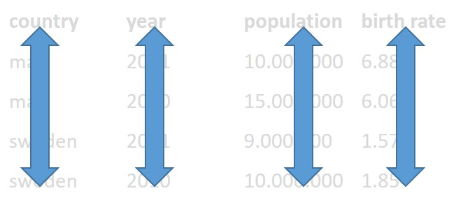

# Lesson 2 - Data types and structures in R

```{r include=FALSE}
load("course_urls.RData")
les <- 2
```


## Contents day 2

 - Reading and cleaning data
 - Visualizations

## Learning objectives

After this lesson:

- You can import data into the R environment
- You know how to inspect your data
- You can make your data "tidy"
- You can visualize categorical data with ggplot.
- You can visualize continuous data with ggplot.
- You can summarize data using boxplots.
- you can perform the most common statistical tests with R.

## Importing text files

So far, we have worked with built-in datasets. In real life you will generate data yourself or you will obtain data from other researchers or public sources such as [NCBI](https://www.ncbi.nlm.nih.gov/).

To start working with your own datasets, data needs to be read by R and stored as R objects. We can use a variety of  `read_function()` from the the [tidyverse](https://www.tidyverse.org/) packages to import plain text datafiles as tibbles (sort of like a data table). These functions work the same. If you have mastered one  you can use the other functions in a similar way:

```{r eval=F}
read_csv()       ## comma separated values
read_csv2()      ## semicolon separated values
read_tsv()       ## tab separated values
read_delim()     ## custom defined delimiter, for example: 
read_delim("voorbeeld.csv", delim="&")
read_fwf()       ## fixed width fields
read_table()     ## white space separated 
```

### separators 

Before choosing the right `read_function()` you need to know how the values of your dataset are separated. 

You can view files by clicking on them in the files tab (lower right corner of the screen). 
```{r echo=FALSE, message=FALSE, out.width = "80%"}

```

**download the datasets for this lesson here: [click](data/lesson3.zip)**

**unzip the folder and place it within your project folder**

**click on heights.csv, select view**

Values of the heights.csv file are separated by comma's. Even though the filename ends on csv (comma separated values) always inspect the contents of a datafile before loading it into R! 

We can use the read_csv() function:

###### Example
```{r}
library(tidyverse)
heights <- read_csv("data/lesson3/heights.csv")
```

you can view the data by typing the object name in the console (or in a script and run that line):

```{r, eval=F}
heights
```

R assumes the decimal separator is a "point". If your datafile has a comma as a decimal separator (most european datafiles) you have to tell the `read_function()` this!

We will use a datafile which is present in the server folder **data/lesson3** named **heights3.txt**. Inspect the datafile heights3.txt. As you can see, 
the values are tab separated and the decimal separator is a comma.

We will first use the `read_tsv()` function with default settings:

###### Example
```{r}
heights_3 <- read_tsv("data/lesson3/heights3.txt")
heights_3
```

The values of variable height are not shown correctly:

* row1 original value = 74,4244387818035. 
* row1 converted value = 7.44e14

We have to instruct `read_tsv()` that the comma acts a decimal separator by using the locale argument in combination with the `locale()` function:

###### Example
```{r}
heights_3 <- read_tsv("data/lesson3/heights3.txt", 
                      locale = locale(decimal_mark = ","))
heights_3
```

Now the values of the height variable are read in correctly.

<div class="question">
##### Exercise `r les` {-} 

Import data datafile heights4.txt in server folder data/lesson3 into R.
</div>

<details><summary>Click for the answer</summary>
```{r}
heights4 <- read_delim("data/lesson3/heights4.txt", delim="@", locale = locale(decimal_mark = ","))
heights4
```
</details>


## Setting variable (column) names

By default `read_function()` uses the first line of a dataset as variable names (column names). 

There are two situations where we have to change the behaviour of the `read_function()`

<div class="tip">
If a dataset doesn't contain variable names (=column names) use the option col_names = FALSE.
</div>

The first line of the dataset will be ignored as variable names. The columns will be labelled automatically from X1 to Xn. If you want to manually add variable names you can provide a vector with the variable names tot the col_names option: col_names = c("variable_name1", "variable_name2", "variable_name3")

Download dataset [heights1.csv](downloaddata/heights1.csv) and move the file to the server folder data/lesson3. To move files between the server and your computer:

**Go to the server, select the folder you want to upload something to.**

**click on Upload**

```{r , echo=FALSE, message=FALSE, out.width = "60%"}

```

**In the upload menu, click Choose File and select heights.csv where you just downloaded it.**

**inspect heights.csv**

This file lacks variable names:

###### Example
```{r include=FALSE}
heights_1 <- read_csv("downloaddata/heights1.csv", col_names = FALSE) 
```
```{r eval=FALSE}
heights_1 <- read_csv("data/lesson3/heights1.csv", col_names = FALSE)  # first line will not be used as variable names 
```
```{r}
head(heights_1)
```

```{r include=FALSE}
heights_1_1 <- read_csv("downloaddata/heights1.csv",  col_names = c("name1", "name2", "name3", "name4", "name5", "name6"))  
```
```{r eval=FALSE}
heights_1_1 <- read_csv("data/lesson3/heights1.csv",  col_names = c("name1", "name2", "name3", "name4", "name5", "name6"))  
# added custom variable names by providing a vector containing the names of the variables
# in this case: "name1, name2  name3 etc"
```
```{r}
head(heights_1_1)
```

Variables names can always be modified by using:

* The function `colnames()`
* The function `rename()`


###### Example
```{r eval=FALSE}
heights_1 <- read_csv("data/lesson3/heights1.csv", col_names = FALSE) 
```
```{r}
colnames(heights_1)<- c("name1", "name2", "name3", "name4", "name5", "name6")   # change all column names 
colnames(heights_1)[3] <- "new_name3"   # change the name of a specified column using an index
heights_1_1 <-rename(heights_1_1,  new_name4 = name4) # change the name of a specified column using rename() 
```

<div class="tip">
**(2) if variable names are present but not at the first line use te options skip=N or comment = "#"**
</div>

Download dataset [heights2.txt](downloaddata/heights2.txt) and move the file to the server folder data/lesson3. This file contains variable names but not at the first row. Note that the values are separated by tabs!

**First we have to inspect the datafile: click on the file.**

The first two lines are comments starting with the # sign. The variable names are present at row3.  To read in the file we will use read_tsv()

###### Example
```{r include = FALSE}
heights_2<-read_tsv("downloaddata/heights2.txt", skip = 2) 
```

```{r eval=FALSE}
heights_2<-read_tsv("data/lesson3/heights2.txt", skip = 2) # first two rows are not imported in object heights_2
```
```{r}
heights_2
```

Alternatively we can use the comment = "#" option

###### Example
```{r include = FALSE}
heights_2<-read_tsv("downloaddata/heights2.txt", comment = "#")
```
```{r eval=FALSE}
heights_2<-read_tsv("data/lesson3/heights2.txt", comment = "#")      ## lines starting with a # sign are ignored for read in
```
```{r}
heights_2
```

<div class="question">
##### Exercise `r les` {-}  
Import datafile iris in server folder data/lesson3 into R.

This file lacks column names and starts with comments. Import the datafile without the comment lines and add columns names "Sepal.Length", "Sepal.Width",  "Petal.Length", "Petal.Width", "Species" to the imported dataset.
</div>

<details><summary>Click for the answer</summary>
```{r}
iris_flower<-read_tsv("data/lesson3/iris",
           comment = "#",
           col_names = c("Sepal.Length", "Sepal.Width", "Petal.Length", "Petal.Width", "Species"))
```
</details>


## Importing Excel files

To import Excel files directly into R we can use `read_excel()` function of the readxl package which is part of tidyverse. When Using `read_excel()` Excel datasheets will be converted to a tibble. `read_excel()` reads both xls and xlsx files and detects the format from the extension.

More information about the readxl package can be found at [tidyverse.org](https://readxl.tidyverse.org/)

NOTE: Sometimes it's more convenient to organise your data in Excel and copy the values as plain text in a text editor such as notepad. Subsequently, import the file using the appropiate read_function() described on the previous page.


###### Example
```{r}
library(tidyverse)
library(readxl)                               # you have to explicity load the readxl library
excel_sheets("data/lesson3/datasets.xlsx")    # inspect how many datasheets are present in the excel file
                              
datasets_iris<-read_excel("data/lesson3/datasets.xlsx")    # default behaviour is to import the first datasheet. 
```

Excel files can have multiple datasheets. To specifically select a datasheet use the sheet = "sheetname" or sheet = number option

###### Example
```{r}
datasets_mtcars<-read_excel("data/lesson3/datasets.xlsx", sheet = "mtcars")  # select Excel datasheet named "mtcars"
datasets_quakes<-read_excel("data/lesson3/datasets.xlsx",  sheet = 4)        # select the 4th Excel datasheet (= "quakes")
```

Datafiles in Excel might not always contain column names (=variable names). If the first row doesn't contain column names we have to tell read_excel() to treat the first row as values and not as variable names by using the col_names=FALSE option. 

###### Example
```{r}
datasets_iris_2<-read_excel("data/lesson3/datasets.xlsx", sheet = 5, col_names = FALSE) 
```

If you want to rename the column names you can use the rename() or the colnames() functions (see [Setting variable (column) names])

<div class="question">
##### Exercise `r les` {-} 
Import sheet "quakes_1" from datafile datasets.xlsx  in server folder data/lesson3 into R. Column names are not listed in datasets.xlsx. Import the datafile and add columns names "lat" "long" "depth" "mag" "stations" to the imported data.
</div>

<details><summary>Click for the answer</summary>
```{r}
library(readxl)
read_excel("data/lesson3/datasets.xlsx",
    sheet = "quakes_1",
    col_names = c("lat", "long", "depth", "mag", "stations"))
```
</details>

## Saving and importing R_Objects

* To import data in plain text  format we use the function read_function() 
* To import data in Excel format we use the function read_excel()

It is also possible to save an R object directly to the server and to read the file from the server in the R environment:

To save an R object to the server use the function `saveRDS()`

To import data that is stored as an R object we make use of the function `readRDS()`

###### Example
```{r eval=FALSE}
library(dslabs)                              # we will use a dataset called olive from the dslabs package                       
View(olive)
saveRDS(olive, "data/lesson3/olive.rds")     # object olive is saved as file olive.rds in server folder data/lesson3   
```

To import this R object from the server into RStudio use `readRDS()`. This function takes 1 argument. Assign the R object from the server to a new object name in Rstudio!

###### Example
```{r eval=FALSE}
olive_from_server <- readRDS("data/lesson3/olive.rds")                    ## the path to the file must be quoted
```

## Inspecting your data

Data wrangling: the process of transforming and mapping data from a "raw" data format into another format with the intent of making it more appropriate and valuable for a variety of downstream purposes such as analytics and visualization ([wikipedia] (https://en.wikipedia.org/wiki/Data_wrangling))

The first step in data wrangling is to inspect the structure of the dataset.  We've already seen some functions to inspect the data. Important questions are:

* What is the datastructure?
* How many variables does the dataset contain?
* What are the names of the variables?
* What are the data types of the variables?
* What are possible categories (factors)?
* What are the levels of the categories?
* Are there NA values?
* Is the data **tidy**?

Let's recall some previously used functions to inspect the data. We will use data from the "dslabs" package.

###### Example
```{r message=FALSE}

library(tidyverse)
library(dslabs)
```
```{r eval=FALSE}
?divorce_margarine      # information about the divorce_margarine dataset from the "dslabs" package
```
```{r message=FALSE}
divorce_margarine_tbl <- as_tibble(divorce_margarine)      # converting dataframe to tibble                    
divorce_margarine_tbl 
```


Let's inspect another dataset from the dslabs package: gapminder

###### Example
```{r eval=FALSE}
?gapminder                                       # information about the "gapminder" dataset
```

```{r}
gapminder_tbl <- as_tibble(gapminder)            # converting dataframe to tibble
gapminder_tbl
levels(gapminder_tbl$continent)                # categories in the continent variable
sum(is.na(gapminder_tbl$infant_mortality))   # count the missing (NA) values
```

The last question of the inspection list is:

Is the data **tidy**?

Before we can answer this question we have to know what tidy data is.

***

## What is tidy data?

Tidy data is a way of organising your data in a neat and structured way. If you make your data tidy, it is ensured that it is compatible with data analysis tools from the [tidyverse](https://www.tidyverse.org/) package. A detailed explanation can be found in [chapter12](https://r4ds.had.co.nz/tidy-data.html) in the e-book R for Data Science

However, it is important to note that data does not always need to be tidy. Other R packages require different data organisation formats!

So what is tidy data:

1. Each variable must have its own column.  
1. Each observation must have its own row. 
1. Each value must have its own cell.

*Table1: Example of tidy data*

| country 	| year 	| population 	| birth rate 	|
|:---------	|:-----	|:----------	|:-----------	|
| mali    	| 2001 	| 10.000.000 	| 6.88       	|
| mali    	| 2010 	| 15.000.000 	| 6.06       	|
| sweden  	| 2001 	| 9.000.000  	| 1.57       	|
| sweden  	| 2010 	| 10.000.000 	| 1.85       	|


Each variable must have its own column.  

```{r , echo=FALSE, message=FALSE, out.width = "60%"}

```

Each observation must have its own row. 

```{r , echo=FALSE, message=FALSE, out.width = "60%"}
knitr::include_graphics("images/03_5_tidy2.jpg")
```

Each value must have its own cell.

```{r , echo=FALSE, message=FALSE, out.width = "60%"}

```

So the following table would by untidy, as there are multiple observations per row:

*Table2: Example of untidy data*

| student  	| EDCC 	| molbio 	| immunologie 	| BID 	|
|:----------	|:------	|:--------	|:-------------	|:-----	|
| Pietje   	| 7.5  	| 6      	| 8.2         	| 8   	|
| Marietje 	| 8    	| 7.9    	| 5           	| 9   	|


This would be the tidy version:

*Table3: Example of untidy data made tidy*

| student  	| course      	| grade 	|
|:----------	|:-------------	|:-------	|
| Pietje   	| EDCC        	| 7.5   	|
| Pietje   	| molbio      	| 6     	|
| Pietje   	| immunologie 	| 8.2   	|
| Pietje   	| BID         	| 8     	|
| Marietje 	| EDCC        	| 8     	|
| Marietje 	| molbio      	| 7.9   	|
| Marietje 	| immunologie 	| 5     	|
| Marietje 	| BID         	| 9     	|

<div class="question">
##### Exercise `r les` {-}    {#onderzoektidyvraag}
The package tidyverse contains the built-in datasets:

* table1
* table2
* table3
* table4a
* table4b

Write code to inspect the data and argue if the tables are tidy
</div>

<details><summary>Click for the answer</summary>

To inspect for instance **table1**, just write `table1` in the console window.

There are three rules to make a dataset tidy:

* Each variable must have its own column.
* Each observation must have its own row.
* Each value must have its own cell.

**table1**: tidy

**table2**: non-tidy, violation of rule2. An observation is a country in a year, but each observation is spread across two rows.

**table3**: non-tidy, violation of rule3. The "rate" column contains both cases and population variables

**table4a/b**: non-tidy, violation of rule 1 and 2. The column names "1999" and "2000" represent values of the year variable, and each row represents two observations, not one.
</details>

## Making your data tidy: gathering

In [this exercise](#onderzoektidyvraag) we noted that table4a is not tidy: the column names '1999' and '2000' represent values of the year variable, and each row represents two observations, not one.

```{r , echo=FALSE, message=FALSE, out.width = "80%"}
knitr::include_graphics("images/03_7_nontidy_table4a.jpg")
```

To merge columns '1999' and '2000' into 1 column we can use the tidyverse function `pivot_longer()`:

```{r}
table4a_tidy <- pivot_longer(data = table4a, cols = c('1999', '2000'),  
                             names_to = "year",  values_to = "cases")
table4a_tidy
```

Alternatively we can use the pipe to redirect data to the `pivot_longer()` function:

###### Example
```{r}
table4a_tidy <- table4a %>% pivot_longer(cols = c('1999', '2000'),  
                                         names_to = "year",  values_to = "cases")
```


<div class="rstudio-tip">
Important: from now on we will often use the pipe %>% to redirect data into an R function: 
</div>

The %>% pipe symbol can be read as "followed by". The %>% symbol directs the **OUTPUT** of one R function as **INPUT** to the following R function.

dataset %>% function() %>% function() .. and so on

This way the steps of data manipulation are easier to follow for the reader. It is good practice to write clean / clear code that can be understand by other people. 


<div class="question">
##### Exercise `r les` {-} 
(a) Import datafile the first sheet gene_expression_c10.xlsx into R (it is already in the server folder data/lesson3)

(b) What are the dimension of the dataset?
</div>

<details><summary>Click for the answer</summary>
```{r}
#(a)
library(readxl)
gene_expression <- read_excel("data/lesson3/gene_expression_c10.xlsx")

#(b)
dim(gene_expression) # or look in the environment panel, upper right part of the screen
```
</details>

<div class="question">
##### Exercise `r les` {-} 
(a) Make the dataset of exercise_5.1 tidy

(b) What are now the dimension of the tidy dataset?
</div>

<details><summary>Click for the answer</summary>
```{r}
#(a)
gene_expression_tidy <- pivot_longer(data = gene_expression,
                                     cols = c('0h', '3h','12h', '24h', '48h'), 
                                     names_to = "time(hrs)", 
                                     values_to = "expression")
# or: 
gene_expression_tidy <- gene_expression %>% 
  pivot_longer(cols = c('0h', '3h','12h', '24h', '48h'), 
               names_to = "time(hrs)", values_to = "expression")

#(b)
dim(gene_expression_tidy)
```
</details>

## Making_your_data_tidy: spreading

In the [this exercise](#onderzoektidyvraag) we noted that table2 is not tidy: 2 row represents 1 observation.

```{r , echo=FALSE, message=FALSE, out.width = "60%"}
knitr::include_graphics("images/03_8_nontidy_table2.jpg")
```

Note that variable column "Type" contains the names of the variables "Cases" and "Population". This is the reason that two rows represent 1 observation. 

To merge the two rows, representing 1 observation, into 1 row we use the tidyverse function `pivot_wider()`. 

```{r}
table2_tidy <- pivot_wider(data = table2, names_from = "type", values_from = "count")
table2_tidy
```

Alternatively we can use the pipe to redirect the data to the pivot_wider() function:

###### Example
```{r}
table2_tidy <- table2 %>% pivot_wider(names_from = "type", values_from = "count")
```

<div class="question">
##### Exercise `r les` {-} 

(a) Import the second data sheet from datafile gene_expression_c10.xlsx (from the previous question, in server folder data/lesson3) into R

(b) Make the dataset tidy

</div>

<details><summary>Click for the answer</summary>
```{r}
#(a)
gene_expression_sheet2 <- read_excel("data/lesson3/gene_expression_c10.xlsx", sheet=2)

#(b)
gene_expression_sheet2_tidy <- pivot_wider(data = gene_expression_sheet2, 
                                           names_from = "assay", 
                                           values_from = "value")
# or: 
gene_expression_sheet2_tidy <- gene_expression_sheet2 %>% 
  pivot_wider(names_from = "assay", values_from ="value")
```
</details>


## Making_your_data_tidy: separate

In [this exercise](#onderzoektidyvraag) we noted that **table3** is not tidy: 2 values are present in 1 cell.

###### Example
```{r}
table3
```

To separate the values in two cells we use the tidyverse function `separate()`:

```{r}
table3_tidy <- separate(table3, rate, into = c("cases", "population"))
table3_tidy
```

The original variable "rate" contained "character" values, namely the two combined values separated by a forward slash. After the separation each new column ("cases" and "population") contain **numeric** values but the value types are still denoted as **characters**. To convert the character values into numeric values we use the **convert** option. 

###### Example
```{r}
table3_tidy <- separate(table3,  rate,  into = c("cases", "population"), convert = TRUE)
```

Normally you have to specify where the values need to be separated. In this case the forward slash character ("/"). The default option of the `separate()` funtion is to separate values based on any non-alphanumeric character (i.e. a character that isn’t a number or letter).  It is good practice though to write the separation character explicity in your code by using the sep="character" option. 

###### Example
```{r}
table3_tidy <- separate(table3, rate, into = c("cases", "population"), convert = TRUE,  sep = "/")
```

By using the **sep=** option we can also split values based on the a specific **number** of characters. For example we want to use the first three character of each country in our column instead of the full names. We can split the country names by the first three characters. 

###### Example
```{r}
# only 1 variable is defined: first 3 characters are stored in variable "country" replacing the original variable "country"
separate(table3_tidy, country, into = c("country"), sep = 3)
```


<div class="question">
##### Exercise `r les` {-} 

(a) Import datafile gene_expression_c10 (the one without the .xlsx) in the server folder data/lesson3 into R. The data colums are separated by a semicolon. 

(b) Make the dataset tidy

</div>

<details><summary>Click for the answer</summary>
```{r}
#(a)
gene_expression_1 <- read_csv2("data/lesson3/gene_expression_c10")

#(b)
gene_expression_1_tidy <- separate(gene_expression_1, "0h-3h-12h-24h-48h",
                             into = c("0h", "3h", "12h", "24h", "48h"),  sep = "!",  convert = TRUE)
# or: 
gene_expression_1_tidy <- gene_expression_1 %>% separate("0h-3h-12h-24h-48h",
                             into = c("0h", "3h", "12h", "24h", "48h"),  sep = "!",  convert = TRUE)
```

First we separate the values in 5 new variables. But the data is not tidy yet. We have to apply the function `pivot_longer()` because the new variables are not true variables but values of the variable "time_after_induction"
```{r}
gene_expression_1_tidy2 <- gene_expression_1_tidy %>%  pivot_longer(
  cols = c('0h', '3h', '12h', '24h', '48h'),
  names_to = "time_after_induction", values_to = "gene_expression")
```

</details>


## map functions
Generally, you will want to avoid repetitive code as it is prone to errors. So, if you want to apply the same function to a number of dataframes, you don't want to do this in a separate, very similar line for each one. 

For instance, let's say we want to perform a Shapiro-Wilk test on multiple conditions in a dataset. The smoking dataset used in this example is an unpaired experiment containing two different mice groups: control mice ("Controle") and a group of mice continuously exposed to cigarette smoke ("Rook"). The measurement values represent minutes of swimming until exhaustion. 


###### Example
```{r, message=F, error=F}
library(tidyverse)
smoking <- read_tsv("data/lesson3/smoking")
smoking #remember there are more rows, you only get shown the first few
```

To perform a Shapiro-Wilk test, you could simply type:
```{r, message=F, error=F}
shapiro.test(smoking$Controle)

shapiro.test(smoking$Rook)
```

If we want to perform the same function on all variables of a dataframe (tibble) we can make use of a series of map functions:

> `map()`       makes a list.

> `map_lgl()`   makes a logical vector

> `map_int()`   makes an integer vector

> `map_dbl()`   makes a numerical vector 

> `map_chr()`   makes a character vector

If we want to perform the Shapiro-Wilk test on each variable of dataset smoking we will use `map()` as the output of the `shapiro.test()` function is a list. For each variable of the smoking dataset, a list is produced and these lists are combined and stored in a new list (thus, the elements of the final list consist of lists!)

###### Example
```{r }
# shapiro.test() outputs multipe lines: use map() to store as list
SW_smoking <- smoking %>% map(shapiro.test)         
class(SW_smoking)                                                                                      

# the output of map() is a list containing two list elements
# each list element contains the p-value of the Shapiro-Wilk test
str(SW_smoking)
```

We see that the output of the Shapiro-Wilk test is stored as a list containing two elements, one for each variable. The elements in the list are lists themselves containing the summary information of the Shapiro-Wilk test.

What we are really interested in is the p-value (NOTE: in the list stored as p.value). We can automatically substract the p-values by adding another `map()` function. As the p-values are numbers we select the `map_dbl()` function so the p-values will be stored in a numeric vector.

###### Example
```{r }

smoking %>% map(shapiro.test) %>% map_dbl("p.value")
```

We see that both p-values are above 0.05. 

## Histogram

We will take a look at a hypothetical follow up experiment on the smoking data we used previously, using 200 mice who got nicotine patches or not. The dependent variable was minutes of swimming until exhaustion. I will spare the poor mice the exhaustion and generate the data for this example. Run this code to generate the fake data. rnorm() generates random numbers from a normal distribution, in this case 200 numbers, from a normal distribution with mean=180 or 160, and sd=15 or 25:
```{r}
set.seed(123)
smoking2 <- tibble(
  controle = rnorm(200,180,15),
  patch = rnorm(200,160,25)
)
```

Let's look at the minimum and maximum swimming times in the patch group:
```{r}
min(smoking2$patch) ## minimum minutes of swimming until exhaustion
max(smoking2$patch) ## maximum minutes of swimming until exhaustion
```

In order to see the distribution of the swimming times between the minimum and maximum values we will make a distribution plot, a histogram. It is build as:

 1. a layer with the data and aesthetics (aes)
 1. a layer telling ggplot we want a histogram
 1. a layer setting the title and axes

```{r}
ggplot(data = smoking2, aes(x = patch)) + 
  geom_histogram()+
  labs(
    title = "Distribution of swimming times of patch mice",
    x= "swimming time (min)",
    y= "count")
```

We can choose the bin size. The bin size, is the range on the x-axis that represents the width of each bar in the histogram. We can change it if we like:

```{r}
ggplot(data = smoking2, aes(x = patch)) + 
  geom_histogram(binwidth = 10)+
  labs(
    title = "Distribution of swimming times of control mice",
    x= "swimming time (min)",
    y= "count")
```

To make separate histograms for the control and the patch group in the same figure, we could make the data tidy and add an extra layer to ggplot called `facet_wrap()`:

```{r}
# tidy data: each variable in 1 column
smoking2_tidy <-  pivot_longer(data = smoking2, cols = c(controle, patch),  
                             names_to = "group",  values_to = "swimming_time")

# create histograms
ggplot(data = smoking2_tidy, aes(x = swimming_time)) + 
  geom_histogram(binwidth = 10)+
  labs(
    title = "Distribution of swimming times of control mice",
    x= "swimming time (min)",
    y= "count")+
  facet_wrap(~ group) 
```


## Difference Questions

When your research question is about a possible difference between samples (e.g. groups, conditions, etc) you often  make a bar chart, and perform a t-test or ANOVA (if your data is normally distributed, see previous lesson). In the following paragraph we will show you how to do this in R.

To create a bar chart we can either use:

- `geom_bar()`:  by default, geom_bar() accepts one variable (categorical) as x-value. The number of occurrences for each category is calculated by default.
- `geom_col()`: by default, geom_col() accepts one variable (categorical) as x-value and one variable (values of each category such as occurences, mean, median, proportion, min, max and so on) as y-value.

Note: arguments in the ggplot() function will be applied to all layers whereas arguments in the geom_function() layer will only be applied to that specific layer. 

###### Examples

Let's plot the amount of penguins per species in the `palmerpenguins` dataset (install it if needed):

```{r message=F, error=F}
# Load the tidyverse package (only once for each R session)
library(tidyverse) 
```
```{r}
library(palmerpenguins) #let's use some penguin data. Penguins are cool.

# Create a bar graph showing the counts based on variable species

penguins %>% # penguins is a datagframe within the palmerpenguins package
  ggplot() + 
  geom_bar(aes(x = species)) +
  theme_minimal() +
  labs(title = 'Penguins per Species in the Palmerpenguins data')

```

If we want to change the color of the bars based on the variable 'species' (3 different colours, because there are 3 different species), we can add an extra aestheti(c) 'fill'. If we want to generally change the color of the bars, we can add 'fill' outside of the aesthetic. 'colour' defines the colour of the border, rather than the bars.

###### Examples

```{r}
## "fill" is placed inside aesthetic
penguins %>%
  ggplot() + 
  geom_bar(aes(x = species, fill = species)) +
  theme_minimal() +
  labs(title = 'Penguins per Species in the Palmerpenguins data')

## "fill" is placed outside the aesthetic
## "color" defines border color
penguins %>%
  ggplot() + 
  geom_bar(aes(x = species), fill = "magenta", colour="black") +
  theme_minimal() +
  labs(title = 'Penguins per Species in the Palmerpenguins data')
```

Each geom_funtion has a standard way of calculating and presenting the data. This is defined by the 'stat' argument. The default for `geom_bar()` is 'count', meaning `geom_bar()` displays the number of occurences of each category in variable "class" on the y-axis. 

Alternatively, the `geom_bar()` can also calculate and display the proportion of each category (relative to the total number) on the y-axis. To do so we must explicitly instruct `geom_bar()` to change the default stat of count to proportion (..prop..). 
###### Examples

```{r}
# Create a bar graph plotting the proportions (using ..prop..)
# NB: 'group = 1' indicates that the proportions are based on entire population
ggplot(data = penguins) + 
  geom_bar(aes(x = species, y =..prop.., group = 1)) +
  labs(title = 'proportions of Penguins per Species')
```

#### Grouped bar graphs

In the examples above, the bar graphs consisted of single bars. In some cases you want to create **grouped bar graphs**. For example, given the penguin dataset introduced above, suppose that you want to know how many male and female penguins there are for each species. You can create a bar graph in a similar way as before, but now specifying 'fill' to be determined by 'sex':

```{r}
penguins %>% count(species, sex) %>%  
  ggplot(aes(x = species, y = n, fill = sex)) + 
  geom_col()
```

We now created a grouped bar graph. However, the default of ggplot is to plot the different bars on top of each other and this is difficult to read. To plot the different bars next to each other, we can use the `position_dodge()` argument:

```{r}
penguins %>% count(species, sex) %>%  
  ggplot(aes(x = species, y = n, fill = sex)) + 
  geom_col(position = position_dodge())
```

#### Bar graphs with mean ± standard deviation
Quite often, you will want to depict an average and standard deviation in a bar graph. For instance, the average flipper length in the different penguin species.

To make a bar graph with the average flipper length, we will need to calculate it first. We will do a lot more data wrangling in the next lesson, so for now, we will just make a new tibble with the averages we need, grouped per species. There are some missing values for flipper length (I imagine not all penguins cooperated nicely when their feet were measured), and we remove those using `na.rm=TRUE`. Look at the content of `flipper_summary` by typing it in the console.

```{r}
flipper_summary <- penguins %>%
  group_by(species) %>%
  summarize(mean_flipper=mean(flipper_length_mm, na.rm=TRUE), stdev=sd(flipper_length_mm, na.rm=TRUE))
```

And we can plot this using:

```{r}
flipper_summary %>%
  ggplot(aes(x=species,y=mean_flipper, group=species, fill=species)) + 
  geom_col(stat="identity")+ 
    geom_errorbar(aes(ymin=mean_flipper-stdev, ymax=mean_flipper+stdev), width=.2)+ # the error bars
  labs(title = "Figure X. average flipper length of penguins", 
       subtitle = "errorbars depict 1 standard deviation",
       x="penguin species", 
       y="average flipper length (mm)") +
  theme(legend.position = "none", text = element_text(size=16)) # legend is not needed
```


### Two sample t-tests
This isn't really a statistics course, we asume you are all familiar with the most common frequentist methods. We will show how to perform some common workflows in R.

### Unpaired two sample t test
As unpaired experiments are a bit more intuitive, we will start with an unpaired two sample t-test.

#### 1. Get the data and prepare the data
Here is some artificial data on ear length of rabbits.

- Research question: Is there a difference in ear length between brown and beige rabbits?

```{r}
rabbit_ears <- tibble(
  rabbitnr = seq(1,20),
  colour = c(rep("beige", 10),rep("brown", 10)),
  earlength = c(17.5, 13.0, 18.6, 19.4, 20.9, 18.9, 22.8, 20.3, 22.1, 20.4, 23.0,
24.1, 26.1, 25.2, 27.8, 28.5, 26.5, 21.5, 20.2, 18.8)
)

colour_rabbits_summary <- rabbit_ears %>%
  group_by(colour) %>%
  summarize(mean_ear=mean(earlength), stdev=sd(earlength))
```

#### 2. Plot the data
```{r, echo=F}
colour_rabbits_summary %>%
  ggplot(aes(x=colour,y=mean_ear, group=colour, fill=colour)) +
  geom_col(stat="identity")+
    geom_errorbar(aes(ymin=mean_ear-stdev, ymax=mean_ear+stdev), width=.2)+ # the error bars
  labs(title = "Figure X. average ear length of rabbits",
       subtitle = "errorbars depict 1 standard deviation",
       x="rabbit colour",
       y="average ear length (cm)") +
  ylim(0, 30) +
  theme(legend.position = "none", text = element_text(size=16)) # legend is not needed
```

Looking at the bar graph, the ear length brown rabbits seems to be a bit longer, on average, than in beige rabbits. Let's investigate this. 

#### 3. Check assumptions
```{r, eval=F}
brown_ears <- rabbit_ears[rabbit_ears$colour=="brown",]
beige_ears <- rabbit_ears[rabbit_ears$colour=="beige",]

#Both have a p-value > 0,05 meaning we can perform a normal parametric t-test.
brown_ears$earlength %>% shapiro.test()
beige_ears$earlength %>% shapiro.test()

# shorter option you have not learned yet
rabbit_ears %>%
  group_by(colour) %>%
  summarise(p.value.sw = shapiro.test(earlength)$p.value)

```

#### 4. Check the variances

```{r eval = FALSE}
# load the package and check out the function
library(car)
?leveneTest()   # check the arguments for running this function
```

You can see that the input for `levenetest()` requires 1 vector with the data and another vector describing the groups. Our rabbit data is already in the correct format, but we have to convert the group variable (rabbit colour) to a **factor** to make sure R understands this is a categorical variable.

```{r message = FALSE, warning = FALSE}
library(car)
leveneTest(rabbit_ears$earlength, as.factor(rabbit_ears$colour), center = mean)
```

```{r echo=F, message = FALSE, warning = FALSE}
lv_ears <- leveneTest(rabbit_ears$earlength, as.factor(rabbit_ears$colour), center = mean)$`Pr(>F)`[1]
```


#### 5. Perform the t-test
Finally we can perform a unpaired t-test with samples having equal variance. Type `?t.test()` in the console to get more information on this function.

###### Example
```{r}
eartest <- t.test(formula = rabbit_ears$earlength ~ rabbit_ears$colour, 
        paired = FALSE, var.equal = TRUE)
eartest
```

Or if you just want the p-value, rounded down to 3 digits:
```{r}
eartest$p.value %>% round(.,3)
```

The schoRsch package has a function to put this into nicely APA formatted text:
```{r}
library(schoRsch)
t_out(eartest)
```


***

Note, the `t.test()` function has the option to enter the data separately. So, we don't have to make the dataset tidy. It works on separate columns with data as well:

```{r, eval=F}
brown_ears <- rabbit_ears[rabbit_ears$colour=="brown",]
beige_ears <- rabbit_ears[rabbit_ears$colour=="beige",]

# note that we don't use "formula = " now, and note the comma's
t.test(brown_ears$earlength, beige_ears$earlength,
        paired = FALSE, var.equal = TRUE)$p.value %>% round(.,3)
```

Obviously, to perform a paired two-sample t-test, change the argument `paired` to TRUE.

<!-- <div class="question"> -->
<!-- ##### Exercise `r les` {-}  -->

<!-- Here is some hypothetical data on the tail length of Siameze and Abyssinian cats. We are wondering if siamese cats have **longer tails** than Abyssinian cats. Run the following code to generate the data, and inspect the dataframe we get. -->

<!-- ```{r} -->
<!-- # make up some data -->
<!-- set.seed(672022) -->
<!-- n<-20 -->
<!-- staartlengtes <- rnorm(n, 30, 4) -->
<!-- noise <- rnorm(n, 0, 2.5) -->
<!-- noise2 <- rnorm(n, 0, 8.5) -->
<!-- staartlengtes_S <- staartlengtes + noise -->
<!-- staartlengtes_A <- staartlengtes*0.8 + noise2 -->

<!-- cat_tails <- tibble(breed = rep(c("Siamese","Abyssinian"),each=n),  -->
<!--        tail_length = c(staartlengtes_S,staartlengtes_A)) -->

<!-- ``` -->

<!--  A) Which of the two variables is categorical? Tell R that it is. -->
<!--  B) Make a bar graph depicting this data. -->
<!--  C) check the assumptions (normality and if relevant, equality of variances) -->
<!--  D) perform the t-test. Note that we have a one-sided research question here, note the word "longer". You can use the argument `alternative = ` within `t.test()`. Check ?t.test -->
<!--  E) formulate a conclusion. -->

<!-- </div> -->

<!-- <details><summary>Click for answer A</summary> -->
<!-- ```{r} -->
<!-- cat_tails$breed <- as.factor(cat_tails$breed) -->
<!-- ``` -->
<!-- </details> -->

<!-- <details><summary>Click for answer B</summary> -->
<!-- ```{r,messages=F} -->

<!-- plot_table <- cat_tails %>% -->
<!--   group_by(breed) %>% summarize(average = mean(tail_length, na.rm = TRUE), -->
<!--                                 sd = sd(tail_length, na.rm = TRUE) ) -->

<!-- # Plot data -->

<!-- plot_table %>% ggplot(aes(x = breed, y = average)) + -->
<!--   geom_col(stat="identity", fill="steelblue")+ -->
<!--   geom_errorbar( aes(x=breed, ymin=average-sd, ymax=average+sd), width=0.2)+ -->
<!--   theme_classic() + # not necessary, I just like the white background -->
<!--   labs(title = "Tail length of Abyssinian and Siamese cats", -->
<!--        subtitle = "errorbars depict 1 standard deviation", -->
<!--        x="cat breed", -->
<!--        y="average tail length (cm)")  -->
<!-- ``` -->
<!-- </details> -->

<!-- <details><summary>Click for answer C</summary> -->

<!-- ```{r message = FALSE, warning = FALSE} -->
<!-- # normality -->
<!-- s_df <- cat_tails[cat_tails$breed=="Siamese",] -->
<!-- a_df <- cat_tails[cat_tails$breed=="Abyssinian",] -->
<!-- shapiro.test(s_df$tail_length)$p.value -->
<!-- shapiro.test(a_df$tail_length)$p.value -->

<!-- # equality of variances -->
<!-- library(car) -->
<!-- leveneTest(cat_tails$tail_length, cat_tails$breed, center = mean) -->

<!-- ``` -->

<!-- Both data columns are normally distributed, but the variances are not equal!  -->
<!-- </details> -->

<!-- <details><summary>Click for answer D</summary> -->

<!--  - note `var.equal = FALSE` because of the unequal variances -->
<!--  - note ` alternative = "greater"` because of the one-sided question -->
<!--  - If you use the formula-statement in t.test, check the order of the factors with `levels(cat_tails$breed)`! (or type `cat_tails$breed` and look at the bottom at the factors. ) -->

<!-- ```{r, eval=F} -->
<!-- # siamese (first) "greater than" Abyssinian (second)? -->
<!-- t.test(s_df$tail_length, a_df$tail_length, var.equal = FALSE, alternative = "greater") -->
<!-- #or: (less, because of the order of the factors in breed: Abyssinian is first) -->
<!-- t.test(formula=cat_tails$tail_length~cat_tails$breed, var.equal = FALSE, alternative = "less") -->
<!-- ``` -->
<!-- </details> -->

<!-- <details><summary>Click for answer E</summary> -->
<!-- ```{r, include=F} -->
<!-- cat_tails  |>  -->
<!--   group_by(breed) |>  -->
<!--   summarise(mean=round(mean(tail_length),0), sd=round(sd(tail_length),0)) -->
<!-- ``` -->
<!-- As p<0.05, we can conclude that Siamese cats (mean± sd = 34±3cm) have significant longer tails than Abyssinian cats (mean±sd=25±7cm). -->
<!-- </details> -->


### Plotting significance

We previously tested the difference in ear length between brown and beige rabbits, which was significant:
```{r}
p_to_plot <- t.test(earlength ~ colour, data=rabbit_ears)$p.value %>% round(3)
```

Let's put an asterix in the plot to communicate the the difference is in fact significant, using the `ggsignif` package
_Install the package first!_

You can also use `annotate()` to put text in a ggplot anywhere you like:

```{r}

library(ggsignif)

colour_rabbits_summary %>%
  ggplot(aes(x=colour,y=mean_ear, group=colour, fill=colour)) + 
  geom_col(stat="identity")+ 
    geom_errorbar(aes(ymin=mean_ear-stdev, ymax=mean_ear+stdev), width=.2)+ # the error bars
  labs(title = "Figure X. average ear length of rabbits", 
       subtitle = "errorbars depict 1 standard deviation",
       x="rabbit colour", 
       y="average ear length (cm)") + 
  ylim(0, 35) + 
  geom_signif(
    comparisons = list(c("beige", "brown")),
    y_position = 30, tip_length = 0, vjust = 0.2,
    annotation = c("*")
  ) +
  annotate("text", x = 1.5, y = 35, label = "two sample t-test p=0.002")
  
```

### ANOVA
The R function to perform the ANOVA test is `aov()` in combination with the function `summary.aov()`

#### 1. Load data, prepare data
We will use the built-in dataset ***PlantGrowth***. This dataset contains the results from an experiment to compare yields (as measured by dried weight of plants) obtained under a control and two different treatment conditions. 

```{r}
# dataframe contains 2 variables: the group variable contains three groups
head(PlantGrowth)

plantgrowth_graph <- PlantGrowth %>%
  group_by(group) %>%
  summarise(mean=round(mean(weight),2), sd=round(sd(weight),2))

```

#### 2. Plot using bargraph 

```{r}
plantgrowth_graph %>%
  ggplot(aes(x=group, y=mean, group=group, fill=group)) +
  geom_col(stat="identity")+ 
    geom_errorbar(aes(ymin=mean-sd, ymax=mean+sd), width=.2)+ # the error bars
  labs(title = "Average dried plant weight ", 
       subtitle = "control and two treatment conditions",
       x="treatment", 
       y="yield (grams)") +
  theme(legend.position = "none", text = element_text(size=16)) # legend is not needed

```

#### 3. Check normality (Shapio-Wilk) of groups separately
The `shapiro.wilk()` function takes one group at a time. If we add the group variable then the shaprio-wilk test will be performed on the data of the three groups together. We first have to separate the three groups into three different variables.

###### Example
```{r}
PlantGrowth_ctrl <- PlantGrowth %>% filter(group == "ctrl")
PlantGrowth_trt1 <- PlantGrowth %>% filter(group == "trt1")
PlantGrowth_trt2 <- PlantGrowth %>% filter(group == "trt2")
PlantGrowth_tibble <- tibble(ctrl = PlantGrowth_ctrl$weight,
                              trt1 = PlantGrowth_trt1$weight,
                              trt2 = PlantGrowth_trt2$weight)
PlantGrowth_tibble %>% 
  map(shapiro.test) %>% 
  map_dbl("p.value") %>% 
  round(digits = 3)
```

You can see that we have normally distributed data.

#### 4. Perform ANOVA

The `aov()` function minimally takes the following arguments:

1. formula : A formula specifying the model.
2. data : A data frame in which the variables specified in the formula will be found. 

The formula defines the group variables and the measurement variables to be test and is written as measurements ~ group. In our case the measurements are stored in the "weight" variable and the group information is stored in the "group" variable in the original dataset PlantGrowth.

```{r}
plant_weight <- aov(weight ~ group, PlantGrowth)
summary.aov(plant_weight)
```
Pr(>F) is the p-value, you can see that it is <0.05

#### 6. Post hoc tests
```{r}
pairwise.t.test(PlantGrowth$weight, PlantGrowth$group, p.adj = "bonferroni")
```


### Line graphs

A **line graph** is a graph that connects data points with a line to visualise a (local) trend. The x-axis variable is continuous, preferably with similar intervals and most often involves time series but also concentrations, doses or any other increasing unit. For example, measurement of tumor size per week after treatment, or number of species per increasing area unit.

To create a line chart, we use the function `geom_line()`.

Let's say we measured $Ca^{2+}$ levels in mg/L in the same pond for 5 days after a mining incident. However, as the $Ca^{2+}$ levels also change with rain levels, etc, we measure 6 times a day and calculate a daily average.

Copy paste this code to generate some fake data. Inspect the final dataframe to see what we made.
```{r}
# generate some fake data
set.seed(12345)
CA_norm_rand <- c(round(rnorm(6,600,runif(1,20,50)),0),
                  round(rnorm(6,580,runif(1,10,40)),0),
                  round(rnorm(6,370,runif(1,10,30)),0),
                  round(rnorm(6,300,runif(1,10,50)),0),
                  round(rnorm(6,320,runif(1,10,30)),0)
                  )

CA_data<- tibble(day = rep(seq(1:5),each=6), 
                           measurement = rep(seq(1:6),5),
                           CA=CA_norm_rand)

CA_perday <- CA_data %>% group_by(day) %>% summarise(mean_CA = mean(CA),
                                        stdev_CA = sd(CA))

```

Now we will make the graph:

```{r}
CA_perday %>% ggplot(aes(x = day, y = mean_CA)) +
  geom_line() +
  geom_point() +
  geom_errorbar(aes(ymin = mean_CA - stdev_CA, ymax = mean_CA + stdev_CA), 
                width = 0.2, colour = "black")+
    labs(
    title = "CA2+ levels in the duck pond",
    subtitle= "20-25 november 2021",
    x= "days after incident",
    y= "average Ca2+ concentration (mg/L)")+
  theme_classic(base_size = 12) + # text size and overall theme
  theme(axis.text.y = element_text(size=12), #font y axis tick labels
        axis.text.x = element_text(size=12), #font x axis tick labels
        axis.title.x = element_text(vjust = -1)) #lower x-axis title a little
```


<div class="question">
##### Exercise `r les` {-} 

Below are the measurements of an experiment on hand trembling as a side effect of using a new drug (TBA) at different doses (in nM). Trembling frequency (in Hz) was measured in triplo.

```{r}
trembling <- tibble(conc_nM = c(0, 25, 50, 100, 150, 200),
                           measurement1 = c(1.1,3.1,5.1,6.1,7.1,8.1),
                           measurement2 = c(1.2,2.9,5.3,5.7,7.2,8.1),
                           measurement3 = c(0.8,3.4,5.0,6.1,6.8,7.7))

trembling_tidy <- trembling %>%
  pivot_longer(cols = c("measurement1", "measurement2", "measurement3"),
               names_to = "measurement",
               values_to = "trembling_Hz")
```

(a) Calculate the average and standard deviation of the trembling frequency for each concentration. Use the trembling_tidy object of the previous exercise in combination with the R functions `group_by()` and `summarize()` from the tidyverse package. We used them in lesson 2 to get the average "mpg" per amount of gears in the car dataset:

###### example:
```{r}
as_tibble(mtcars) %>% group_by(gear) %>% summarize(average = mean(mpg, na.rm = TRUE))
```

Use `group_by()` on the conc_nM variable of object trembling_tidy

(b) Make a line graph of the average values and standard deviation.
</div>

<details><summary>Click for the answer</summary>

(a)
```{r}
trem_line_mean_sd <- trembling_tidy %>% group_by(conc_nM) %>%
  summarize(mean = mean(trembling_Hz, na.rm = TRUE),
            stdev = sd(trembling_Hz, na.rm = TRUE))
```
(b)
```{r}
ggplot(data = trem_line_mean_sd, aes(x = conc_nM, y = mean)) +
  geom_point() +
  geom_line() +
  geom_errorbar(aes(ymin = mean - stdev, ymax = mean + stdev), 
                width = 5, colour = "black")+
  labs(
    title = "Hand trembling at different doses of medicine TBA",
    subtitle = "errorbars denote 1 standard deviation",
    x= "average TBA concentration (nM)",
    y= "Hand trembling (Hz)"
    )+
  theme_classic(base_size = 12) + # text size and overall theme
  theme(axis.text.y = element_text(size=12), #font y axis tick labels
        axis.text.x = element_text(size=12), #font x axis tick labels
        axis.title.x = element_text(vjust = -1)) #lower x-axis title a little
```
</details>


### Boxplots

A **boxplot** (box and whisker plot) is a graph that shows the spread of quantitative data based on quartiles and outliers (see figure below). Boxplots may differ a bit in what the wiskers represent. ggplot calculates the Interquartile range (IQR). The upper whisker (vertical stripe) extends from the hinge (the box) to the largest value no further than 1.5 * IQR from the hinge. So  1.5 * IQR above the 75th percentile on top, and  1.5 * IQR below the 25th percentile on the bottom.

```{r echo=FALSE, message=FALSE, out.width = "50%", fig.align = "center", fig.cap = "Interpretation of a boxplot made in ggplot. IQR = Inter Quartile Range."}
knitr::include_graphics("images/04_2_boxplot.jpg")
```

To create a boxplot, we can use the function `geom_boxplot()`. We will use the `airquality` dataset which is built-in in R and contains daily air quality measurements in New York, May to September 1973. The variable "Ozone" contains mean ozone concentration in parts per billion from 13:00 to 15:00 hours at Roosevelt Island. 

```{r, error=F, warning=F}
airdf <- as.tibble(airquality)

ggplot(data = airdf, aes(x = as.factor(Month), y = Ozone)) +
  geom_boxplot(aes(fill = as.factor(Month)), 
               outlier.colour = "red", outlier.shape = 8,show.legend = FALSE) +
  scale_x_discrete(
    labels=c("May","June","July","August","September")) +
  theme_classic(base_size = 12) + # text size and overall theme
  theme(axis.text.y = element_text(size=12, angle = 0, vjust = 0), #font y axis tick labels
        axis.text.x = element_text(size=12, angle = 0, vjust = 0), #font x axis tick labels
        axis.title.x = element_text(vjust = -2))+ #lower x-axis title a little
  labs(
    title = "Mean ozone concentration at Roosevelt Island",
    subtitle= "per day, measured 1300 to 1500h, May to September 1973",
    x= "Month",
    y= "average [Ozone] (ppb)"
    )
```


<div class="question">
##### Exercise `r les` {-} 
ggplot has been giving us an warning:

> Warning message:
Removed 37 rows containing non-finite values (stat_boxplot). 

Why?
</div>
<details><summary>Click for the answer</summary>
There are 37 missing values in the "Ozone" column.

```{r}
sum(is.na(airdf$Ozone))
```
</details>


<!-- <div class="question"> -->
<!-- ##### Exercise `r les` {-}  -->

<!-- Use the built-in dataset 'iris' to answer the following question. Make a boxplot showing the summary data of the variable "Sepal.Lenght" for the different iris species listed in the "Species" variable. Each boxplot has a different color. -->
<!-- </div> -->

<!-- <details><summary>Click for the answer</summary> -->
<!-- ```{r} -->
<!-- ggplot(data = iris, aes(x = Species, y = Sepal.Length)) + -->
<!--   geom_boxplot(aes(fill = Species))+ -->
<!--     labs( -->
<!--     title = "Sepal Lenght of different iris species", -->
<!--     y= "Sepal Length" -->
<!--     )+ -->
<!--   theme(legend.position = "none", text = element_text(size=16)) -->
<!-- ``` -->
<!-- </details> -->


## Scatter plot

We will investigate correlation with the penguins dataset. We want to explore the correlation between the flipper length and body mass in penguins. Do larger penguins have larger flippers?

A **scatter plot** is a graph in which the values of two continous variables are plotted along x-axis and y-axis. The pattern of the resulting points could reveal any correlation present. To create a scatter plot we use the function `geom_point()`.

#### 1. load data, prepare data

```{r}
library(palmerpenguins)
head(penguins)
```

A pearson correlation analysis can be done like this:

```{r}
# round correlation coefficient to 1 decimal place
cor_coefficient <- round(cor.test(penguins$body_mass_g, 
                                  penguins$flipper_length_mm, 
                                  method=c("pearson"))$estimate,
                         1)
```

#### 2. plot using scatterplot
```{r}
ggplot(data = penguins, aes(x = body_mass_g, y = flipper_length_mm)) +
  geom_point(aes(color = species, 
                 shape = species),
             size = 3,alpha = 0.8)+
  labs(title = "Relation between flipper length and body mass",
       subtitle = " Penguins, Palmer Station LTER",
       y = "Flipper length (mm)",
       x = "Body mass (g)") +
  theme_minimal()+
  annotate("text", x = 3500, y = 230, size=4,
           label = paste("pearson's r = ", cor_coefficient))

```


***

<div class="question">
##### Exercise `r les` {-} 

Use dataset 'temp_carbon' from the **dslabs** package to answer the following questions.

(a) What are the units used for the variables carbon_emissions and temp_anomaly? use `?temp_carbon` once you loaded the package.
(b) Make a scatter plot of carbon_emissions (x-axis) and temp_anomaly (y-axis). tip: if an axis title gets too long, you can add a line break by using `\n`. eg: `labs(y = "text text \nmoretext")`
(c) Rewrite the code of (a) to show ocean_anomaly and land anomaly as separate colours in the graph.
</div>

<details><summary>Click for the answer</summary>
(a)
carbon_emissions: millions of metric tons

temp_anomaly: degrees Celsius

```{r}
library(dslabs)
ggplot(data = temp_carbon, 
       aes(x = carbon_emissions, y = temp_anomaly)) +
  geom_point()+
  labs(title = "Annual mean global temperature anomaly versus carbon emissions. ",
       x = "Annual carbon emissions (* million metric tons)",
       y = " Global annual mean temperature anomaly in degrees Celsius \nrelative to the 20th century mean")
```
</br>
(c)
```{r}
ggplot(data = temp_carbon, 
       aes(x = carbon_emissions)) +
      geom_point(aes(y = ocean_anomaly), colour = "blue") +
      geom_point(aes(y = land_anomaly), colour = "red") +
  labs(title = "Annual mean temperature anomaly over oceans and on land \nversus carbon emissions. ",
       x = "Annual carbon emissions (* million metric tons)",
       y = "annual mean temperature anomaly in degrees Celsius \nrelative to the 20th century mean")

```
</details>

<div class="question">
##### Exercise `r les` {-} 

Use dataset 'temp_carbon' from the **dslabs** package to answer the following questions.

(a) Make the dataset temp_carbon tidy.
(b) Use the tidy dataset to re-create the figure of the previous exercise, part (c) (the colours don't need to be exaclty the same)
</div>

<details><summary>Click for the answer</summary>

(a)
```{r}
temp_carb_tidy <- temp_carbon %>% 
  pivot_longer(cols = c("land_anomaly", "ocean_anomaly"),
               names_to = "anomaly", values_to = "temperature")
```
(b)
```{r}
temp_carb_tidy %>%
  ggplot(aes(x = carbon_emissions, y = temperature, colour = anomaly)) +
  geom_point() +
  labs(title = "Annual mean temperature anomaly over oceans and on land \nversus carbon emissions. ",
       x = "Annual carbon emissions (* million metric tons)",
       y = "annual mean temperature anomaly in degrees Celsius \nrelative to the 20th century mean")
```
</br>
Clearly, working with tidy data makes things easier. We don't need to add the ocean- and land-points separately.

</details>

### Regression

To plot a linear regression, you make a scatterplot with `ggplot()`, and add both the determination coefficient (= the squared correlation coefficient ($R^2$) ) with `stat_cor()` and the equation (Y = b + a*X, with a=slope and b=intercept) with `stat_regline_equation()`. 

For example: 

#### 1. load data, prepare data
```{r}
# load packages
library(ggplot2)
library(ggpubr)

# generate some fake data
set.seed(123)
df <- data.frame(x = c(1:10)) # X is not a random variable
df$y <- 2 + 3 * df$x + rnorm(10, sd = 0.8)
```

#### 2. plot with linear function

```{r}
# make calibration line
ggplot(data = df, aes(x = x, y = y)) +
        geom_smooth(method = "lm", se=FALSE, color="blue", formula = y ~ x) +
        geom_point()+
  stat_cor(label.y = 60, size = 5,digits = 3,
           aes(label = paste(..rr.label.., sep = "~`,`~"))) +
  stat_regline_equation(label.y = 55, size = 5)+
  theme_classic(base_size = 18) + # text size and overall theme
  labs(title = "Calibration line for X",
       x = "X (units)",
       y = "Y (units)")

```

