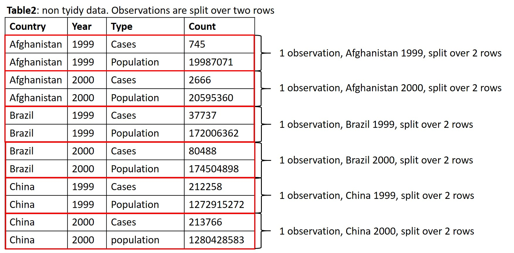

# Lesson 3 - Importing data & tidy data

```{r include=FALSE}
load("course_urls.RData")
les <- 3
```

```{r echo=FALSE, message=FALSE, out.width = "50%", fig.align = "center"}
knitr::include_graphics("images/03_01_tidy.jpg")
```

## Learning objectives

After this lesson:

- You can import data into the R environment
- You know how to inspect your data
- You can make your data "tidy"

## Importing text files

So far, we have worked with built-in datasets. In real life you will generate data yourself or you will obtain data from other researchers or public sources such as [NCBI](https://www.ncbi.nlm.nih.gov/).

To start working with your own datasets, data needs to be read by R and stored as R objects. We can use a variety of  `read_function()` from the the [tidyverse](https://www.tidyverse.org/) packages to import plain text datafiles as tibbles (sort of like a data table). These functions work the same. If you have mastered one  you can use the other functions in a similar way:

```{r eval=F}
read_csv()       ## comma separated values
read_csv2()      ## semicolon separated values
read_tsv()       ## tab separated values
read_delim()     ## custom defined delimiter, for example: 
read_delim("voorbeeld.csv", delim="&")
read_fwf()       ## fixed width fields
read_table()     ## white space separated 
```

### separators 

Before choosing the right `read_function()` you need to know how the values of your dataset are separated. 

You can view files by clicking on them in the files tab (lower right corner of the screen). 
```{r echo=FALSE, message=FALSE, out.width = "80%"}
knitr::include_graphics("images/01_3_Rstudio.jpg")
```

**Navigate to the folder data/lesson3.**

**try clicking on a few txt files and inspect what they look like.**

**click on heights.csv, select view**

Values of the heights.csv file are separated by comma's. Even though the filename ends on csv (comma separated values) always inspect the contents of a datafile before loading it into R! 

We can use the read_csv() function:

###### Example
```{r}
library(tidyverse)
heights <- read_csv("data/lesson3/heights.csv")
```

you can view the data by typing the object name in the console (or in a script and run that line):

```{r, eval=F}
heights
```

R assumes the decimal separator is a "point". If your datafile has a comma as a decimal separator (most european datafiles) you have to tell the `read_function()` this!

We will use a datafile which is present in the server folder **data/lesson3** named **heights3.txt**. Inspect the datafile heights3.txt. As you can see, 
the values are tab separated and the decimal separator is a comma.

We will first use the `read_tsv()` function with default settings:

###### Example
```{r}
heights_3 <- read_tsv("data/lesson3/heights3.txt")
heights_3
```

The values of variable height are not shown correctly:

* row1 original value = 74,4244387818035. 
* row1 converted value = 7.44e14

We have to instruct `read_tsv()` that the comma acts a decimal separator by using the locale argument in combination with the `locale()` function:

###### Example
```{r}
heights_3 <- read_tsv("data/lesson3/heights3.txt", 
                      locale = locale(decimal_mark = ","))
heights_3
```

Now the values of the height variable are read in correctly.

### extracting numbers
The `read_function()` (in this case `read_tsv`) guesses the datatype of each column and tries to read and convert the data in the right format. A problem you might encounter are numbers surrounded by non-numerical characters such as % of currency characters. For example $1,23 or 31%. To extract only the number we can use two options:

* The function `parse_number()`
* The argument **col_types** in combination with the `function cols()`.  

To demonstrate number extraction out of a character value we will use file **dollar.txt** in the server folder **data/lesson3**

###### Example
```{r}
dollar <- read_tsv("data/lesson3/dollar.txt")
dollar                                        # variable amount is of data type character (chr)
parse_number(dollar$amount[1])            # parse_number() extracts numeric value out of $100 
dollar$amount <- parse_number(dollar$amount)  # replace all character strings for numeric values of the variable "amount"
dollar                                        # check that numeric values are extracted and returned 
```

The alternative solution is to use the `read_function()` and change the **col_types** argument.  The **col_types** argument is used in combination with the `col()` and the `col_number()` function (of which the latter is equivalent to the `parse_number()`  function). The `col()` function is used to  select all variables and the `col_number()` function is used to select a specific variable (in this case "amount") to extract the number out of a character vector.

###### Example
```{r}
dollar_2 <- read_tsv("data/lesson3/dollar.txt",  col_types = cols(amount = col_number()))
dollar_2  # numeric values are extracted and returned . Data type is double (dbl)
```

<div class="question">
##### Exercise `r les` {-} 

Import data datafile heights4.txt in server folder data/lesson3 into R.
</div>

<details><summary>Click for the answer</summary>
```{r}
heights4 <- read_delim("data/lesson3/heights4.txt", delim="@", locale = locale(decimal_mark = ","))
heights4
```
</details>

<div class="question">
##### Exercise `r les` {-} 

Import data datafile salary.csv in server folder data/lesson3 into R. 

Convert character vectors with numbers to numeric values only. The thousand separator is a dot !
</div>

<details><summary>Click for the answer</summary>
```{r}
salary <- read_csv2("data/lesson3/salary.csv", 
                   col_types = cols(Salary_2018 = col_number(), 
                                    Increase_in_salary_2018 = col_number()))
salary
```
</details>


## Setting variable (column) names

By default `read_function()` uses the first line of a dataset as variable names (column names). 

There are two situations where we have to change the behaviour of the `read_function()`

<div class="tip">
If a dataset doesn't contain variable names (=column names) use the option col_names = FALSE.
</div>

The first line of the dataset will be ignored as variable names. The columns will be labelled automatically from X1 to Xn. If you want to manually add variable names you can provide a vector with the variable names tot the col_names option: col_names = c("variable_name1", "variable_name2", "variable_name3")

Download dataset [heights1.csv](downloaddata/heights1.csv) and move the file to the server folder data/lesson3. To move files between the server and your computer:

**Go to the server, select the folder you want to upload something to.**

**click on Upload**

```{r , echo=FALSE, message=FALSE, out.width = "60%"}
knitr::include_graphics("images/03_3_uploadles.PNG")
```

**In the upload menu, click Choose File and select heights.csv where you just downloaded it.**

**inspect heights.csv**

This file lacks variable names:

###### Example
```{r include=FALSE}
heights_1 <- read_csv("downloaddata/heights1.csv", col_names = FALSE) 
```
```{r eval=FALSE}
heights_1 <- read_csv("data/lesson3/heights1.csv", col_names = FALSE)  # first line will not be used as variable names 
```
```{r}
head(heights_1)
```

```{r include=FALSE}
heights_1_1 <- read_csv("downloaddata/heights1.csv",  col_names = c("name1", "name2", "name3", "name4", "name5", "name6"))  
```
```{r eval=FALSE}
heights_1_1 <- read_csv("data/lesson3/heights1.csv",  col_names = c("name1", "name2", "name3", "name4", "name5", "name6"))  
# added custom variable names by providing a vector containing the names of the variables
# in this case: "name1, name2  name3 etc"
```
```{r}
head(heights_1_1)
```

Variables names can always be modified by using:

* The function `colnames()`
* The function `rename()`


###### Example
```{r eval=FALSE}
heights_1 <- read_csv("data/lesson3/heights1.csv", col_names = FALSE) 
```
```{r}
colnames(heights_1)<- c("name1", "name2", "name3", "name4", "name5", "name6")   # change all column names 
colnames(heights_1)[3] <- "new_name3"   # change the name of a specified column using an index
heights_1_1 <-rename(heights_1_1,  new_name4 = name4) # change the name of a specified column using rename() 
```

<div class="tip">
**(2) if variable names are present but not at the first line use te options skip=N or comment = "#"**
</div>

Download dataset [heights2.txt](downloaddata/heights2.txt) and move the file to the server folder data/lesson3. This file contains variable names but not at the first row. Note that the values are separated by tabs!

**First we have to inspect the datafile: click on the file.**

The first two lines are comments starting with the # sign. The variable names are present at row3.  To read in the file we will use read_tsv()

###### Example
```{r include = FALSE}
heights_2<-read_tsv("downloaddata/heights2.txt", skip = 2) 
```

```{r eval=FALSE}
heights_2<-read_tsv("data/lesson3/heights2.txt", skip = 2) # first two rows are not imported in object heights_2
```
```{r}
heights_2
```

Alternatively we can use the comment = "#" option

###### Example
```{r include = FALSE}
heights_2<-read_tsv("downloaddata/heights2.txt", comment = "#")
```
```{r eval=FALSE}
heights_2<-read_tsv("data/lesson3/heights2.txt", comment = "#")      ## lines starting with a # sign are ignored for read in
```
```{r}
heights_2
```

<div class="question">
##### Exercise `r les` {-}  
Import datafile iris in server folder data/lesson3 into R.

This file lacks column names and starts with comments. Import the datafile without the comment lines and add columns names "Sepal.Length", "Sepal.Width",  "Petal.Length", "Petal.Width", "Species" to the imported dataset.
</div>

<details><summary>Click for the answer</summary>
```{r}
iris_flower<-read_tsv("data/lesson3/iris",
           comment = "#",
           col_names = c("Sepal.Length", "Sepal.Width", "Petal.Length", "Petal.Width", "Species"))
```
</details>


## Importing Excel files

To import Excel files directly into R we can use `read_excel()` function of the readxl package which is part of tidyverse. When Using `read_excel()` Excel datasheets will be converted to a tibble. `read_excel()` reads both xls and xlsx files and detects the format from the extension.

More information about the readxl package can be found at [tidyverse.org](https://readxl.tidyverse.org/)

NOTE: Sometimes it's more convenient to organise your data in Excel and copy the values as plain text in a text editor such as notepad. Subsequently, import the file using the appropiate read_function() described on the previous page.


###### Example
```{r}
library(tidyverse)
library(readxl)                               # you have to explicity load the readxl library
excel_sheets("data/lesson3/datasets.xlsx")    # inspect how many datasheets are present in the excel file
                              
datasets_iris<-read_excel("data/lesson3/datasets.xlsx")    # default behaviour is to import the first datasheet. 
```

Excel files can have multiple datasheets. To specifically select a datasheet use the sheet = "sheetname" or sheet = number option

###### Example
```{r}
datasets_mtcars<-read_excel("data/lesson3/datasets.xlsx", sheet = "mtcars")  # select Excel datasheet named "mtcars"
datasets_quakes<-read_excel("data/lesson3/datasets.xlsx",  sheet = 4)        # select the 4th Excel datasheet (= "quakes")
```

Datafiles in Excel might not always contain column names (=variable names). If the first row doesn't contain column names we have to tell read_excel() to treat the first row as values and not as variable names by using the col_names=FALSE option. 

###### Example
```{r}
datasets_iris_2<-read_excel("data/lesson3/datasets.xlsx", sheet = 5, col_names = FALSE) 
```

If you want to rename the column names you can use the rename() or the colnames() functions (see [Setting variable (column) names])

<div class="question">
##### Exercise `r les` {-} 
Import sheet "quakes_1" from datafile datasets.xlsx  in server folder data/lesson3 into R. Column names are not listed in datasets.xlsx. Import the datafile and add columns names "lat" "long" "depth" "mag" "stations" to the imported data.
</div>

<details><summary>Click for the answer</summary>
```{r}
library(readxl)
read_excel("data/lesson3/datasets.xlsx",
    sheet = "quakes_1",
    col_names = c("lat", "long", "depth", "mag", "stations"))
```
</details>

## Saving and importing R_Objects

* To import data in plain text  format we use the function read_function() 
* To import data in Excel format we use the function read_excel()

It is also possible to save an R object directly to the server and to read the file from the server in the R environment:

To save an R object to the server use the function `saveRDS()`

To import data that is stored as an R object we make use of the function `readRDS()`

###### Example
```{r eval=FALSE}
library(dslabs)                              # we will use a dataset called olive from the dslabs package                       
View(olive)
saveRDS(olive, "data/lesson3/olive.rds")     # object olive is saved as file olive.rds in server folder data/lesson3   
```

To import this R object from the server into RStudio use `readRDS()`. This function takes 1 argument. Assign the R object from the server to a new object name in Rstudio!

###### Example
```{r eval=FALSE}
olive_from_server <- readRDS("data/lesson3/olive.rds")                    ## the path to the file must be quoted
```

## Inspecting your data

Data wrangling: the process of transforming and mapping data from a "raw" data format into another format with the intent of making it more appropriate and valuable for a variety of downstream purposes such as analytics and visualization ([wikipedia] (https://en.wikipedia.org/wiki/Data_wrangling))

The first step in data wrangling is to inspect the structure of the dataset.  We've already seen some functions to inspect the data. Important questions are:

* What is the datastructure?
* How many variables does the dataset contain?
* What are the names of the variables?
* What are the data types of the variables?
* What are possible categories (factors)?
* What are the levels of the categories?
* Are there NA values?
* Is the data **tidy**?

Let's recall some previously used functions to inspect the data. We will use data from the "dslabs" package.

###### Example
```{r message=FALSE}

library(tidyverse)
library(dslabs)
```
```{r eval=FALSE}
?divorce_margarine      # information about the divorce_margarine dataset from the "dslabs" package
```
```{r message=FALSE}
divorce_margarine_tbl <- as_tibble(divorce_margarine)      # converting dataframe to tibble                    
divorce_margarine_tbl 
```


Let's inspect another dataset from the dslabs package: gapminder

###### Example
```{r eval=FALSE}
?gapminder                                       # information about the "gapminder" dataset
```

```{r}
gapminder_tbl <- as_tibble(gapminder)            # converting dataframe to tibble
gapminder_tbl
levels(gapminder_tbl$continent)                # categories in the continent variable
sum(is.na(gapminder_tbl$infant_mortality))   # count the missing (NA) values
```

The last question of the inspection list is:

Is the data **tidy**?

Before we can answer this question we have to know what tidy data is.

***

## What is tidy data?

Tidy data is a way of organising your data in a neat and structured way. If you make your data tidy, it is ensured that it is compatible with data analysis tools from the [tidyverse](https://www.tidyverse.org/) package. A detailed explanation can be found in [chapter12](https://r4ds.had.co.nz/tidy-data.html) in the e-book R for Data Science

However, it is important to note that data does not always need to be tidy. Other R packages require different data organisation formats!

So what is tidy data:

1. Each variable must have its own column.  
1. Each observation must have its own row. 
1. Each value must have its own cell.

*Table1: Example of tidy data*

| country 	| year 	| population 	| birth rate 	|
|:---------	|:-----	|:----------	|:-----------	|
| mali    	| 2001 	| 10.000.000 	| 6.88       	|
| mali    	| 2010 	| 15.000.000 	| 6.06       	|
| sweden  	| 2001 	| 9.000.000  	| 1.57       	|
| sweden  	| 2010 	| 10.000.000 	| 1.85       	|


Each variable must have its own column.  

```{r , echo=FALSE, message=FALSE, out.width = "60%"}
knitr::include_graphics("images/03_4_tidy1.jpg")
```

Each observation must have its own row. 

```{r , echo=FALSE, message=FALSE, out.width = "60%"}
knitr::include_graphics("images/03_5_tidy2.jpg")
```

Each value must have its own cell.

```{r , echo=FALSE, message=FALSE, out.width = "60%"}
knitr::include_graphics("images/03_6_tidy3.jpg")
```

So the following table would by untidy, as there are multiple observations per row:

*Table2: Example of untidy data*

| student  	| EDCC 	| molbio 	| immunologie 	| BID 	|
|:----------	|:------	|:--------	|:-------------	|:-----	|
| Pietje   	| 7.5  	| 6      	| 8.2         	| 8   	|
| Marietje 	| 8    	| 7.9    	| 5           	| 9   	|


This would be the tidy version:

*Table3: Example of untidy data made tidy*

| student  	| course      	| grade 	|
|:----------	|:-------------	|:-------	|
| Pietje   	| EDCC        	| 7.5   	|
| Pietje   	| molbio      	| 6     	|
| Pietje   	| immunologie 	| 8.2   	|
| Pietje   	| BID         	| 8     	|
| Marietje 	| EDCC        	| 8     	|
| Marietje 	| molbio      	| 7.9   	|
| Marietje 	| immunologie 	| 5     	|
| Marietje 	| BID         	| 9     	|

<div class="question">
##### Exercise `r les` {-}    {#onderzoektidyvraag}
The package tidyverse contains the built-in datasets:

* table1
* table2
* table3
* table4a
* table4b

Write code to inspect the data and argue if the tables are tidy
</div>

<details><summary>Click for the answer</summary>

To inspect for instance **table1**, just write `table1` in the console window.

There are three rules to make a dataset tidy:

* Each variable must have its own column.
* Each observation must have its own row.
* Each value must have its own cell.

**table1**: tidy

**table2**: non-tidy, violation of rule2. An observation is a country in a year, but each observation is spread across two rows.

**table3**: non-tidy, violation of rule3. The "rate" column contains both cases and population variables

**table4a/b**: non-tidy, violation of rule 1 and 2. The column names "1999" and "2000" represent values of the year variable, and each row represents two observations, not one.
</details>

## Making your data tidy: gathering

In [this exercise](#onderzoektidyvraag) we noted that table4a is not tidy: the column names '1999' and '2000' represent values of the year variable, and each row represents two observations, not one.

```{r , echo=FALSE, message=FALSE, out.width = "80%"}
knitr::include_graphics("images/03_7_nontidy_table4a.jpg")
```

To merge columns '1999' and '2000' into 1 column we can use the tidyverse function `pivot_longer()`:

```{r}
table4a_tidy <- pivot_longer(data = table4a, cols = c('1999', '2000'),  
                             names_to = "year",  values_to = "cases")
table4a_tidy
```

Alternatively we can use the pipe to redirect data to the `pivot_longer()` function:

###### Example
```{r}
table4a_tidy <- table4a %>% pivot_longer(cols = c('1999', '2000'),  
                                         names_to = "year",  values_to = "cases")
```


<div class="rstudio-tip">
Important: from now on we will often use the pipe %>% to redirect data into an R function: 
</div>

The %>% pipe symbol can be read as "followed by". The %>% symbol directs the **OUTPUT** of one R function as **INPUT** to the following R function.

dataset %>% function() %>% function() .. and so on

This way the steps of data manipulation are easier to follow for the reader. It is good practice to write clean / clear code that can be understand by other people. 


<div class="question">
##### Exercise `r les` {-} 
(a) Import datafile the first sheet gene_expression_c10.xlsx into R (it is already in the server folder data/lesson3)

(b) What are the dimension of the dataset?
</div>

<details><summary>Click for the answer</summary>
```{r}
#(a)
library(readxl)
gene_expression <- read_excel("data/lesson3/gene_expression_c10.xlsx")

#(b)
dim(gene_expression) # or look in the environment panel, upper right part of the screen
```
</details>

<div class="question">
##### Exercise `r les` {-} 
(a) Make the dataset of exercise_5.1 tidy

(b) What are now the dimension of the tidy dataset?
</div>

<details><summary>Click for the answer</summary>
```{r}
#(a)
gene_expression_tidy <- pivot_longer(data = gene_expression,
                                     cols = c('0h', '3h','12h', '24h', '48h'), 
                                     names_to = "time(hrs)", 
                                     values_to = "expression")
# or: 
gene_expression_tidy <- gene_expression %>% 
  pivot_longer(cols = c('0h', '3h','12h', '24h', '48h'), 
               names_to = "time(hrs)", values_to = "expression")

#(b)
dim(gene_expression_tidy)
```
</details>

## Making_your_data_tidy: spreading

In the [this exercise](#onderzoektidyvraag) we noted that table2 is not tidy: 2 row represents 1 observation.

```{r , echo=FALSE, message=FALSE, out.width = "60%"}

```

Note that variable column "Type" contains the names of the variables "Cases" and "Population". This is the reason that two rows represent 1 observation. 

To merge the two rows, representing 1 observation, into 1 row we use the tidyverse function `pivot_wider()`. 

```{r}
table2_tidy <- pivot_wider(data = table2, names_from = "type", values_from = "count")
table2_tidy
```

Alternatively we can use the pipe to redirect the data to the pivot_wider() function:

###### Example
```{r}
table2_tidy <- table2 %>% pivot_wider(names_from = "type", values_from = "count")
```

<div class="question">
##### Exercise `r les` {-} 

(a) Import the second data sheet from datafile gene_expression_c10.xlsx (from the previous question, in server folder data/lesson3) into R

(b) Make the dataset tidy

</div>

<details><summary>Click for the answer</summary>
```{r}
#(a)
gene_expression_sheet2 <- read_excel("data/lesson3/gene_expression_c10.xlsx", sheet=2)

#(b)
gene_expression_sheet2_tidy <- pivot_wider(data = gene_expression_sheet2, 
                                           names_from = "assay", 
                                           values_from = "value")
# or: 
gene_expression_sheet2_tidy <- gene_expression_sheet2 %>% 
  pivot_wider(names_from = "assay", values_from ="value")
```
</details>


## Making_your_data_tidy: separate

In [this exercise](#onderzoektidyvraag) we noted that **table3** is not tidy: 2 values are present in 1 cell.

###### Example
```{r}
table3
```

To separate the values in two cells we use the tidyverse function `separate()`:

```{r}
table3_tidy <- separate(table3, rate, into = c("cases", "population"))
table3_tidy
```

The original variable "rate" contained "character" values, namely the two combined values separated by a forward slash. After the separation each new column ("cases" and "population") contain **numeric** values but the value types are still denoted as **characters**. To convert the character values into numeric values we use the **convert** option. 

###### Example
```{r}
table3_tidy <- separate(table3,  rate,  into = c("cases", "population"), convert = TRUE)
```

Normally you have to specify where the values need to be separated. In this case the forward slash character ("/"). The default option of the `separate()` funtion is to separate values based on any non-alphanumeric character (i.e. a character that isn’t a number or letter).  It is good practice though to write the separation character explicity in your code by using the sep="character" option. 

###### Example
```{r}
table3_tidy <- separate(table3, rate, into = c("cases", "population"), convert = TRUE,  sep = "/")
```

By using the **sep=** option we can also split values based on the a specific **number** of characters. For example we want to use the first three character of each country in our column instead of the full names. We can split the country names by the first three characters. 

###### Example
```{r}
# only 1 variable is defined: first 3 characters are stored in variable "country" replacing the original variable "country"
separate(table3_tidy, country, into = c("country"), sep = 3)
```


<div class="question">
##### Exercise `r les` {-} 

(a) Import datafile gene_expression_c10 (the one without the .xlsx) in the server folder data/lesson3 into R. The data colums are separated by a semicolon. 

(b) Make the dataset tidy

</div>

<details><summary>Click for the answer</summary>
```{r}
#(a)
gene_expression_1 <- read_csv2("data/lesson3/gene_expression_c10")

#(b)
gene_expression_1_tidy <- separate(gene_expression_1, "0h-3h-12h-24h-48h",
                             into = c("0h", "3h", "12h", "24h", "48h"),  sep = "!",  convert = TRUE)
# or: 
gene_expression_1_tidy <- gene_expression_1 %>% separate("0h-3h-12h-24h-48h",
                             into = c("0h", "3h", "12h", "24h", "48h"),  sep = "!",  convert = TRUE)
```

First we separate the values in 5 new variables. But the data is not tidy yet. We have to apply the function `pivot_longer()` because the new variables are not true variables but values of the variable "time_after_induction"
```{r}
gene_expression_1_tidy2 <- gene_expression_1_tidy %>%  pivot_longer(
  cols = c('0h', '3h', '12h', '24h', '48h'),
  names_to = "time_after_induction", values_to = "gene_expression")
```

</details>

## Checking normality

An important part of data analysis is to perform a statistical test to demonstrate that differences between experimental conditions are significant. In this course we will show how to perform a range of statistical test in R. These tests have been explained in detail in the 2nd year course TLSC-BID3V-17_Dataverwerking (see the figure below) and will only be briefly discussed again during this course. You previously executed them in SPSS or Excel, now we will show how to do them in R.

<div class="tip">
If you realise you have quite forgotten what you learned in TLSC-BID3V-17_Dataverwerking and/or TLSC-EV1V-17, revisit the course content and refresh your knowledge! 

BID: canvas should be still up

EV1V: [click here for online reader](https://lesmaterialen.rstudio.hu.nl/statistiek-en-excel-reader/)
</div>

```{r flowscheme, echo=FALSE, message=FALSE, out.width = "80%", fig.cap = "Decision scheme for statistical testing"}
knitr::include_graphics("images/08_2_general_flowscheme.jpg")
# linkin: This is a figure \@ref(fig:flowscheme)
```

<div class="tip">
Non-parametric tests in R actually just use the exact same syntax (way of writing the code) as the parametric equivalent, but using a different function name. Therefore, we will only cover the parametric tests within this course, en provide you with a table of non-parametric equivalent function names. 
</div>


The most common parametric statistical tests rely on the assumption that the residuals are normally distributed. (Not a clue what we're talking about? Check the 1th year course on statistics [here](https://lesmaterialen.rstudio.hu.nl/statistiek-en-excel-reader/meten.html#eerstekeernorm) and also [here](https://lesmaterialen.rstudio.hu.nl/statistiek-en-excel-reader/kansverdeling.html#andere-verdelingen)).

In the cases you will encounter here, this just means the same as the data within each group or variable coming from a population with a normal distribution. You will have learned in the 2nd year course on dataverwerking to perform a **Shapiro-Wilk test** to check this assumption when dealing with interval / ratio data. If any variable or any group data column is not normally distributed, Shapiro-Wilk test will give you a p-value below 0.05 and you have to make use of a non-parametric test.


<div class="tip">
The Shapiro-Wilk test is used to determine whether your data are is normally distributed.
</div>

First, let's perform a Shapiro-Wilk in R:. 

To analyze the normality of a dataset is we will make use of the Shapiro-Wilk test (see figure 2). A statistical test serves to either accepts or reject the null-hypothesis. In the case of the Shapiro-Wilk test the null-hypothesis (H0) is defined as:

* H0: the sample came from a population that is **not different from** a normally distributed population.
* H1: the sample came from a population that **is different from** a normally distributed population.

This means that if the p-value is > 0,05 the H0 is accepted and we are allowed to perform a parametric test. (So in contrast to most statistical tests, we generally "want" a p>0.05 here...) It is important to note that all variables being compared must be normally distributed in order to perform a parametric test. 

So if you want to investigate the correlation between the length of ears and the maximum running speed in rabbits, both your columns with data on ear length and maximum running speeds need to be "passing the Shapiro Wilk test" if you want to do parametric tests. 

And if you are interested in investigating whether mice who inhaled cigarette smoke for quite a while differ in stamina from a control group of mice, you will perform the Shapiro Wilk test on the data from both groups.  

<div class="tip">
Remember null hypothesis testing from previous statistics courses:

 - The H0 (null hypothesis) generally states that there is **no** effect or difference.
 - The p-value gives you the probability of seeing the data when the H0 would be true.
 - If the p-value is below a value you agreed on before doing the testing ($alpha$, generally 0.05) then you reject the H0. So, for example in a two sample design: if the data was very, very unlikely (low p-value) in the situation that there is no actual difference between groups (H0), we should reject the idea that there is no actual difference between groups (reject H0) and accept that there is probably a difference between groups (alternative hypothesis, H1).
 - so: if p<0.05, there is a significant effect/difference/etc.
 - so: if p>0.05, we cannot say there is a significant effect/difference/etc.
</div>


***
To perform the Shapiro-Wilk test of normality for one variable at a time, use the function `shapiro.test()`. 

The function `shapiro.test()` takes a numeric vector as input and performs the shapiro-wilk test.

The output of shapiro.test() is a list with fixed column names:

> [1] "statistic" "p.value" "method" "data.name"

***

Let's demonstrate the shapiro-wilk test with a dataset named **smoking** present in server folder **"data/lesson3"**. The smoking dataset is an unpaired experiment containing two different mice groups: control mice ("Controle") and a group of mice continuously exposed to cigarette smoke ("Rook"). The measurement values represent minutes of swimming until exhaustion. 

###### Example
```{r, message=F, error=F}
library(tidyverse)
smoking <- read_tsv("data/lesson3/smoking")
smoking #remember there are more rows, you only get shown the first few
```

To perform a Shapiro-Wilk test, simply type:
```{r, message=F, error=F}
shapiro.test(smoking$Controle)

shapiro.test(smoking$Rook)
```

Both variables of the dataset "smoking" have a p-value > 0,05 meaning we can perform a parametric test. 

## map functions
In the example we performed the Shapiro-Wilk test twice. This is because the `shapiro.test()` function accepts one vector at a time. This makes the code repetitive and generally in coding we want to avoid repetitive code as it is prone to errors. 

If we want to perform the same function on all variables of a dataframe (tibble) we can make use of a series of map functions:

> `map()`       makes a list.

> `map_lgl()`   makes a logical vector

> `map_int()`   makes an integer vector

> `map_dbl()`   makes a numerical vector 

> `map_chr()`   makes a character vector


<div class="question">
##### Exercise `r les` {-} 
Make sure you understand the difference between logical, integer, numerical, and character. Google it.
</div>

For example, if we want the sum of each variable in dataset smoking we will use `map_dbl()`. The output of the `sum()` function will be stored in a numeric vector of type dbl (double)

###### Example
```{r }
smoking %>% map_dbl(sum)
```

If we want to perform the Shapiro-Wilk test on each variable of dataset smoking we will use `map()` as the output of the `shapiro.test()` function is a list. For each variable of the smoking dataset, a list is produced and these lists are combined and stored in a new list (thus, the elements of the final list consist of lists!)

###### Example
```{r }
# shapiro.test() outputs multipe lines: use map() to store as list
SW_smoking <- smoking %>% map(shapiro.test)         
class(SW_smoking)                                                                                      

# the output of map() is a list containing two list elements
# each list element contains the p-value of the Shapiro-Wilk test
str(SW_smoking)
```

We see that the output of the Shapiro-Wilk test is stored as a list containing two elements, one for each variable. The elements in the list are lists themselves containing the summary information of the Shapiro-Wilk test.

What we are really interested in is the p-value (NOTE: in the list stored as p.value). We can automatically substract the p-values by adding another `map()` function. As the p-values are numbers we select the `map_dbl()` function so the p-values will be stored in a numeric vector.

###### Example
```{r }

smoking %>% map(shapiro.test) %>% map_dbl("p.value")
```

We see that both p-values are above 0,05. We accept the H0 and conclude that both samples are normally distributed. We are allowed to perform a parametric test.

<div class="question">
##### Exercise 7
Dataset Shapiro_Wilk present in server folder /data/lesson3 contains 10 samples with hematocrit values.  
Write an R code to determine which samples are not normally distributed.
 
</div>

<details><summary>Click for the answer</summary>


```{r}
library(tidyverse)
# load the data
SW <- read_tsv("data/lesson3/Shapiro_Wilk")

SW_pvalues <- SW %>% 
  map(shapiro.test) %>% # perform Shapiro-Wilk test
  map_dbl("p.value") %>% # extract p-values
  round(digits = 3) #round them down to 3 digits

# select those that are significant (ie: not normally distributed)
SW_pvalues[SW_pvalues < 0.05]
```

</details>

<!--- To be finished and included later if I ever have the time
https://towardsdatascience.com/stop-testing-for-normality-dba96bb73f90

### Q-Q plots
Now, there are some issues with using a Shapiro-Wilk. Mainly in the next course (DAUR2) you will encounter very large datasets. Remember what the p-value of a null hypothesis test means: it is the probability of finding the data that you found, if the null hypothesis was correct. What happens when you use such null hypothesis testing with big datasets is that the larger amount of data increases your ability to detect very small deviations from what you would have expected to see when the null hypothesis would be correct. Therefore, at sufficiently large dataset sizes, even tiny effects may become statistically significant. 

But why?
Perhaps you will remember how to calculate z-values from the first year course on Statistiek&Excel. You will remember that 


Shapiro-Wilk is not any different in this sense, so with datasets over about 200 datapoints, Shapiro Wilk will nearly always tell you you have non-normally distributed data (residuals).Luckily, there are other ways to inspect your data: 
-->


## Histograms

A **histogram** is a representation of the distribution of numerical (continuous) data. A histogram divides the x-axis into equally spaced bins and then uses the height of a bar to display the number of observations that fall in each bin. Histograms are often used to inspect the distribution of a dataset. A fundamental skill in data science is to visualize your data clearly and honestly. 

We will use the package **ggplot2** to make graphs in R (part of  the **tidyverse** , so doesn't have to be loaded separately from tidyverse). 

```{r eval=FALSE}
library(tidyverse)   
```

ggplot graphics are build with layers. In different layers, you provide ggplot with information about the data (**data**), how you want the graph to look like (**aesthetics**), and what kind of graph it should be (**geom function**). 

We will take a look at a hypothetical follow up experiment on the smoking data we used previously, using 200 mice who got nicotine patches or not. The dependent variable was minutes of swimming until exhaustion. I will spare the poor mice the exhaustion and generate the data for this example. Run this code to generate the fake data:
```{r}
set.seed(123)
smoking2 <- tibble(
  controle = rnorm(200,180,15),
  patch = rnorm(200,160,25)
)
```

Let's look at the minimum and maximum swimming times in the patch group:
```{r}
min(smoking2$patch) ## minimum minutes of swimming until exhaustion
max(smoking2$patch) ## maximum minutes of swimming until exhaustion
```

In order to see the distribution of the swimming times between the minimum and maximum values we will make a distribution plot, a histogram. It is build as:

 1. a layer with the data and aesthetics (aes)
 1. a layer telling ggplot we want a histogram
 1. a layer setting the title and axes

```{r}
ggplot(data = smoking2, aes(x = patch)) + 
  geom_histogram()+
  labs(
    title = "Distribution of swimming times of patch mice",
    x= "swimming time (min)",
    y= "count")
```

We can choose the bin size. The bin size, is the range on the x-axis that represents the width of each bar in the histogram. We can change it if we like:

```{r}
ggplot(data = smoking2, aes(x = patch)) + 
  geom_histogram(binwidth = 10)+
  labs(
    title = "Distribution of swimming times of control mice",
    x= "swimming time (min)",
    y= "count")
```

To make separate histograms for the control and the patch group in the same figure, we could make the data tidy and add an extra layer to ggplot called `facet_wrap()`:

```{r}
# tidy data: each variable in 1 column
smoking2_tidy <-  pivot_longer(data = smoking2, cols = c(controle, patch),  
                             names_to = "group",  values_to = "swimming_time")

# create histograms
ggplot(data = smoking2_tidy, aes(x = swimming_time)) + 
  geom_histogram(binwidth = 10)+
  labs(
    title = "Distribution of swimming times of control mice",
    x= "swimming time (min)",
    y= "count")+
  facet_wrap(~ group) 
```

This is your first time using ggplot! Nice.

<div class="question">
##### Exercise `r les` {-} 

To generate random numbers of the standard normal distribution we make use of the function `rnorm()`. To generate 1000 random values of the standard normal distribution run rnorm(n = 1000).

(a) Use the function rnorm() to generate a tibble with 1000 random values of the standard normal distribution.
(b) Create a histogram of the 1000 random values of (a). Use a binwidth of 0.2.
</div>

<details><summary>Click for the answer</summary>

(a)
```{r}
normal_dist <- tibble(x = rnorm(1000))
```
(b)
Note that as we randomly generated numbers, your graph will look a bit different. You almost certainly generated different random nnumers than we did when we made this reader.
```{r}
ggplot(data = normal_dist, aes(x = x)) +
  geom_histogram(binwidth = 0.2)
```
</details>


## Overview R functions


#### Data import of plain text files

function | package
------ | --------
read_csv()   |  tidyverse
read_csv2()  |  tidyverse
read_tsv()   |  tidyverse
read_delim() |  tidyverse
read_fwf()   |  tidyverse
read_table() |  tidyverse
colnames()   |  tidyverse
rename()     |  tidyverse
saveRDS()    |  base
readRDS      |  base

#### Data import of Excel files

function | package
------ | --------
read_excel()    |   readxl
excel_sheets()  |  readxl

#### Inspecting your data

function | package
------ | --------
system()    |   base
as_tibble() |   tidyverse
is.na()     |   base
levels()    |    base

#### Tidy Data

function | package
------ | --------
pivot_longer()      |   tidyverse
pivot_wider()      |   tidyverse
separate()    |   tidyverse
