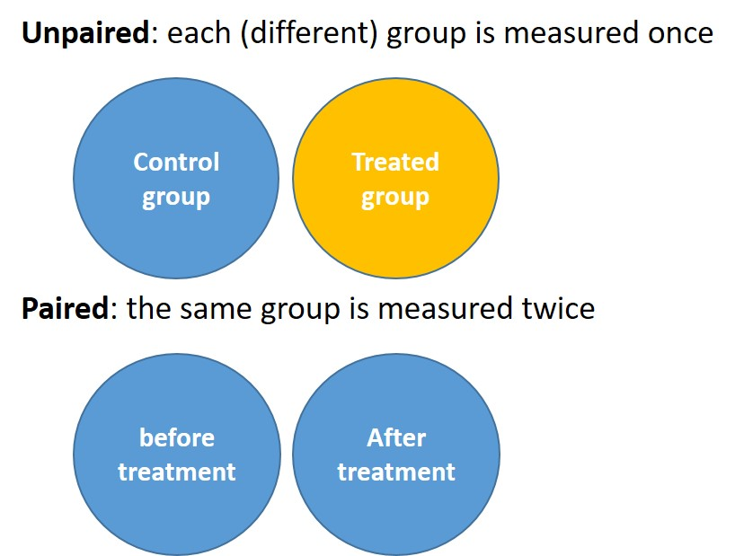

# Lesson 4 - Answering research questions

```{r include=FALSE}
load("course_urls.RData")
les <- 4
```

```{r echo=FALSE, message=FALSE, out.width = "50%", fig.align = "center"}
knitr::include_graphics("images/04_1_ggplot.png")
```

## Learning objectives

After this lesson:

- You will have a basic understanding of different graph types and when to use them.
- You can visualize categorical data with ggplot.
- You can visualize continuous data with ggplot.
- You can summarize data using boxplots.
- you can perform the most common statistical tests with R.


note: if your data is not in a folder /data/, just ignore that part of the path name!

## Difference Questions

When your research question is about a possible difference between samples (e.g. groups, conditions, etc) you often  make a bar chart, and perform a t-test or ANOVA (if your data is normally distributed, see previous lesson).

### Practice making bar charts

To start this lesson, we will first practice a bit with using ggplot2. We used it before to make histograms, but ggplot can make a lot of different graphs. 

A **bar chart** is a graph that presents categorical (nominal) data with rectangular **bars** with heights or lengths proportional to the values that they represent. The bars can be plotted vertically or horizontally.

To create a bar chart we can either use:

- `geom_bar()`:  by default, geom_bar() accepts one variable (categorical) as x-value. The number of occurrences for each category is calculated by default.
- `geom_col()`: by default, geom_col() accepts one variable (categorical) as x-value and one variable (values of each category such as occurences, mean, median, proportion, min, max and so on) as y-value.

Note: arguments in the ggplot() function will be applied to all layers whereas arguments in the geom_function() layer will only be applied to that specific layer. 

###### Examples

Let's plot the amount of penguins per species in the `palmerpenguins` dataset (install it if needed):

```{r message=TRUE}
# Load the tidyverse package (only once for each R session)
library(tidyverse) 
```
```{r}
library(palmerpenguins) #let's use some penguin data. Penguins are cool.

# Create a bar graph showing the counts based on variable species

penguins %>% # penguins is a datagframe within the palmerpenguins package
  ggplot() + 
  geom_bar(aes(x = species)) +
  theme_minimal() +
  labs(title = 'Penguins per Species in the Palmerpenguins data')

```

If we want to change the color of the bars based on the variable 'species' (3 different colours, because there are 3 different species), we can add an extra aestheti(c) 'fill'. If we want to generally change the color of the bars, we can add 'fill' outside of the aesthetic.

###### Examples

```{r}
## "fill" is placed inside aesthetic
penguins %>%
  ggplot() + 
  geom_bar(aes(x = species, fill = species)) +
  theme_minimal() +
  labs(title = 'Penguins per Species in the Palmerpenguins data')

## "fill" is placed outside the aesthetic
penguins %>%
  ggplot() + 
  geom_bar(aes(x = species), fill = "magenta") +
  theme_minimal() +
  labs(title = 'Penguins per Species in the Palmerpenguins data')

## "color" defines border color
penguins %>%
  ggplot() + 
  geom_bar(aes(x = species), fill = "magenta", colour="black") +
  theme_minimal() +
  labs(title = 'Penguins per Species in the Palmerpenguins data')
```

Each geom_funtion has a standard way of calculating and presenting the data. This is defined by the 'stat' argument. The default for `geom_bar()` is 'count', meaning `geom_bar()` displays the number of occurences of each category in variable "class" on the y-axis. 

Alternatively, the `geom_bar()` can also calculate and display the proportion of each category (relative to the total number) on the y-axis. To do so we must explicitly instruct `geom_bar()` to change the default stat of count to proportion (..prop..). An alternative way to create a graph showing the proportion of each category is to first calculate the proportion values by using some handy functions of the tidyverse packages (see also lesson 5). The new values are then stored in a separate variable. 

###### Examples

```{r}
# Create a bar graph plotting the proportions (using ..prop..)
# NB: 'group = 1' indicates that the proportions are based on entire population
ggplot(data = penguins) + 
  geom_bar(aes(x = species, y =..prop.., group = 1)) +
  labs(title = 'proportions of Penguins per Species')

# Calculate the counts of each category of the class variable using count() and
# add a new variable that is a function of existing columns using mutate(). Use
# the new variable to create a bar graph.
# NB: count() creates a new variable 'n' containing the counts
penguins  %>%  count(species) %>%  
  mutate(proportion = n / sum(n)) %>% 
  ggplot() +
  geom_col(aes(x = species, y = proportion, fill = species)) +
 labs(title = 'Also proportions of Penguins per Species')
```

<!-- By first calculating the proportion values manually, we can display the counts of each category in ascending or decending order. In combination with the `reorder()` function we change the order of the x-axis value based on the counts. To show the bars in descending order, we can simply put a minus sign before the variable in the `reorder()` function (see examples below). -->

<!-- ```{r} -->
<!-- # Create a bar graph after calculating the counts using count() -->
<!-- # NB: the x-axis categories are reordered based on the counts. -->
<!-- penguins %>% count(species) %>%   -->
<!--   ggplot() +  -->
<!--   geom_col(aes(x = reorder(species, n), y = n,  fill = species)) -->


<!-- # Fix the axis titles by setting them manually in labs: -->

<!-- penguins %>% count(species) %>%   -->
<!--   ggplot() +  -->
<!--   geom_col(aes(x = reorder(species, n), y = n,  fill = species))+ -->
<!--     labs(title = "penguin count per species", -->
<!--        subtitle = "in ascending order", -->
<!--        x = "species", -->
<!--        y = "count")  -->

<!-- # Similar to previous example, but with bars in descending order -->
<!-- # and bar-labels on the bars -->
<!-- penguins %>% count(species) %>%   -->
<!--   ggplot() +  -->
<!--   geom_col(aes(x = reorder(species, -n), y = n, fill = species))+ -->
<!--       labs(title = "penguin count per species", -->
<!--        subtitle = "in descending order", -->
<!--        x = "species", -->
<!--        y = "count") + -->
<!--   geom_label(aes(x = species, y = n, label = n)) #add labels -->
<!-- ``` -->

<div class="question">
##### Exercise `r les` {-} 

Stars are classified by their spectra (the wavelengths that they absorb) and their temperature. There are seven main types of stars based on decreasing temperature. The categories are: O, B, A, F, G, K, and M. Use the dataset 'stars' from the 'dslabs' package to answer the following questions:

(a) Make a graph to show the number of stars for each type.
(b) Make a graph to show the number of stars for each type. Each bar has a different color.
(c) Add a black line to the different coloured bars of graph (b).
</div>

<details><summary>Click if you want to see what the graphs should look like</summary>

(a)
```{r echo=F}
library(dslabs)
ggplot(data = stars, aes(x = type)) + 
  geom_bar()+
       labs(title = "Number of stars for each type")
```
(b)
```{r echo=F}
ggplot(data = stars, aes(x = type)) + 
  geom_bar(aes(fill = type))+
  labs(title = "Number of stars for each type")
```
(c)
```{r echo=F}
ggplot(data = stars, aes(x = type)) + 
  geom_bar(aes(fill = type), colour = "black")+
  labs(title = "Number of stars for each type")
```
</details>

<details><summary>Click if you really tried and can't replicate the graphs from the answer above</summary>

(a)
```{r eval=F}
library(dslabs)
ggplot(data = stars, aes(x = type)) + 
  geom_bar()+
       labs(title = "Number of stars for each type")
```
(b)
```{r eval=F}
ggplot(data = stars, aes(x = type)) + 
  geom_bar(aes(fill = type))+
  labs(title = "Number of stars for each type")
```
(c)
```{r eval=F}
ggplot(data = stars, aes(x = type)) + 
  geom_bar(aes(fill = type), colour = "black")+
  labs(title = "Number of stars for each type")
```
</details>

<!-- <div class="question"> -->
<!-- ##### Exercise `r les` {-}  -->

<!-- Make a graph to show the number of stars for each type in descending order. Each bar has a different color and a black line. -->

<!-- Hint: first calculate the numbers for each category of the variable 'type'. To make the graph use `geom_col()` instead of `geom_bar()`. -->
<!-- </div> -->

<!-- <details><summary>Click for the answer</summary> -->
<!-- 1.2: -->
<!-- ```{r, echo=F} -->
<!-- stars %>% count(type) %>% -->
<!--   ggplot(aes(x = reorder(type , -n), y = n)) + -->
<!--     geom_col(aes(fill = type), colour = "black")+ -->
<!--     labs(title = "Number of stars for each type") -->
<!-- ``` -->
<!-- </details> -->

<!-- <details><summary>Click if you really tried and can't replicate the graph from the answer above</summary> -->

<!-- 1.2: -->
<!-- ```{r, eval=F} -->
<!-- stars %>% count(type) %>% -->
<!--   ggplot(aes(x = reorder(type , -n), y = n)) + -->
<!--     geom_col(aes(fill = type), colour = "black")+ -->
<!--     labs(title = "Number of stars for each type") -->
<!-- ``` -->
<!-- </details> -->

#### Grouped bar graphs

In the examples above, the bar graphs consisted of single bars. In some cases you want to create **grouped bar graphs**. For example, given the penguin dataset introduced above, suppose that you want to know how many male and female penguins there are for each species. You can create a bar graph in a similar way as before, but now specifying 'fill' to be determined by 'sex':

```{r}
penguins %>% count(species, sex) %>%  
  ggplot(aes(x = species, y = n, fill = sex)) + 
  geom_col()
```

We now created a grouped bar graph. However, the default of ggplot is to plot the different bars on top of each other and this is difficult to read. To plot the different bars next to each other, we can use the `position_dodge()` argument:

```{r}
penguins %>% count(species, sex) %>%  
  ggplot(aes(x = species, y = n, fill = sex)) + 
  geom_col(position = position_dodge())
```

#### Bar graphs with mean ± standard deviation
Quite often, you will want to depict an average and standard deviation in a bar graph. For instance, the average flipper length in the different penguin species.

To make a bar graph with the average flipper length, we will need to calculate it first. We will do a lot more data wrangling in the next lesson, so for now, we will just make a new tibble with the averages we need, grouped per species. There are some missing values for flipper length (I imagine not all penguins cooperated nicely when their feet were measured), and we remove those using `na.rm=TRUE`. Look at the content of `flipper_summary` by typing it in the console.

```{r}
flipper_summary <- penguins %>%
  group_by(species) %>%
  summarize(mean_flipper=mean(flipper_length_mm, na.rm=TRUE), stdev=sd(flipper_length_mm, na.rm=TRUE))
```

And we can plot this using:

```{r}
flipper_summary %>%
  ggplot(aes(x=species,y=mean_flipper, group=species, fill=species)) + 
  geom_col(stat="identity")+ 
    geom_errorbar(aes(ymin=mean_flipper-stdev, ymax=mean_flipper+stdev), width=.2)+ # the error bars
  labs(title = "Figure X. average flipper length of penguins", 
       subtitle = "errorbars depict 1 standard deviation",
       x="penguin species", 
       y="average flipper length (mm)") +
  theme(legend.position = "none", text = element_text(size=16)) # legend is not needed
```


### Two sample t-tests

Often, bar graphs are used to visualise possible **differences** between samples (e.g. between groups, conditions, etc). Generally, we then have a **categorical variable on the x-axis** (such as penguin species), and a **continuous variable on the y-axis** (such as flipper length in mm.).

But obviously you will have to do some statistics before we can confidently proclaim we see any differences between the conditions.   

Before running a t-test in R we need to know:

1. The experimental set-up (i.e. unpaired vs paired)

```{r pairedfig, echo=FALSE, message=FALSE, out.width = "80%", fig.cap = "Unpaired or paired experimental set-up examples"}

```

2. whether the samples have equal variances (NOTE: only relevant with an unpaired experimental set up)

***

### Unpaired two sample t test
As unpaired experiments are a bit more intuitive, we will start with an unpaired two sample t-test.

#### 1. Get the data and prepare the data
Here is some artificial data on ear length of rabbits:
```{r}
rabbit_ears <- tibble(
  rabbitnr = seq(1,20),
  colour = c(rep("beige", 10),rep("brown", 10)),
  earlength = c(17.5, 13.0, 18.6, 19.4, 20.9, 18.9, 22.8, 20.3, 22.1, 20.4, 23.0,
24.1, 26.1, 25.2, 27.8, 28.5, 26.5, 21.5, 20.2, 18.8)
)

colour_rabbits_summary <- rabbit_ears %>%
  group_by(colour) %>%
  summarize(mean_ear=mean(earlength), stdev=sd(earlength))
```

#### 2. Plot the data
```{r, echo=F}
colour_rabbits_summary %>%
  ggplot(aes(x=colour,y=mean_ear, group=colour, fill=colour)) +
  geom_col(stat="identity")+
    geom_errorbar(aes(ymin=mean_ear-stdev, ymax=mean_ear+stdev), width=.2)+ # the error bars
  labs(title = "Figure X. average ear length of rabbits",
       subtitle = "errorbars depict 1 standard deviation",
       x="rabbit colour",
       y="average ear length (cm)") +
  ylim(0, 30) +
  theme(legend.position = "none", text = element_text(size=16)) # legend is not needed
```

Looking at the bar graph, the ear length brown rabbits seems to be a bit longer, on average, than in beige rabbits. Let's investigate this. 

#### 3. Check normality

- Research question: Is there a difference in ear length between brown and beige rabbits?

<div class="question">
##### Exercise 7
As you have learned in lesson 3, we first need to check whether the data is normally distributed. Please check.

</div>

<details><summary>HINT</summary>

You need to use `shapiro.test`. 

We have two groups of rabbits, so **both** groups need to have normally distributed ear lengths. The ear length is currently in a tidy format, bu we previously mapped shapiro.test() to data in wide format...

You have several options, all of which are fine.

 - 1. manually split the data using indexing (lesson 1) (specifically, look at the homework assignment after lesson 2). Realise that the colour variable is text data, not a number.
 - 2. use `pivot_wider` to make separate columns for ear length in the two groups (lesson 3) and then index the column you want (lesson 1)
 - 3. magically already know how to summarise (lesson 5)

</details>

<details><summary>Click for the answer</summary>

Let's do option 1 for now. 
```{r, eval=F}
brown_ears <- rabbit_ears[rabbit_ears$colour=="brown",]
beige_ears <- rabbit_ears[rabbit_ears$colour=="beige",]

brown_ears$earlength %>% shapiro.test()
beige_ears$earlength %>% shapiro.test()
```

The shorter option 3 you have not learned yet
```{r}
rabbit_ears %>%
  group_by(colour) %>%
  summarise(p.value.sw = shapiro.test(earlength)$p.value)

```

Both have a p-value > 0,05 meaning we can perform a normal parametric t-test.
</details>

#### 4. Check the variances
Next, as we have an unpaired design, we need to know if the variance in ear length in the two groups of rabbits is very different.

To test for equal variances we will make use of **levene's test**. In the case of Levene's test the null-hypothesis (H0) is defined as:

**H0: var1 = var2** (samples come from populations with variances that are **not different**.)

**H1: var1 ≠ var2** (samples come from populations with variances that are **different** from each other.)

<div class="tip">
Levene's test can be used to check for equal **variances**. 
</div>

To perform levene's test use the function `leveneTest()` from the "car" package ("car" stands for "Companion to Applied Regression", this package is not about cars.)

###### Example
```{r eval = FALSE}
# load the package and check out the function
library(car)
?leveneTest()   # check the arguments for running this function
```

You can see that the input for `levenetest()` requires 1 vector with the data and another vector describing the groups. Our rabbit data is already in the correct format, but we have to convert the group variable (rabbit colour) to a **factor** to make sure R understands this is a categorical variable.

<div class="tip">
Tip: If R is absolutely refusing to cooperate, make sure you defined your variables correctly as categorical (factor), numbers or text.
</div>

###### Example
```{r message = FALSE, warning = FALSE}
library(car)
leveneTest(rabbit_ears$earlength, as.factor(rabbit_ears$colour), center = mean)
```

```{r echo=F, message = FALSE, warning = FALSE}
lv_ears <- leveneTest(rabbit_ears$earlength, as.factor(rabbit_ears$colour), center = mean)$`Pr(>F)`[1]
```

We find a p-value (**Pr(>F)**) of `r round(lv_ears,3)`, which is >0.05, so H0 is accepted. The groups have equal variance.

#### 5. Perform the t-test
Finally we can perform a unpaired t-test with samples having equal variance. The `t.test()` function takes the following arguments:

* x : a (non-empty) numeric vector of data values.
* y : an optional (non-empty) numeric vector of data values.
* paired : a logical indicating whether you want a paired t-test.(determine by looking at the experimental design)
* var.equal : a logical variable indicating whether to treat the two variances as being equal (determine with a Levene's test)
* conf.level : default 95%
* formula : optional formula defining the data and the groups written as data ~ groups (when your data is in tidy format)

Before we perform the t.test we have again to define the H0 and H1:

**H0: μ1 = μ2** (brown and beige rabbits **do not differ** in mean ear length)

**H1: μ1 ≠ μ2** (brown and beige rabbits **do differ** in mean ear length)

###### Example
```{r}
t.test(formula = rabbit_ears$earlength ~ rabbit_ears$colour, 
        paired = FALSE, var.equal = TRUE)
```

Or if you just want the p-value, rounded down to 3 digits:
```{r}
t.test(formula = rabbit_ears$earlength ~ rabbit_ears$colour, 
        paired = FALSE, var.equal = TRUE)$p.value %>% round(.,3)
```

```{r, include=F}
ms <- rabbit_ears  |> 
  group_by(colour) |> 
  summarise(mean=round(mean(earlength),0), sd=round(sd(earlength),0))
```

#### 5. Draw a conclusion
Based on this p-value being below 0.05, we can conclude that there **is a significant difference** in ear length between brown rabbits (mean±sd = 24 ± 3 cm) and beige rabbits (19± 3 cm.), with brown rabbits having the on average longer ears.

***

Note, the `t.test()` function has the option to enter the data separately. So, we don't have to make the dataset tidy. It works on separate columns with data as well:

```{r, eval=F}
brown_ears <- rabbit_ears[rabbit_ears$colour=="brown",]
beige_ears <- rabbit_ears[rabbit_ears$colour=="beige",]

# note that we don't use "formula = " now, and note the comma's
t.test(brown_ears$earlength, beige_ears$earlength,
        paired = FALSE, var.equal = TRUE)$p.value %>% round(.,3)
```


<div class="question">
##### Exercise `r les` {-} 

Here is some hypothetical data on the tail length of Siameze and Abyssinian cats. We are wondering if siamese cats have **longer tails** than Abyssinian cats. Run the following code to generate the data, and inspect the dataframe we get.

```{r}
# make up some data
set.seed(672022)
n<-20
staartlengtes <- rnorm(n, 30, 4)
noise <- rnorm(n, 0, 2.5)
noise2 <- rnorm(n, 0, 8.5)
staartlengtes_S <- staartlengtes + noise
staartlengtes_A <- staartlengtes*0.8 + noise2

cat_tails <- tibble(breed = rep(c("Siamese","Abyssinian"),each=n), 
       tail_length = c(staartlengtes_S,staartlengtes_A))

```

 A) Which of the two variables is categorical? Tell R that it is.
 B) Make a bar graph depicting this data.
 C) check the assumptions (normality and if relevant, equality of variances)
 D) perform the t-test. Note that we have a one-sided research question here, note the word "longer". You can use the argument `alternative = ` within `t.test()`. Check ?t.test
 E) formulate a conclusion.

</div>

<details><summary>Click for answer A</summary>
```{r}
cat_tails$breed <- as.factor(cat_tails$breed)
```
</details>

<details><summary>Click for answer B</summary>
```{r,messages=F}

plot_table <- cat_tails %>%
  group_by(breed) %>% summarize(average = mean(tail_length, na.rm = TRUE),
                                sd = sd(tail_length, na.rm = TRUE) )

# Plot data

plot_table %>% ggplot(aes(x = breed, y = average)) +
  geom_col(stat="identity", fill="steelblue")+
  geom_errorbar( aes(x=breed, ymin=average-sd, ymax=average+sd), width=0.2)+
  theme_classic() + # not necessary, I just like the white background
  labs(title = "Tail length of Abyssinian and Siamese cats",
       subtitle = "errorbars depict 1 standard deviation",
       x="cat breed",
       y="average tail length (cm)") 
```
</details>

<details><summary>Click for answer C</summary>

```{r message = FALSE, warning = FALSE}
# normality
s_df <- cat_tails[cat_tails$breed=="Siamese",]
a_df <- cat_tails[cat_tails$breed=="Abyssinian",]
shapiro.test(s_df$tail_length)$p.value
shapiro.test(a_df$tail_length)$p.value

# equality of variances
library(car)
leveneTest(cat_tails$tail_length, cat_tails$breed, center = mean)

```

Both data columns are normally distributed, but the variances are not equal! 
</details>

<details><summary>Click for answer D</summary>

 - note `var.equal = FALSE` because of the unequal variances
 - note ` alternative = "greater"` because of the one-sided question
 - If you use the formula-statement in t.test, check the order of the factors with `levels(cat_tails$breed)`! (or type `cat_tails$breed` and look at the bottom at the factors. )

```{r, eval=F}
# siamese (first) "greater than" Abyssinian (second)?
t.test(s_df$tail_length, a_df$tail_length, var.equal = FALSE, alternative = "greater")
#or: (less, because of the order of the factors in breed: Abyssinian is first)
t.test(formula=cat_tails$tail_length~cat_tails$breed, var.equal = FALSE, alternative = "less")
```
</details>

<details><summary>Click for answer E</summary>
```{r, include=F}
cat_tails  |> 
  group_by(breed) |> 
  summarise(mean=round(mean(tail_length),0), sd=round(sd(tail_length),0))
```
As p<0.05, we can conclude that Siamese cats (mean± sd = 34±3cm) have significant longer tails than Abyssinian cats (mean±sd=25±7cm).
</details>

### Paired two sample t test

To investigate a difference question on paired data, we will make use of the dataset **hematocrit_paired** present in server folder **data/lesson4**.  This dataset contains the hematocrit values (in %) of a group of athletes before and after altitude workout. Notice that each element (person) of the group is measured twice (before and after) and therefore this is a paired experimental setup.

We want to know whether there is a difference in hematocrit values before vs. after the altitude workout.

#### 1. Load the data 
We will load the data from a datafile on the server:
```{r}
#check which separator is used between the columns
#We will use read_csv2() to import data file hematocrit_paired into R

hematocrit_paired <-read_csv2( "data/lesson4/hematocrit_paired" )

hematocrit_tidy <-  pivot_longer(data = hematocrit_paired, cols = c(voor, na),  
                             names_to = "condition",  values_to = "hematocrit")

```

#### 2. Plot the data

We can make a bar graph:

```{r}
hematocrit_tidy_summary <- hematocrit_tidy %>%
  group_by(condition) %>%
  summarize(mean=mean(hematocrit), stdev=sd(hematocrit))

hematocrit_tidy_summary %>%
  ggplot(aes(x=condition,y=mean)) +
  geom_col(stat="identity")+
    geom_errorbar(aes(ymin=mean-stdev, ymax=mean+stdev), width=.2)+ # the error bars
  theme_classic()+
  labs(title = "Hematocrit before and after altitude workout ",
       subtitle = "errorbars depict 1 standard deviation",
       x="workout condition",
       y="average hematocrit (%)") +
  theme(legend.position = "none", text = element_text(size=14)) # legend is not needed
```

<!-- Kan heel geod dat er best verschillen zijn maar dat je die in een bar graph door paired design niet ziet. Voor nu laat ik het zo. -->

#### 3. Check normality
First we have to check the assumption for doing a t-test: normally distributed residuals. However, which residuals should we be looking at here? 

In a paired experimental setup, data in the two conditions that are to be compared are not independent. Rather, they appear in pairs. In the hematocrit-dataset, data in each row (2 datapoints) belongs to the same participant. Some athletes in the experiment may just have a higher hematocrit than others, but this is not what we are interested in. We are interested in the difference between before and after the workout, regardless of individual baseline differences between athletes. 

If we would just do a normal unpaired t-test, effects of the workout (within subject effects) would be a lot harder to see because of all the individual differences (between subject effects) in which we are not interested. In a normal unpaired t-test, these sources of variance would be mixed. Luckily, we can get rid of the between subject variance by looking at the difference in hematocrit between the two measurements for each athlete and test if these differences are significantly different from 0. This is exactly what a paired-sample t-test does. 

Now, as a paired sample t-test is in fact a one-sample t test on the difference between conditions (before and after in this case), the normality assumption also considers these difference scores:

```{r}
hematocrit_difference <- hematocrit_paired$na - hematocrit_paired$voor

shapiro.test(hematocrit_difference)$p.value
```

p-value > 0,05. Accept H0: The differences are normally distributed. 

#### 4. Perform the t-test

We can now perform a paired t-test. Before we can conduct the t-test we have to formulate the H0 and H1:

**H0: μ1 = μ2** (hematocrit values before and after workout **do not differ**)

**H1: μ1 ≠ μ2** (hematocrit values before and after workout **do differ**)

###### Example
```{r}

t.test( hematocrit_paired$voor , hematocrit_paired$na , 
        paired = TRUE )$p.value %>% 
  round( digits = 3 )
```

Compare this to the one sample t-test on whether the individual differences between before and after differ from 0. It will be the same:

###### Example
```{r}

t.test( hematocrit_difference, mu=0)$p.value %>% 
  round( digits = 3 )
```

#### 5. Draw a conclusion
The p-value is > 0,05: accepts H0. There is no statistically significant difference in hematocrit levels between the samples before and after altitude workout.


### Plotting significance

We previously tested the difference in ear length between brown and beige rabbits, which was significant:
```{r}
p_to_plot <- t.test(earlength ~ colour, data=rabbit_ears)$p.value %>% round(3)
```

Let's put an asterix in the plot to communicate the the difference is in fact significant, using the `ggsignif` package
_Install the package first!_

You can also use `annotate()` to put text in a ggplot anywhere you like:

```{r}

library(ggsignif)

colour_rabbits_summary %>%
  ggplot(aes(x=colour,y=mean_ear, group=colour, fill=colour)) + 
  geom_col(stat="identity")+ 
    geom_errorbar(aes(ymin=mean_ear-stdev, ymax=mean_ear+stdev), width=.2)+ # the error bars
  labs(title = "Figure X. average ear length of rabbits", 
       subtitle = "errorbars depict 1 standard deviation",
       x="rabbit colour", 
       y="average ear length (cm)") + 
  ylim(0, 35) + 
  geom_signif(
    comparisons = list(c("beige", "brown")),
    y_position = 30, tip_length = 0, vjust = 0.2,
    annotation = c("*")
  ) +
  annotate("text", x = 1.5, y = 35, label = "two sample t-test p=0.002")
  
```

### ANOVA
If we want to compare whether three (or more) samples are significantly different we make use of an ANOVA test. In one-way ANOVA test, a significant p-value indicates that some of the group means are different, but we don’t know which pairs of groups are different!

<div class="tip">
ANOVA can be used to compare three or more groups/conditions.
</div>

The R function to perform the ANOVA test is `aov()` in combination with the function `summary.aov()`

#### 1. Load data, prepare data
We will use the built-in dataset ***PlantGrowth***. This dataset contains the results from an experiment to compare yields (as measured by dried weight of plants) obtained under a control and two different treatment conditions. 

```{r}
# dataframe contains 2 variables: the group variable contains three groups
head(PlantGrowth)

plantgrowth_graph <- PlantGrowth %>%
  group_by(group) %>%
  summarise(mean=round(mean(weight),2), sd=round(sd(weight),2))

```


#### 2. Plot using bargraph 

```{r}
plantgrowth_graph %>%
  ggplot(aes(x=group, y=mean, group=group, fill=group)) +
  geom_col(stat="identity")+ 
    geom_errorbar(aes(ymin=mean-sd, ymax=mean+sd), width=.2)+ # the error bars
  labs(title = "Average dried plant weight ", 
       subtitle = "control and two treatment conditions",
       x="treatment", 
       y="yield (grams)") +
  theme(legend.position = "none", text = element_text(size=16)) # legend is not needed

```

#### 3. Check normality (Shapio-Wilk) of groups separately
To conduct an ANOVA test data values in each group have to be normally distributed: 

The `shapiro.wilk()` function takes one group at a time. If we add the group variable then the shaprio-wilk test will be performed on the data of the three groups together. We first have to separate the three groups into three different variables.

###### Example
```{r}
PlantGrowth_ctrl <- PlantGrowth %>% filter(group == "ctrl")
PlantGrowth_trt1 <- PlantGrowth %>% filter(group == "trt1")
PlantGrowth_trt2 <- PlantGrowth %>% filter(group == "trt2")
PlantGrowth_tibble <- tibble(ctrl = PlantGrowth_ctrl$weight,
                              trt1 = PlantGrowth_trt1$weight,
                              trt2 = PlantGrowth_trt2$weight)
PlantGrowth_tibble %>% 
  map(shapiro.test) %>% 
  map_dbl("p.value") %>% 
  round(digits = 3)
```

You can see that we have normally distributed data.

#### 4. Perform ANOVA

The `aov()` function minimally takes the following arguments:

1. formula : A formula specifying the model.
2. data : A data frame in which the variables specified in the formula will be found. 

The formula defines the group variables and the measurement variables to be test and is written as measurements ~ group. In our case the measurements are stored in the "weight" variable and the group information is stored in the "group" variable in the original dataset PlantGrowth.

Before conducting the ANOVA test we have to define the H0 and the H1 :

**H0: μ1 = μ2 = μ3** (mean dried weight of plants in the 3 conditions is equal)

**H1: The means are not all equal** (notice that this one is harder to write in mathematical symbols as this test won't tell us **which** means are unequal!)

###### Example
```{r}
plant_weight <- aov(weight ~ group, PlantGrowth)
summary.aov(plant_weight)
```
Pr(>F) is the p-value, you can see that it is <0.05


#### 5. Draw a conclusion

P-value < 0,05. So H0 is rejected and H1 is accepted: there is a significant difference between the groups in weight (although we don't know exactly between which groups).

#### 6. Post hoc tests

**If** there is a significant effect of group here, we may want to check which groups differ. We do this by performing multiple two sample t-tests commparing each combination of two conditions. There is a convenience function to compare them all at once:

```{r}
pairwise.t.test(PlantGrowth$weight, PlantGrowth$group, p.adj = "none")
```

The numbers are the p-values for the t-test with each combination of groups.

However, as we perform multiple t-tests here, we need to lower the $alpha$ (more on why this is needed in lesson 7.). We will lower it from the general 0.05, to 0.05 / amount_of_t_tests. So 0.05/3 = 0.017.

Only p-values below 0.017 will now indicate a significant difference.

The table shows that the difference between treatment 1 and treatment 2 is significant (p=0.0045) at an $/alpha$ of 0.017.


<div class="question">
##### Exercise `r les` {-} 
Chemistry students determine the weight percentage of sodium in bags of potatos using an analytical instrument. Four groups of students divide each bag of chips into 4 equal part for a total of 12 bags. Each group measures the weight / weight % of sodium. The results are listed in the datafile **potato** present in server folder **data/lesson4** 

(a) Make a boxplot of the data

(b) Write an R code to perform all required statistical test to test the following H0 and H1:

H0 : There is no difference in sodium weight/weight % between the 4 groups

H1 : There is a difference in sodium weight/weight % between the 4 groups 
</div>

<details><summary>Click for the answer</summary>
```{r}
#(a)

## first data import
potato <- read_delim("data/lesson4/potato", delim = ":", locale = locale(decimal_mark = ","))

## use map() to parse each column into a number. Convert output list to tibble
potato <- potato %>% map(parse_number, locale = locale(decimal_mark = ",")) %>% as_tibble()
potato_tidy <- potato %>% pivot_longer(cols = c(group1, group2, group3, group4), 
                                       names_to = "group", values_to = "weight_%")

potato_tidy %>% ggplot(aes(x = group, y =`weight_%`, fill = group)) +
geom_boxplot() +
  labs(title="sodium in bags of potatos measured by 4 groups of students",
        y= "weight / weight % sodium")+
  theme_classic() + #remove the gray background if you think it is ugly 
  theme(legend.position = "none") #legend is redundant, also increase text size

#(b)
## shapiro-wilk test
potato %>% map(shapiro.test) %>% map_dbl("p.value") %>% round(digits = 3)

## ANOVA: use the tidy object
potato_tidy_aov <- aov(`weight_%` ~ group, potato_tidy)
summary.aov(potato_tidy_aov)

## if you only want to show the p-value of the ANOVA

potato_tidy_aov_pvalue <- summary.aov(potato_tidy_aov)
potato_tidy_aov_pvalue[[1]]$`Pr(>F)`[1] %>% round(digit = 3)
```

p>0.05, so there is no significant difference in sodium weight/weight % between the 4 groups.

</details>

***


### One sample t-test
A one sample design is actually just a research question regarding a difference, however instead of commparing two samples to each other, you compare one sample to a number / reference value. 

Suppose we test a new method for determining mercury and we test this method on a reference material that we know contains 29% mercury

#### 1. Load data, prepare data
We measured the material 30 times and obtained the following percentages:
```{r, include=F}
set.seed(1234)
mercury = round(c(rnorm(30,30.5,1)),1)
#dput(mercury)
```

```{r}
c(30.6, 30, 30.1, 31, 29.8, 29.1, 31.1, 29.5, 30.5, 29.6, 31.6, 
30, 29.8, 30, 28.9, 29.3, 28.3, 29.2, 30.2, 30, 31.9, 29.4, 29.6, 
30.2, 29.5, 29.5, 29.4, 29.2, 30, 30)

m_data<- tibble(mercury=mercury)
```

Question: Is there a systematic error in our new method? So: is there a significant difference between our measurements and 29%?

#### 2. Plot the data
<div class="question">
##### Exercise `r les` {-} 

Plot the data in a histogram. 
</div>

<details><summary>Click for the answer</summary>
Looking at the graph, there could be a slight overestimation of the mercury content using our new method.

```{r}
ggplot(data = m_data, aes(x = mercury)) +
  geom_histogram(binwidth = 0.2) + 
  theme_classic()+
    labs(title = "Distribution of mercury measurements", 
       subtitle = "using the new method",
       x="% mercury", 
       y="count")  
```
</details>

#### 3. Check normality 

<div class="question">
##### Exercise `r les` {-} 

Check if the mercury measurements are normally distributed
</div>

<details><summary>Click for the answer</summary>
```{r}
shapiro.test(m_data$mercury)
```

They are. We can perform normal parametric tests.
</details>

#### 4. Perform one sample t-test

To test if the measurements obtained with this new method significantly differ from the known mercury content, you can do a one sample t-test:

```{r}
t.test(m_data$mercury, mu = 29)
```

It gives us a p-value far lower than 0.05. So we indeed find a systematic error in our measurements. 

#### 5. Draw a conclusion

The average of our measurements is `r round(t.test(m_data$mercury, mu = 29)$estimate,1)` and p<0.05, so we have a significant overestimation of the mercury content with our new method.

***

### Detection 

You could of course use the same statistical test to see if there is for instance any mercury in a different material that should contain none at all. Then you just fill in zero for the mu.

Let's say we used the old, calibrated method and measured 5 times: 0.12, -0.23, 0.20, -0.14, 0.2. 

Let's test this as well, even though it is not a lot of data:
```{r}
t.test(c(0.12, -0.23, 0.20, -0.14, 0.2), mu = 0)
```

Given these few measurements, we find no convincing evidence to say that there is any mercury in this material, as the p-value is larger than 0.05. We will however look at the possible trouble arising from these statements based on very low sample sizes in lesson 7.

## Descriptive Questions 

Some research questions do not necessarily rely on inductive statistics, but rather you are interested in for instance the spread or the distribution of a dataset. We covered descriptive statistics (mean, standard deviation etc) in the previous lesson, as well as histograms, but will focus a bit more on line graphs and boxplots here.

### Line graphs

A **line graph** is a graph that connects data points with a line to visualise a (local) trend. The x-axis variable is continuous, preferably with similar intervals and most often involves time series but also concentrations, doses or any other increasing unit. For example, measurement of tumor size per week after treatment, number of species per increasing area unit or a calibration line with fixed increasing concentrations on the x-axis. 

<div class="tip">
Note: the x-values of a line graph should always be numeric!! (so no groups, factors etc. No qualitative variables, only quantitative.)

Also, values inbetween the measured x-axis values should theoretically be possible. So the variable needs to be continuous.
</div>

To create a line chart, we use the function `geom_line()`.

We will use a new dataset called 'gapminder', which is part of the **dslabs** package. We will create a line graph showing the change in life expectancy from 1960-2016 in the Netherlands.

###### Example

```{r message = FALSE}
library(dslabs)
```
```{r}
gapminder %>% 
  filter(country == "Netherlands") %>% ## select data from the Netherlands
  ggplot(aes(x = year, y = life_expectancy)) +
  geom_line()
```

We add points to the graph by adding an extra `geom_point()` layer.

###### Example

```{r}
gapminder %>% 
  filter(country == "Netherlands") %>% ## select data from the Netherlands
  ggplot(aes(x = year, y = life_expectancy)) +
  geom_line() +
  geom_point()
```

Next, we compare the average life_expectancy per continent. 

###### Example

```{r}
gapminder %>% 
  group_by(year, continent) %>% ## data is grouped for each continent
  mutate(life_exp = mean(life_expectancy, na.rm = TRUE)) %>% 
  ggplot(aes(x = year, y = life_exp)) + 
  geom_line(aes(colour = continent)) # no need to factorise as continent is text, not a number
```

An important feature to show in a graph is the standard deviation (stdev) of your measurements. We will illustrate this with a repeated measures example.

Let's say we measured $Ca^{2+}$ levels in mg/L in the same pond for 5 days after a mining incident. However, as the $Ca^{2+}$ levels also change with rain levels, etc, we measure 6 times a day and calculate a daily average.

You can just copy paste this code to generate some fake data, we will discuss how to do these kind of steps in following lessons.
```{r}
# generate some fake data
set.seed(12345)
CA_norm_rand <- c(round(rnorm(6,600,runif(1,20,50)),0),
                  round(rnorm(6,580,runif(1,10,40)),0),
                  round(rnorm(6,370,runif(1,10,30)),0),
                  round(rnorm(6,300,runif(1,10,50)),0),
                  round(rnorm(6,320,runif(1,10,30)),0)
                  )

CA_data<- tibble(day = rep(seq(1:5),each=6), 
                           measurement = rep(seq(1:6),5),
                           CA=CA_norm_rand)

CA_perday <- CA_data %>% group_by(day) %>% summarise(mean_CA = mean(CA),
                                        stdev_CA = sd(CA))

```

Now we will make the graph. Make sure you do understand these lines:

```{r}
CA_perday %>% ggplot(aes(x = day, y = mean_CA)) +
  geom_line() +
  geom_point() +
  geom_errorbar(aes(ymin = mean_CA - stdev_CA, ymax = mean_CA + stdev_CA), 
                width = 0.2, colour = "black")+
    labs(
    title = "CA2+ levels in the duck pond",
    subtitle= "20-25 november 2021",
    x= "days after incident",
    y= "average Ca2+ concentration (mg/L)")+
  theme_classic(base_size = 12) + # text size and overall theme
  theme(axis.text.y = element_text(size=12), #font y axis tick labels
        axis.text.x = element_text(size=12), #font x axis tick labels
        axis.title.x = element_text(vjust = -1)) #lower x-axis title a little
```

<!-- <div class="question"> -->
<!-- ##### Exercise `r les` {-}  -->

<!-- Use dataset 'gapminder' from the **dslabs** package to answer the following question.  -->

<!-- Make a line graph with points showing the population for Rwanda in time. What happened in 1995? -->
<!-- <!-- (b) Make a line graph to compare the average fertility per region. --> -->
<!-- </div> -->

<!-- <details><summary>Click for the answer</summary> -->


<!-- ```{r} -->
<!-- gapminder %>% filter(country =="Rwanda") %>% -->
<!--   ggplot(aes(x=year, y=population)) + -->
<!--   geom_line() + -->
<!--   geom_point() -->
<!-- ``` -->
<!-- <!-- (b) --> -->
<!-- <!-- ```{r} --> -->
<!-- <!-- gapminder %>% group_by(year, region) %>% --> -->
<!-- <!--   mutate(mean_fertility = mean(fertility, na.rm = TRUE)) %>% --> -->
<!-- <!--   ggplot(aes(x=year, y=mean_fertility, colour=region)) + --> -->
<!-- <!--   geom_line() --> -->
<!-- <!-- ``` --> -->
<!-- </details> -->

<div class="question">
##### Exercise `r les` {-} 

Below are the measurements of an experiment on hand trembling as a side effect of using a new drug (TBA) at different doses (in nM). Trembling frequency (in Hz) was measured in triplo.

```{r echo = FALSE}
trembling <- tibble(conc_nM = c(0, 25, 50, 100, 150, 200),
                           meting1 = c(1.1,3.1,5.1,6.1,7.1,8.1),
                           meting2 = c(1.2,2.9,5.3,5.7,7.2,8.1),
                           meting3 = c(0.8,3.4,5.0,6.1,6.8,7.7))

knitr::kable(as.data.frame(trembling), digits = c(1, 1, 1,1))
```

(a) Put the table into R as a tibble.
(b) Make the data tidy.
</div>

<details><summary>Click for the answer</summary>

(a)
```{r}
trembling <- tibble(conc_nM = c(0, 25, 50, 100, 150, 200),
                           meting1 = c(1.1,3.1,5.1,6.1,7.1,8.1),
                           meting2 = c(1.2,2.9,5.3,5.7,7.2,8.1),
                           meting3 = c(0.8,3.4,5.0,6.1,6.8,7.7))
```
(b)
```{r}
trembling_tidy <- trembling %>%
  pivot_longer(cols = c("meting1", "meting2", "meting3"),
               names_to = "measurement",
               values_to = "trembling_Hz")
```
</details>

<div class="question">
##### Exercise `r les` {-} 

(a) Calculate the average and standard deviation of the trembling frequency for each concentration. Use the trembling_tidy object of the previous exercise in combination with the R functions `group_by()` and `summarize()` from the tidyverse package. We used them in lesson 2 to get the average "mpg" per amount of gears in the car dataset:

###### example:
```{r}
as_tibble(mtcars) %>% group_by(gear) %>% summarize(average = mean(mpg, na.rm = TRUE))
```

Use `group_by()` on the conc_nM variable of object trembling_tidy

(b) Make a line graph of the average values and standard deviation.
</div>

<details><summary>Click for the answer</summary>

(a)
```{r}
trem_line_mean_sd <- trembling_tidy %>% group_by(conc_nM) %>%
  summarize(mean = mean(trembling_Hz, na.rm = TRUE),
            stdev = sd(trembling_Hz, na.rm = TRUE))
```
(b)
```{r}
ggplot(data = trem_line_mean_sd, aes(x = conc_nM, y = mean)) +
  geom_point() +
  geom_line() +
  geom_errorbar(aes(ymin = mean - stdev, ymax = mean + stdev), 
                width = 5, colour = "black")+
  labs(
    title = "Hand trembling at different doses of medicine TBA",
    subtitle = "errorbars denote 1 standard deviation",
    x= "average TBA concentration (nM)",
    y= "Hand trembling (Hz)"
    )+
  theme_classic(base_size = 12) + # text size and overall theme
  theme(axis.text.y = element_text(size=12), #font y axis tick labels
        axis.text.x = element_text(size=12), #font x axis tick labels
        axis.title.x = element_text(vjust = -1)) #lower x-axis title a little
```
</details>


### Boxplots

A **boxplot** (box and whisker plot) is a graph that shows the spread of quantitative data based on quartiles and outliers (see figure below). Quartiles are just the datapoints, devided in 4 sections of equal amounts of datapoint. So the upper value of the lowest 25% of datapoints is the 25th percentile. The upper value of the lowest 50% of datapoints is the median. The upper value of the lowest 75% of datapoints is the 75th percentile.

```{r echo=FALSE, message=FALSE, out.width = "50%", fig.align = "center", fig.cap = "Interpretation of a boxplot. IQR = Inter Quartile Range."}
knitr::include_graphics("images/04_2_boxplot.jpg")
```

Now R calculates the difference between the 75th percentile and the 25th percentile. This is the Interquartile range (IQR). The upper whisker (vertical stripe) extends from the hinge (the box) to the largest value no further than 1.5 * IQR from the hinge. So  1.5 * IQR above the 75th percentile on top, and  1.5 * IQR below the 25th percentile on the bottom.

To create a boxplot, we can use the function `geom_boxplot()`. We will use the `airquality` dataset which is built-in in R and contains daily air quality measurements in New York, May to September 1973. The variable "Ozone" contains mean ozone concentration in parts per billion from 13:00 to 15:00 hours at Roosevelt Island. We will put the data in a tibble:

```{r}

airdf <- as.tibble(airquality)
head(airdf)
```

We can see that "Month" is saved as a number. However, suppose we want to group measurements per month and create a box for each month. We have to tell R to treat Month as factor rather than numeric with `as.factor()`.

###### Example

```{r, error=F, warning=F}
ggplot(data = airdf, aes(x = as.factor(Month), y = Ozone)) +
  geom_boxplot(aes(fill = as.factor(Month)))
```

<div class="question">
##### Exercise `r les` {-} 
ggplot has been giving us an warning:

> Warning message:
Removed 37 rows containing non-finite values (stat_boxplot). 

Why?
</div>
<details><summary>Click for the answer</summary>
There are 37 missing values in the "Ozone" column.

```{r}
sum(is.na(airdf$Ozone))
```
</details>

Box plots can be used to look for outliers. Outliers are datapoints that differ significantly from the distribution of the rest of the data.

In boxplots, any datapoint that is more than 1.5 * IQR above the 75th percentile or  1.5 * IQR below the 25th percentile is considered a potential outlier. They are plotted as individual points.

To change to colour of the potential outliers use *outlier.colour*. To change to shape of the outliers use *outlier.shape*.

###### Example 

```{r}
ggplot(data = airdf, aes(x = as.factor(Month), y = Ozone)) +
  geom_boxplot(aes(fill = as.factor(Month)), outlier.colour = "red", outlier.shape = 8)
```

</br></br>
Boxplots are often presented with flipped coordinates. Also, a legend here is not needed:

###### Example

```{r}
ggplot(data = airdf, aes(x = as.factor(Month), y = Ozone)) +
  geom_boxplot(aes(fill = as.factor(Month)), 
               outlier.colour = "red", outlier.shape = 8,show.legend = FALSE)+
  coord_flip()
```

Now this isn't a usable graph. To finish your graph for communication, informative labels are required as well as putting some effort into making it look nice!

###### Example

```{r}
ggplot(data = airdf, aes(x = as.factor(Month), y = Ozone)) +
  geom_boxplot(aes(fill = as.factor(Month)), 
               outlier.colour = "red", outlier.shape = 8,show.legend = FALSE) +
  scale_x_discrete(
    labels=c("May","June","July","August","September")) +
  theme_classic(base_size = 12) + # text size and overall theme
  theme(axis.text.y = element_text(size=12, angle = 0, vjust = 0), #font y axis tick labels
        axis.text.x = element_text(size=12, angle = 0, vjust = 0), #font x axis tick labels
        axis.title.x = element_text(vjust = -2))+ #lower x-axis title a little
  labs(
    title = "Mean ozone concentration at Roosevelt Island",
    subtitle= "per day, measured 1300 to 1500h, May to September 1973",
    x= "Month",
    y= "average [Ozone] (ppb)"
    )
```

<div class="question">
##### Exercise `r les` {-} 

Use the built-in dataset 'iris' to answer the following question. Make a boxplot showing the summary data of the variable "Sepal.Lenght" for the different iris species listed in the "Species" variable. Each boxplot has a different color.
</div>

<details><summary>Click for the answer</summary>
```{r}
ggplot(data = iris, aes(x = Species, y = Sepal.Length)) +
  geom_boxplot(aes(fill = Species))+
    labs(
    title = "Sepal Lenght of different iris species",
    y= "Sepal Length"
    )+
  theme(legend.position = "none", text = element_text(size=16))
```
</details>


<!-- <div class="question"> -->
<!-- ##### Exercise `r les` {-}  -->

<!-- Use the built-in dataset 'mpg' to answer the following question. Make a boxplot showing the summary data of the variable "hwy" for the different cars listed in the "class" variable. Use `?mpg` to find information about this dataset. Color the outliers purple and flip the boxplot 90 degrees. -->
<!-- </div> -->

<!-- <details><summary>Click for the answer</summary> -->
<!-- ```{r} -->
<!-- ggplot(data = mpg, aes(x = class, y = hwy)) + -->
<!--   geom_boxplot(aes(fill = class), outlier.colour = "purple") + -->
<!--   coord_flip()+ -->
<!--   labs( -->
<!--     title = "efficiency of different car types", -->
<!--     subtitle= "car models 1999 - 2008", -->
<!--     x= "class", -->
<!--     y= "efficiency (highway miles per gallon)" -->
<!--     )+ -->
<!--   theme(legend.position = "none", text = element_text(size=16)) -->
<!-- ``` -->
<!-- </details> -->

## Outliers

<!-- Hier zou wel meer aandacht naar mogen maar past nu niet -->

Potential outliers are easy to spot in a boxplot. Outliers can be an underlying reason that a Shapiro-Wilk test is telling you the data are not normally distributed, while you would have expected normally distributed data. 

<!-- ### Repeated measures of the same item: -->
<!-- You have met the Dixon's q-test before for repeated measures of the same individual! So for instance when you measure the ear length of the same single rabbit (named Flappie, lives in your garden, brown tail, likes cucumber) 5 times, you can check for outliers using the Dixon's q test. This test only works for repeated measures of the same item and low sample numbers, between 3 and 30 datapoints.  -->

<!-- ```{r} -->
<!-- library(outliers) -->
<!-- example_ears <- c(17.5, 17.4, 18.6, 17.3, 17.4) -->
<!-- dixon.test(example_ears) -->
<!-- ``` -->

<!-- 18.6 is an outlier as p<0.05, and it should be removed from the dataset. As Dixon's q test is only done on very low sample sizes, we can easily do this manually: -->

<!-- ```{r} -->
<!-- example_ears[example_ears==18.6] <- NA -->
<!-- example_ears -->
<!-- ``` -->

When doing data analyis, you will have to decide on what to do with potential outliers. A common strategy is to set boundaries within which you consider data points valid data, and reject datapooints that are outside of your boundaries. Similar to the approach in the box plots. But there are other possibilities: you can for instance keep all your data but use non-parametric statistical tests. And there are a couple of nullhypothesis-tests that investigate whether datapoints are outliers or not.

In this example we will follow the boxplot, and consider any point further than 1.5*IQR from the 25th or 75th percentile an outlier. Let's say we measured the ears of 22 white rabbits:

```{r}
white_rabbit_ears= tibble(ear_length=c(17.5, 13.0, 18.6, 19.4, 20.9, 18.9, 22.8, 20.3, 62.1, 20.4, 23.0,
24.1, 26.1, 25.2, 27.8, 28.5, 76.5, 21.5, 20.2, 18.8))

ggplot(data = white_rabbit_ears, aes( y = ear_length)) +
  geom_boxplot()+
    labs(
    title = "Ear Lenght of white rabbits",
    y= "ear Length (cm)"
    )+
  theme(legend.position = "none", text = element_text(size=16))
```

Now if we want to remove those 2 outliers:

```{r}
Q1 <- quantile(white_rabbit_ears$ear_length, .25)
Q3 <- quantile(white_rabbit_ears$ear_length, .75)
IQR<- IQR(white_rabbit_ears$ear_length)

# get threshold values for outliers
Tlower = Q1-(1.5*IQR) 
Tupper = Q3+(1.5*IQR) 

# replace outliers with NA
white_rabbit_ears$ear_length[white_rabbit_ears$ear_length < Tlower] <- NA
white_rabbit_ears$ear_length[white_rabbit_ears$ear_length > Tupper] <- NA

```

**Important** : always report very precisely how many datapoints you excluded and using what method and thresholds! Also, be conservative in throwing away data. Are you really sure it is an outlier?

In this case we are pretty sure. Those would be some very weid rabbits with ears around 70 cm. This is probably a measurement error or some weird mutant mega rabbits that shouldn't be part of our sample. We can safely ignore these two data points.

## Relation Questions

Instead of hunting for differences, sometimes we have questions regarding the relation between two variables. Usually, these cases are either correlational studies or regressions. 

They are similar, but not the same.

In a correlation analysis, you investigate the relationship between two variables. A pearson's correlation coefficient (r) is a number describing the linear relationship between two random variables X and Y. 

In a regression analysis, you try to find a model (equation) that describes a relationship between two variables X and Y (with Y being random but not X) using the least squares method. For instance in linear regression, this model would look like Y=aX+b. A model can then be used to predict Y if you have a value for X.


### Correlation

We will investigate correlation with the penguins dataset. We want to explore the correlation between the flipper length and body mass in penguins. Do larger penguins have larger flippers?


#### 1. load data, prepare data

```{r}
library(palmerpenguins)
head(penguins)
```


#### 2. plot using scatterplot

This kind of data should be plotted with a scatter plot.

A **scatter plot** is a graph in which the values of two continous variables are plotted along x-axis and y-axis. The pattern of the resulting points could reveal any correlation present. To create a scatter plot we use the function `geom_point()`.


```{r}

ggplot(data = penguins, aes(x = body_mass_g, y = flipper_length_mm)) +
  geom_point()+
  labs(title = "Relation between flipper length and body mass",
       subtitle = " Penguins, Palmer Station LTER",
       y = "Flipper length (mm)",
       x = "Body mass (g)") +
  theme_minimal()
```

At first glance, it seems that heavier penguins have longer flippers. 

The graph shows a increasing relation between flipper length in mm and body mass in gram, as you see the dots generally being higher on the y-axis with lower body weights (more to the right on the x-axis). In other words how heavier the penguin, the larger its flippers. 

#### 3. perform correlation analysis

We can check whether there is indeed a correlation with `cor.test()`. `cor.test()` can do several types of correlation analyses, including the most common: Pearson correlation. Pearson's correlation is a measure of the linear relationship between two continuous random variables. 

Pearson correlation does not strictly require the data itself to be normally distributed, in reality it is a bit more complicated, especially with larger datasets. The ins and outs go beyond the scope of this course. 


<!-- Meer van toepassing op regressie eigenlijk. Ik heb geen tijd meer. later. -->

<!-- We will check whether the data is approximately normally distributed using a Q-Q plot. This visualises the difference between a set of datapoints and a theoretical distribution, in this case a normal distribution. If the dots are approximately aligned with the line in the Q-Q plot, we can assume a normal distribution. -->

<!-- ```{r} -->
<!-- ggplot(chinstrap, aes(sample = body_mass_g)) +  -->
<!--   stat_qq() +  -->
<!--   stat_qq_line() -->

<!-- ggplot(chinstrap, aes(sample = flipper_length_mm)) +  -->
<!--   stat_qq() +  -->
<!--   stat_qq_line() -->
<!-- ``` -->

<!-- That doesn't look too bad. -->

<!-- ```{r} -->
<!-- model <- lm(body_mass_g ~ flipper_length_mm, data = chinstrap) -->
<!-- plot(model, 4) -->
<!-- ``` -->

A pearson correlation analysis can be done like this:

```{r}
cor.test(penguins$body_mass_g, penguins$flipper_length_mm, method=c("pearson"))
```

It seems that there is indeed a significant correlation between flipper length and body mass because p is smaller than 0.05. The correlation coefficient is `r cor.test(penguins$body_mass_g, penguins$flipper_length_mm, method=c("pearson"))$estimate`.

However, there are several penguin species in this dataset. Let's colour the points in the scatterplot based on the species:

```{r}
ggplot(data = penguins, aes(x = body_mass_g, y = flipper_length_mm)) +
  geom_point(aes(color = species, 
                 shape = species),
             size = 3,alpha = 0.8)+
  labs(title = "Relation between flipper length and body mass",
       subtitle = " Penguins, Palmer Station LTER",
       y = "Flipper length (mm)",
       x = "Body mass (g)") +
  theme_minimal()

```

We can further modify the graph by changing the shape, size and alpha (= transparency) of the points. Let's also put the correlation coefficient in the graph with `annotate()`.

```{r}
# round correlation coefficient to 1 decimal place
cor_coefficient <- round(cor.test(penguins$body_mass_g, penguins$flipper_length_mm, method=c("pearson"))$estimate,1)

# add to plot
ggplot(data = penguins, aes(x = body_mass_g, y = flipper_length_mm)) +
  geom_point(aes(color = species, 
                 shape = species),
             size = 3,alpha = 0.8)+
  labs(title = "Relation between flipper length and body mass",
       subtitle = " Penguins, Palmer Station LTER",
       y = "Flipper length (mm)",
       x = "Body mass (g)") +
  theme_minimal()+
  annotate("text", x = 3500, y = 230, size=4,
           label = paste("pearson's r = ", cor_coefficient))

```

#### 4. draw a conclusion

Because p < 0.05, the analysis show that there is a significant correlation between flipper length and body mass (p<0.001)*, with a correlation coefficient of `r round(cor.test(penguins$body_mass_g, penguins$flipper_length_mm, method=c("pearson"))$estimate,1)`. As can be seen in the graph, penguins with a larger body mass tend to have longer flippers.

* with very low values for p, you report "p<0.01" or "p<0.001" instead of the exact p-value. Anything above 0.001 is just reported exactly. Don't confuse the reporting of the p-value (e.g. "p=0.032" or "p<0.001") with the testing of the p-value against an $/alpha$ of 0.05.


<!-- leuk: culmen length en culmen depth geeft over all species een meh-correlatie licht negatief, maar per species licht positief. -->

***

<div class="question">
##### Exercise `r les` {-} 

Use dataset 'temp_carbon' from the **dslabs** package to answer the following questions.

(a) What are the units used for the variables carbon_emissions and temp_anomaly? use `?temp_carbon` once you loaded the package.
(b) Make a scatter plot of carbon_emissions (x-axis) and temp_anomaly (y-axis). tip: if an axis title gets too long, you can add a line break by using `\n`. eg: `labs(y = "text text \nmoretext")`
(c) Rewrite the code of (a) to show ocean_anomaly and land anomaly as separate colours in the graph.
</div>

<details><summary>Click for the answer</summary>
(a)
carbon_emissions: millions of metric tons

temp_anomaly: degrees Celsius

```{r}
library(dslabs)
ggplot(data = temp_carbon, 
       aes(x = carbon_emissions, y = temp_anomaly)) +
  geom_point()+
  labs(title = "Annual mean global temperature anomaly versus carbon emissions. ",
       x = "Annual carbon emissions (* million metric tons)",
       y = " Global annual mean temperature anomaly in degrees Celsius \nrelative to the 20th century mean")
```
</br>
(c)
```{r}
ggplot(data = temp_carbon, 
       aes(x = carbon_emissions)) +
      geom_point(aes(y = ocean_anomaly), colour = "blue") +
      geom_point(aes(y = land_anomaly), colour = "red") +
  labs(title = "Annual mean temperature anomaly over oceans and on land \nversus carbon emissions. ",
       x = "Annual carbon emissions (* million metric tons)",
       y = "annual mean temperature anomaly in degrees Celsius \nrelative to the 20th century mean")

```
</details>

<div class="question">
##### Exercise `r les` {-} 

Use dataset 'temp_carbon' from the **dslabs** package to answer the following questions.

(a) Make the dataset temp_carbon tidy.
(b) Use the tidy dataset to re-create the figure of the previous exercise, part (c) (the colours don't need to be exaclty the same)
</div>

<details><summary>Click for the answer</summary>

(a)
```{r}
temp_carb_tidy <- temp_carbon %>% 
  pivot_longer(cols = c("land_anomaly", "ocean_anomaly"),
               names_to = "anomaly", values_to = "temperature")
```
(b)
```{r}
temp_carb_tidy %>%
  ggplot(aes(x = carbon_emissions, y = temperature, colour = anomaly)) +
  geom_point() +
  labs(title = "Annual mean temperature anomaly over oceans and on land \nversus carbon emissions. ",
       x = "Annual carbon emissions (* million metric tons)",
       y = "annual mean temperature anomaly in degrees Celsius \nrelative to the 20th century mean")
```
</br>
Clearly, working with tidy data makes things easier. We don't need to add the ocean- and land-points separately.

</details>

### Regression

Scatter plots are often used in the lab to make a calibration curve ("ijklijn"). We can use R again to make a calibration curve, again with the `ggpubr` package that you installed earlier.

A calibration curve is an example of a regression analysis.
We try to find an equation (Y=aX+b) that describes a relationship between two variables X and Y.


We make a scatterplot with `ggplot()`, and add both the determination coefficient (= the squared correlation coefficient ($R^2$) ) with `stat_cor()` and the equation (Y = b + a*X, with a=slope and b=intercept) with `stat_regline_equation()`. 

#### 1. load data, prepare data
```{r}
# load packages
library(ggplot2)
library(ggpubr)

# generate some fake data
set.seed(123)
df <- data.frame(x = c(1:10)) # X is not a random variable
df$y <- 2 + 3 * df$x + rnorm(10, sd = 0.8)
```

#### 2. plot using scatterplot, include trendline
#### &
#### 3. perform regression analysis

```{r}
# make calibration line
ggplot(data = df, aes(x = x, y = y)) +
        geom_smooth(method = "lm", se=FALSE, color="blue", formula = y ~ x) +
        geom_point()+
  stat_cor(label.y = 60, size = 5,digits = 3,
           aes(label = paste(..rr.label.., sep = "~`,`~"))) +
  stat_regline_equation(label.y = 55, size = 5)+
  theme_classic(base_size = 18) + # text size and overall theme
  labs(title = "Calibration line for X",
       x = "X (units)",
       y = "Y (units)")

```

#### 4. use model for whatever you like

<div class="question">
Now you could use the model to predict the Y value for a data point with X=5.4. What would it be? 
</div>

<details><summary>Click for the answer</summary>
```{r}
round(1.5*(3.1*5.4),1)
```
</details>

<div class="question">
And the X value for a data point with Y=15?
</div>

<details><summary>Click for the answer</summary>
```{r}
round((15-1.5)/3.1,1)
```
</details>


## Checklists 
for statistical tests and visualisations

### verschilvragen
#### one sample design

 1. load data, prepare data
 1. plot using histogram or boxplot
 1. check normality (Shapio-Wilk)
 1. perform one sample t-test
 1. draw a conclusion

#### two sample design

 1. Look at the experimental design to see if it is paired or unpaired

paired:

 1. load data, prepare data
 1. plot using bargraph or boxplot
 1. check normality (Shapio-Wilk) of difference between conditions
 1. perform two sample t-test
 1. draw a conclusion

unpaired:

 1. load data, prepare data
 1. plot using bargraph or boxplot
 1. check normality (Shapio-Wilk) of both groups separately
 1. check equality of variances (Shapio-Wilk)
 1. perform two sample t-test
 1. draw a conclusion

#### ANOVA (> 2 conditions)

 1. load data, prepare data
 1. plot using bargraph or boxplot
 1. check normality (Shapio-Wilk) of both groups separately
 1. perform ANOVA
 1. if significant, perform post hoc tests

### verbandvragen

correlation

 1. load data, prepare data
 1. plot using scatterplot
 1. perform correlation analysis
 1. draw a conclusion

regression

 1. load data, prepare data
 1. plot using scatterplot, include trendline
 1. perform regression analysis
 1. use model for whatever you like

## Overview R functions

#### To create a graph 

function | package
:------ | :--------
ggplot() | tidyverse
geom_bar() | tidyverse
geom_col() | tidyverse
geom_point() | tidyverse 
geom_smooth | tidyverse
geom_line() | tidyverse
geom_errorbar | tidyverse
coord_flip() | tidyverse
labs() | tidyverse

#### Data transformation

function | package
:------ | :--------
mutate() | tidyverse
reorder() | stats
filter () | tidyverse
group_by() | tidyverse

#### Arithmetic

function | package
:------ | :--------
count() | tidyverse
mean() | base
