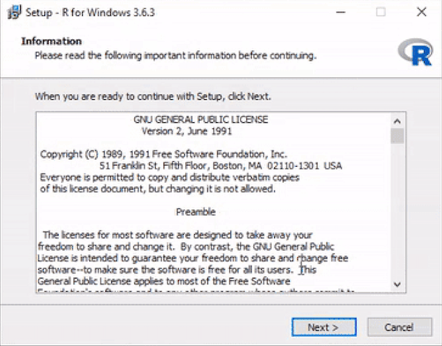
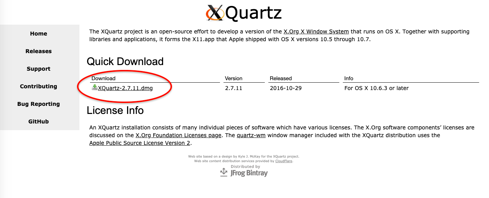

# Preparation before the course

```{r include=FALSE}
load("course_urls.RData")

```


## Let's get started! 

**Note: if you already have R and RStudio installed (and recently updated) on your computer, skip to the next page**

RStudio is a nice [IDE](https://en.wikipedia.org/wiki/Integrated_development_environment) for using R, with a user-friendly interface and lots of options.


In preparation of this course, we are going to install RStudio (and first R itself!) on your own computer, so it is readily available to you at any time within and after this course. R and RStudio are both free and [open source](https://en.wikipedia.org/wiki/Open_source). We encourage you to keep using R for future projects and your everyday data issues. It is currently an important tool in statistics, data science and bioinformatics.

Getting it all set up can be a bit tricky at times, so please follow the instructions carefully and in the correct order (seriously, keep to the order as well, it will make your life easier). The instructions will walk you through it.

### Remarks before starting

#### Windows users

Please make sure you are allowed to install software on your computer. If you do not have administrator rights for the computer you are using, you can contact the teachers for guidance. 

#### Mac users

Mac security settings might block you from installing certain programs. Whenever you see a pop-up like this:

```{r , echo=FALSE, message=FALSE, out.width = "70%"}

```

Go to you Applications --> System Preferences --> Security&Privacy

```{r , echo=FALSE, message=FALSE, out.width = "70%"}
knitr::include_graphics("images/security.png")
```

Click on "Open anyway" and in the next pop-up on "open".

***

## Updating R and RStudio

**Note: if you you haven't installed R and RStudio yet, you do not need to do this. Skip to [installing R](#installRhere).**

### Windows users

#### Update RStudio 

Go to Help > Check for Updates. 

#### Update R 

Open RStudio, and type in the console:

```{r, eval=FALSE}
install.packages("installr")
library(installr) 
```

Let it install and load, and type:

```{r, eval=FALSE}
updateR()
```

This will check whether you have the current version, and update if not. It will guide you through the decisions; say "yes", "OK" and/or "next" whenever it wants your opinion.

After this, skip the next two sections and continue to the page on [installing git](#installGIThere).

### Mac users

#### Update RStudio

Actually, just open RStudio. It will warn you if there are updates, unless you disabled this option in the preferences menu; in that case you can go to Help > Check for updates.

#### Update R

Type ```R.version.string``` in the console, check [here](https://cloud.r-project.org/) if that is correct. If it needs to be updated,  install the newest version of R as described on the next page. When you are done, close and reopen RStudio.

***

## Install R {#installRhere}

### Windows 

1. Go to [the R website](https://cloud.r-project.org/bin/windows/base/) and click on the download link on top. You will download a file called "R-3.6.3-win.exe" or very similar. 

```{r , echo=FALSE, message=FALSE, out.width = "70%"}

```

2. Run this file and follow all steps using the default settings to install R on  your computer.

```{r , echo=FALSE, message=FALSE, out.width = "70%"}

```

3. Windows users will also need to install [the R build tools](https://cran.r-project.org/bin/windows/Rtools/rtools42/rtools.html)


### Mac 

1. Go to [the R website](https://cloud.r-project.org/bin/macosx/).

    + If you have the latest OS X, ignore all text until "Latest release:", and click on the top .pkg file to download it.
    
    + If you do not have the latest OS X on your mac, consider updating it first. If you really do not want to, find the .pkg file for your OS X in the table and download it.

```{r , echo=FALSE, message=FALSE, out.width = "70%"}

```


2. Open the .pkg file to start the installer and follow all steps using default settings to install R on your computer.

```{r , echo=FALSE, message=FALSE, out.width = "70%"}
knitr::include_graphics("images/wizardRmac.png")
```

Some functions in R that you may use in the future require something called X11, which used to be included in OS X, but isn't anymore. To prevent future trouble, let's install it via XQuartz while we are installing things anyway:

- Go to <https://www.xquartz.org/>, download the file under "quick download".
    
```{r , echo=FALSE, message=FALSE, out.width = "70%"}

```


- Open the downloaded disk image (.dmg file). 
    
```{r , echo=FALSE, message=FALSE, out.width = "70%"}
knitr::include_graphics("images/xquarkdisk.png")
```

- Double click on XQuartz.pkg and follow the installation steps.
    
```{r , echo=FALSE, message=FALSE, out.width = "70%"}
knitr::include_graphics("images/xquarkwizard.png")
```

***


## Install RStudio

### Install RStudio itself 

Go to [the RStudio website](https://rstudio.com/products/rstudio/download/#download)

The website will probably suggest the correct download file for you (A). If not, look in the table lower down the page for the correct file (B): 

```{r , echo=FALSE, message=FALSE, out.width = "70%"}
knitr::include_graphics("images/rstudio_download.png")
```

Download and run the installer with default installation options:

```{r , echo=FALSE, message=FALSE, out.width = "70%"}
knitr::include_graphics("images/setup-wizard-rstudio.png")
```

Now open your newly installed RStudio. It will look familiar:

```{r , echo=FALSE, message=FALSE, out.width = "70%"}
knitr::include_graphics("images/rstudio_leeg.png")
```

### Installing packages

However, not everything is up and running as it was on the server in DAUR1. First of all, not all packages that we use have been installed. You will have to install packages once on your computer, and load them within every script you want to use them. 

To install packages, use the **console**. Do not install packages from within a script (the figure below shows RStudio when a script is open to highlight the difference):

```{r , echo=FALSE, message=FALSE, out.width = "70%"}

```

Go ahead and **install the tidyverse package**, we will need it during the course. Type the following command in the console:

```{r, eval=FALSE}
install.packages("tidyverse")
```

If, in the future, R bugs you in the console with "Do you want to install from sources the packages which need compilation?" just answer no (n) for now.

### Loading packages

A quick note on loading packages, even though you don't have to do that now. Remember that packages (in this case the tidyverse package) can be loaded using:

```{r, eval=FALSE}
library(tidyverse)
```

Make it a habit to load all packages you need in the beginning of your script, instead of loading them where-ever you happen to need them. This makes it easier to keep track of all the packages you are loading and prevents you from loading and reloading packages every time you run a chunk of code along the way.

```{r , echo=FALSE, message=FALSE, out.width = "70%"}
knitr::include_graphics("images/loadpackages.png")
```

***

## If all is still not well

Are you experiencing technical problems, software that does not run or options that are not available, or any other type of problem, check below:

In the following order:

 1. Have you tried turning your computer off and on again? Turn off your computer and start it back up. Try if it works now.
 1. Try to find your problem on the internet. If RStudio gives you an error message, copy paste (part of) the error message to google and see if a solution comes up. Really: try, click around, see what you can come up with, using the help of the internet. Consider this part of what you gain from this course, being able to google and solve R trouble is a valuable skill. And you will get better in it the more you practice (we know, we've practiced a lot).
 1. If 1, 2 and 3 all fail, send us an e-mail describing your problem, including a copy-paste of the error message if there is one (no screenshot).


## reader

Obviously, you have already found the reader for the course. 

 - Try the following:
  - Open links in the reader in a new tab by holding ctrl (pc) or command (mac) when clicking on it.
  - You can click menu-items to see the different paragraphs. 
 
<!-- - try to log in at the [Rstudio server](`r serverurl`) with your HU credentials. -->

<!-- You will see the Rstudio environment. This is an environment for using R. -->

## Introduction to R

R is a language and environment for statistical computing and graphics. It is one of the most popular programming languages for data analysis and statistics, rapidly taking over software packages such as SPSS. Rather than using a GUI (Graphical User Interface, clicking buttons and menus), R is typically accessed through a command-line interpreter. So you will type for instance "2+2" and R will tell you the answer:

```{r}
2+2
```

However, you can also ask R to give you p-values for an ANOVA, print you a nice scatter plot, or give a summary of a large dataset. Once you know how, R will let you do these tasks a lot faster than Excel or SPSS could. Moreover, more advanced users will be able to ask R to do things like finding all the genes in an online database that are associated with a certain disease, fit deep learning models, build interactive web apps and analyse huge next generation sequencing datasets. 

R is thus extremely versatile, but can be a bit daunting when first encountered. But as you likely have some experience in SPSS and Excel, you already know the basics of data analysis. You will see that learning R will save you a lot of time in the future. Also, R has been adopted by many companies as the language of choice to analyze data, so it is an important skill to acquire.

Therefore, we will give you an introduction to the R language in this course. R is an open-source project supported by the user community, so please note that it is all free of charge. This also means that R changes fast depending on the needs of the user community. We may encounter instances where things have changed in the time window between the development of this course and you following the lessons. Consider these differences a valuable lesson in really getting to know R and its possibilities.

### Variables and functions

The standard R installation comes with base R and core packages that allow for a fully functioning statistical environment. Rather than allowing the user to look at data in a two-dimensional data table on screen, such as for instance in Excel or SPSS, R saves data in **variables**. Variables can contain arrays of numbers, or even lists of multiple data tables. These variables are stored, but not printed on the screen unless you ask R to do so. We will further discuss them in lesson 1. 

Once you have stored your data in variables, you can apply functions to your data. In programming, **functions** are sets of instructions that you want to use repeatedly. Many functions are stored and shared in packages. A **package** provides code, functions and data to execute certain tasks in R. There are hundreds of functions each performing a certain task. For example the function **sum()** from the base package calculates the sum of a series of numbers. You can find a complete list of base R function and their descriptions [on this website](https://stat.ethz.ch/R-manual/R-devel/library/base/html/00Index.html).

Beside the base R functions, R comes with some **core packages**. These core packages include the **stat package**, which can be used to perform statistical tasks. For example, the function **median()** calculates the median of a series of numbers.  

<!-- ### Additional packages -->

<!-- The base and core functions are readily available in the R console without the need for installing additional packages. To expand the functionality of R, additional packages can be installed in the R environment. Packages can be found at so called repositories, online places where the packages are stored. The main repositories are: -->

<!-- - [CRAN](https://cran.r-project.org/) (The Comprehensive R Archive Network).  -->
<!-- - [Bioconductor](http://bioconductor.org/) (packages for the analysis of high-throughput genomic data. We will use these a lot in DAUR2). -->
<!-- - [Github](https://github.com/) (GitHub is a development platform to host and review code, manage projects, and build software).  -->

```{r echo=FALSE, message=FALSE, out.width = "70%", fig.cap = "Organization of the R workflow"}

```

<!-- ### This course -->

<!-- Within this course, you will run R on a server provided by the HU, and within Rstudio, an integrated development environment (IDE) for R. You will access the server/RStudio using a web browser. RStudio is designed to make it easy to write scripts, keep track of your variables and plot graphs. -->

<!-- ## The server -->
<!-- RStudio is an IDE that can run on your local Windows, Mac OS X, or Linux workstation. -->

<!-- However, for the current course, we will use a version of Rstudio that provides a web browser based interface to R: running on the server. This will ensure that everyone will have the correct packages installed and is using the same version of R:. -->

<!-- If you find yourself liking R: a lot and want to use it in the future, you will know enough by the end of the course to install your own local Rstudio version. -->

<!-- *The server can be found [here](`r serverurl`)*.  -->

<!-- ### first log-in -->
<!-- **Log into the server.** -->

## Rstudio

Open up your newly installed Rstudio program 

Rstudio provides a user-friendly interface with separate windows for everything you will be using: the console, scripts, environments, objects,  graphs, files  and so on. 

Your screen will look like this:
```{r Rlayout1, echo=FALSE, message=FALSE, out.width = "100%", fig.cap = "Rstudio layout"}
knitr::include_graphics("images/01_3_Rstudio.jpg")
```

### Console
In the bottom left you see the console window and terminal. You will be working mostly in the console window, in which the line should start with 

`>`

(if it starts with `root@something_something_your.name#` you are typing in the terminal. Go to the console by clicking on "console" in the bottom left menu bar).

Note (seriously!) that anything you type in the console **will not be saved**. This is just where you can tell R what to do right now, and where R will print the results of a command. You can use it as a calculator as well.


**try typing 2+2 in the console window and hit enter**

These commands typed directly into the console will be forgotten when you close the session. A session is in fact just this: R keeps track of your calculations and the variables you made (we'll get to that) until you explicitly quit the session.

Within the current session Rstudio will also remember your console commands. You can retrieve previous commands with the arrow keys:

* Up — Recall previous command(s)
* Down — Reverse of Up

**Try pressing the UP key. You will see that R retrieves the 2+2 command**. You can use this to repeat commands (or change them a bit if you want).


## Projects

Most of the time, we do want R to save what we are doing. Therefore, we will be working in scripts, and within a project.

If you start with R you should create a Project.  A project defines a folder where you store all the datafiles, Rscripts and RMarkdown files. When you open a Project your working directory will be the folder where your Project file is stored.

Projects can be exchanged between computers and researchers in time as it contains all the necessary packages, files and scripts to do the analysis. A project is self-contained. A researcher can define multiple Projects within Rstudio which run independently of each other.  A Project also guarantees that datafiles /scripts can be found in subfolders within the Project (even when executed on a different computer)

### Starting a new Project in Rstudio 

**Click on File and Select New Project**

```{r echo=FALSE, message=FALSE, out.width = "60%"}

```

**If you encounter this message Click on "Don't Save", otherwise  continue with the next instruction**

```{r echo=FALSE, message=FALSE, out.width = "60%"}
knitr::include_graphics("images/01_5_Project_2.jpg")
```

**Click on "new Directory"**

```{r echo=FALSE, message=FALSE, out.width = "60%"}

```

**Make a new directory for this course (for instance "daur" for Data Analysis Using R)**

**Click on "Create Project"**

```{r echo=FALSE, message=FALSE, out.width = "60%"}
knitr::include_graphics("images/01_9_Project_6.png")
```

**Done**

### Opening a project in Rstudio
When starting an R session open the Project you want to work on. This will automatically set your working directory to the  folder containing the RProject file. The working directory is where R will look for any files (datafiles, scripts etc) you want to use.
If you want to switch projects, or you are not currently in a project, you can open one:

**Click on "Open Project". If you have opened the RProject before you can also select "Recent Projects"**

```{r echo=FALSE, message=FALSE, out.width = "60%"}

```

**Select and open the folder containing the RProject file. In this instance daur**

**Select and open the daur.Rproj file to open the RProject**


We will continue working in Rstudio in lesson 1.

### More help
This course is based on the book "R for Data Science" of Garrett Grolemund and Hadley Wickham. [This book is freely available](https://r4ds.had.co.nz/index.html). We will refer to this book in the learning material providing extra (in depth) information / explanation.  

There are thousands of tutorials on R if you want to know more. Generally, online tutorials on R: are rather good. Good starting points are:
[bioconductor](https://www.bioconductor.org/help/course-materials/)

[Rstudio](https://www.rstudio.com/online-learning/)

[Coursera](https://www.coursera.org/learn/r-programming)

[Rmarkdown](https://rmarkdown.rstudio.com/)
 

The official documentation on R functions can be difficult to read / understand. To start searching for information on R, for example on how a particular function works you can use google (or your favourite searching engine) with the following search term:
R function() tutorial / example
So for example, google: 

R unique() tutorial / example

## DIY
In this course, we will give you a tour of R and we will discuss many functions using examples.

Every lesson will consists of a series of canvas pages with examples and explanations, followed by exercises. 

We expect you to try things yourself during this course. When reading the lessons, try all the examples in R. So open Rstudio on the server, copy-paste the examples in a script and run them. *Play around with the code.* You will not learn R: by watching someone else write it, or by reading about it. This is a skill that you will need to practice. 

Often, we will show you what the output of a piece of code should look like in lighter gray. You can also recognise code output by the ## in front of the lines:


###### Example
```{r}
sesamstraat <- c("ernie", "bert", "elmo", "pino", "grover", "kermit", "ms piggy", "koekiemonster")
sort(sesamstraat)
```

If your output looks different, such as:
`Error in sort(sesamstrat) : object 'sesamstrat' not found` 

you know something is going wrong.

**Make sure you code along with the examples.** Try to replicate what the reader is doing!


